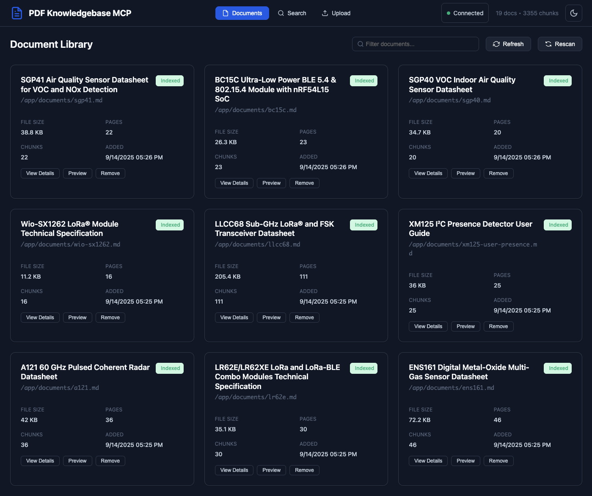
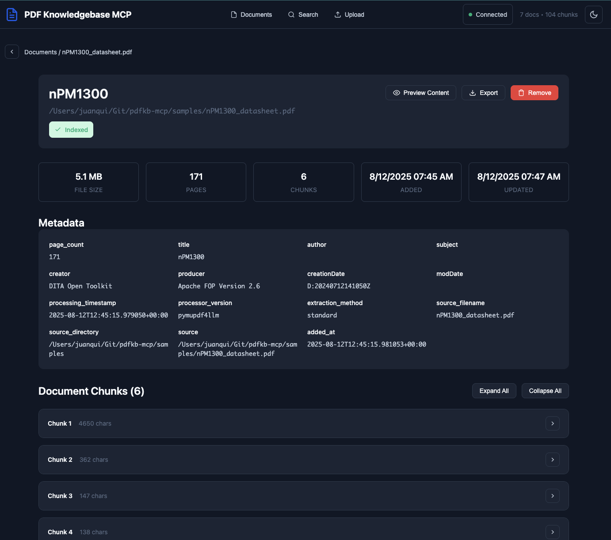
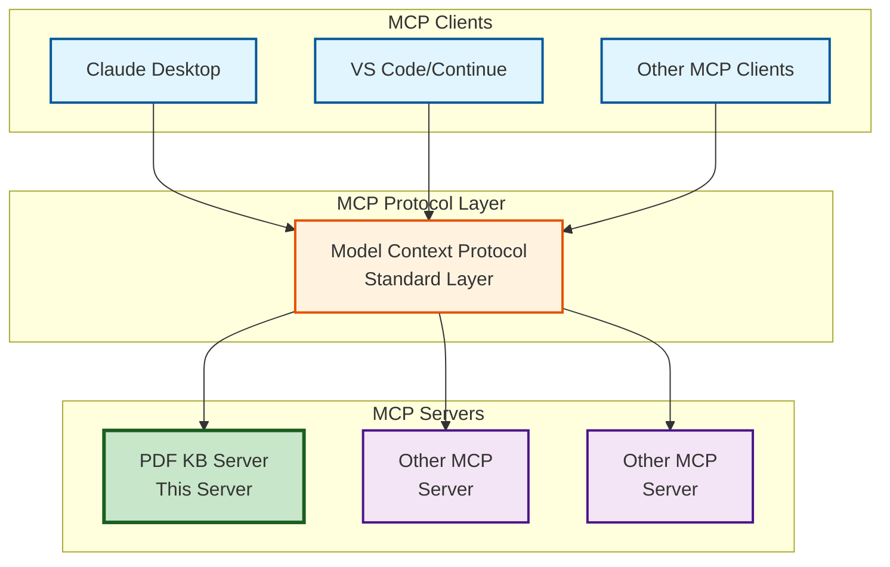
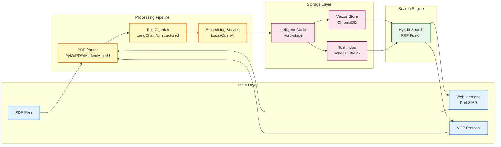

# PDF Knowledgebase MCP Server

A Model Context Protocol (MCP) server that enables intelligent document search and retrieval from PDF collections. Built for seamless integration with Claude Desktop, Continue, Cline, and other MCP clients, this server provides advanced search capabilities powered by local, OpenAI, or HuggingFace embeddings and ChromaDB vector storage.

## ✨ Major New Features

### 🤖 Document Summarization (NEW!)
**Automatically generate rich document metadata using AI**
- **Local LLM Support**: Use Qwen3, Phi-3, and other local models - no API costs, full privacy
- **Remote LLM Support**: OpenAI-compatible APIs for cloud-based summarization
- **Rich Metadata**: Auto-generates titles, short descriptions, and detailed summaries
- **Smart Content Processing**: Configurable page limits and intelligent content truncation
- **Fallback Handling**: Graceful degradation when summarization fails

### 🌐 Remote Access & Multi-Client Support (NEW!)
**Access your document repository from anywhere**
- **Unified Server Architecture**: Single server serving both web interface and MCP endpoints
- **HTTP Transport Mode**: RESTful API access for modern MCP clients
- **SSE Transport Mode**: Server-Sent Events for real-time remote access
- **Multi-Client Architecture**: Share document processing across multiple clients
- **Single Port Deployment**: Efficient resource usage with unified endpoints
- **Flexible Deployment**: Local, remote, or hybrid deployment modes

### 🎯 Advanced Search & Intelligence
**Best-in-class document retrieval capabilities**
- **Hybrid Search**: Combines semantic similarity with keyword matching (BM25)
- **Reranking Support**: Qwen3-Reranker models for improved search relevance
- **GGUF Quantized Models**: 50-70% smaller models with maintained quality
- **Local Embeddings**: Full privacy with HuggingFace models - no API costs
- **Custom Endpoints**: Support for OpenAI-compatible APIs and custom providers
- **Semantic Chunking**: Content-aware chunking for better context preservation

### 🔄 Enterprise-Ready Operations
**Production-ready document processing**
- **Non-blocking Operations**: Background processing with graceful startup
- **Intelligent Caching**: Multi-stage caching with selective invalidation
- **Enhanced Monitoring**: Better logging, error handling, and resource management
- **Graceful Shutdown**: Configurable timeouts and proper cleanup
- **Performance Optimized**: Improved memory usage and concurrent processing
## Table of Contents

- [🚀 Quick Start](#-quick-start)
- [🌐 Web Interface](#-web-interface)
- [🏗️ Architecture Overview](#️-architecture-overview)
- [📝 Document Summarization](#-document-summarization)
- [🤖 Local Embeddings](#-local-embeddings)
- [🔄 Reranking](#-reranking)
- [🔍 Hybrid Search](#-hybrid-search)
- [🔽 Minimum Chunk Filtering](#-minimum-chunk-filtering)
- [🧩 Semantic Chunking](#-semantic-chunking)
- [🎯 Parser Selection Guide](#-parser-selection-guide)
- [⚙️ Configuration](#️-configuration)
- [🖥️ MCP Client Setup](#️-mcp-client-setup)
- [📊 Performance & Troubleshooting](#-performance--troubleshooting)
- [🔧 Advanced Configuration](#-advanced-configuration)
- [📚 Appendix](#-appendix)

## 🚀 Quick Start

### Step 1: Configure Your MCP Client

**🆕 Option A: Complete Local Setup with Document Summarization (No API Key Required)**
```json
{
  "mcpServers": {
    "pdfkb": {
      "command": "uvx",
      "args": ["pdfkb-mcp[hybrid]"],
      "env": {
        "PDFKB_KNOWLEDGEBASE_PATH": "/Users/yourname/Documents",
        "PDFKB_ENABLE_HYBRID_SEARCH": "true",
        "PDFKB_ENABLE_SUMMARIZER": "true",
        "PDFKB_SUMMARIZER_PROVIDER": "local",
        "PDFKB_SUMMARIZER_MODEL": "Qwen/Qwen3-4B-Instruct-2507-FP8"
      },
      "transport": "stdio",
      "autoRestart": true
    }
  }
}
```

**Option B: Local Embeddings w/ Hybrid Search (No API Key Required)**
```json
{
  "mcpServers": {
    "pdfkb": {
      "command": "uvx",
      "args": ["pdfkb-mcp[hybrid]"],
      "env": {
        "PDFKB_KNOWLEDGEBASE_PATH": "/Users/yourname/Documents",
        "PDFKB_ENABLE_HYBRID_SEARCH": "true"
      },
      "transport": "stdio",
      "autoRestart": true
    }
  }
}
```

**🆕 Option B: Remote/SSE Mode (Accessible from Multiple Clients)**
```json
{
  "mcpServers": {
    "pdfkb": {
      "command": "uvx",
      "args": ["pdfkb-mcp[hybrid]"],
      "env": {
        "PDFKB_KNOWLEDGEBASE_PATH": "/Users/yourname/Documents",
        "PDFKB_ENABLE_HYBRID_SEARCH": "true"
      },
      "transport": "sse",
      "autoRestart": true
    }
  }
}
```

**🆕 Option A2: Local GGUF Embeddings (Memory Optimized, No API Key Required)**
```json
{
  "mcpServers": {
    "pdfkb": {
      "command": "uvx",
      "args": ["pdfkb-mcp[hybrid]"],
      "env": {
        "PDFKB_KNOWLEDGEBASE_PATH": "/Users/yourname/Documents",
        "PDFKB_LOCAL_EMBEDDING_MODEL": "Qwen/Qwen3-Embedding-0.6B-GGUF",
        "PDFKB_GGUF_QUANTIZATION": "Q6_K",
        "PDFKB_ENABLE_HYBRID_SEARCH": "true"
      },
      "transport": "stdio",
      "autoRestart": true
    }
  }
}
```

**🆕 Option A3: Local Embeddings with Reranking (Best Search Quality, No API Key Required)**
```json
{
  "mcpServers": {
    "pdfkb": {
      "command": "uvx",
      "args": ["pdfkb-mcp[hybrid]"],
      "env": {
        "PDFKB_KNOWLEDGEBASE_PATH": "/Users/yourname/Documents",
        "PDFKB_ENABLE_HYBRID_SEARCH": "true",
        "PDFKB_ENABLE_RERANKER": "true",
        "PDFKB_RERANKER_MODEL": "Qwen/Qwen3-Reranker-0.6B"
      },
      "transport": "stdio",
      "autoRestart": true
    }
  }
}
```

**Option B: OpenAI Embeddings w/ Hybrid Search**
```json
{
  "mcpServers": {
    "pdfkb": {
      "command": "uvx",
      "args": ["pdfkb-mcp[hybrid]"],
      "env": {
        "PDFKB_EMBEDDING_PROVIDER": "openai",
        "PDFKB_OPENAI_API_KEY": "sk-proj-abc123def456ghi789...",
        "PDFKB_KNOWLEDGEBASE_PATH": "/Users/yourname/Documents",
        "PDFKB_ENABLE_HYBRID_SEARCH": "true"
      },
      "transport": "stdio",
      "autoRestart": true
    }
  }
}
```

**🆕 Option C: HuggingFace w/ Custom Provider**
```json
{
  "mcpServers": {
    "pdfkb": {
      "command": "uvx",
      "args": ["pdfkb-mcp[hybrid]"],
      "env": {
        "PDFKB_EMBEDDING_PROVIDER": "huggingface",
        "PDFKB_HUGGINGFACE_EMBEDDING_MODEL": "sentence-transformers/all-MiniLM-L6-v2",
        "PDFKB_HUGGINGFACE_PROVIDER": "nebius",
        "HF_TOKEN": "hf_your_token_here",
        "PDFKB_KNOWLEDGEBASE_PATH": "/Users/yourname/Documents",
        "PDFKB_ENABLE_HYBRID_SEARCH": "true"
      },
      "transport": "stdio",
      "autoRestart": true
    }
  }
}
```

**🆕 Option D: Custom OpenAI-Compatible API**
```json
{
  "mcpServers": {
    "pdfkb": {
      "command": "uvx",
      "args": ["pdfkb-mcp[hybrid]"],
      "env": {
        "PDFKB_EMBEDDING_PROVIDER": "openai",
        "PDFKB_OPENAI_API_KEY": "your-api-key",
        "PDFKB_OPENAI_API_BASE": "https://api.studio.nebius.com/v1/",
        "PDFKB_EMBEDDING_MODEL": "text-embedding-3-large",
        "PDFKB_KNOWLEDGEBASE_PATH": "/Users/yourname/Documents",
        "PDFKB_ENABLE_HYBRID_SEARCH": "true"
      },
      "transport": "stdio",
      "autoRestart": true
}
```

### Step 3: Verify Installation

1. **Restart your MCP client** completely
2. **Check for PDF KB tools**: Look for `add_document`, `search_documents`, `list_documents`, `remove_document`
3. **Test functionality**: Try adding a PDF and searching for content

## 🌐 Web Interface

The PDF Knowledgebase includes a modern web interface for easy document management and search. **The web interface is disabled by default and must be explicitly enabled.**


### Server Modes

**1. MCP Only Mode - Stdio Transport** (Default):
```bash
pdfkb-mcp
```
- Runs only the MCP server for integration with Claude Desktop, VS Code, etc.
- Most resource-efficient option
- Best for pure MCP integration

**2. MCP Only Mode - HTTP/SSE Transport**:
```bash
# Option A: Environment variable
PDFKB_TRANSPORT=http pdfkb-mcp    # or sse

# Option B: Command line flags
pdfkb-mcp --transport http        # or --transport sse
```
- Runs MCP server in HTTP/SSE mode for remote access from multiple clients
- MCP endpoints available for client connections
- Best for centralized document processing accessible from multiple clients

**3. Unified Server Mode** (MCP + Web):
```bash
# Option A: Environment variable
PDFKB_WEB_ENABLE=true pdfkb-mcp

# Option B: Command line flag
pdfkb-mcp --enable-web

# Option C: With HTTP/SSE transport
PDFKB_WEB_ENABLE=true pdfkb-mcp --transport http
```
- Runs unified server with both MCP endpoints AND web interface on same port
- Web interface available at http://localhost:8000
- MCP endpoints available at http://localhost:8000/mcp/ (HTTP) or http://localhost:8000/sse/ (SSE)
- API documentation at http://localhost:8000/docs
- Best of both worlds: API integration + web UI in single efficient server
### Web Interface Features


*Modern web interface showing document collection with search, filtering, and management capabilities*

- **📄 Document Upload**: Drag & drop PDF files or upload via file picker
- **🔍 Semantic Search**: Powerful vector-based search with real-time results
- **📊 Document Management**: List, preview, and manage your PDF collection
- **📈 Real-time Status**: Live processing updates via WebSocket connections
- **🎯 Chunk Explorer**: View and navigate document chunks for detailed analysis
- **⚙️ System Metrics**: Monitor server performance and resource usage


*Detailed document view showing metadata, chunk analysis, and content preview*

### Quick Web Setup

1. **Install and run**:
   ```bash
   uvx pdfkb-mcp                    # Install if needed
   PDFKB_WEB_ENABLE=true pdfkb-mcp  # Start integrated server
   ```

2. **Open your browser**: http://localhost:8000

3. **Configure environment** (create `.env` file):
   ```bash
   PDFKB_OPENAI_API_KEY=sk-proj-abc123def456ghi789...
   PDFKB_KNOWLEDGEBASE_PATH=/path/to/your/pdfs
   PDFKB_WEB_PORT=8000
   PDFKB_WEB_HOST=localhost
   PDFKB_WEB_ENABLE=true
   ```

### Web Configuration Options

| Environment Variable | Default | Description |
|---------------------|---------|-------------|
| `PDFKB_WEB_ENABLE` | `false` | Enable/disable unified server (web + MCP endpoints) |
| `PDFKB_WEB_PORT` | `8000` | Unified server port |
| `PDFKB_WEB_HOST` | `localhost` | Server host |
| `PDFKB_TRANSPORT` | `stdio` | MCP transport: `stdio`, `http`, or `sse` |
| `PDFKB_WEB_CORS_ORIGINS` | `http://localhost:3000,http://127.0.0.1:3000` | CORS allowed origins |

### Command Line Options

The server supports command line arguments:

```bash
# Enable unified server (web + MCP endpoints)
pdfkb-mcp --enable-web

# Enable unified server with HTTP transport
pdfkb-mcp --enable-web --transport http

# Use custom configuration file
pdfkb-mcp --config myconfig.env

# Change log level
pdfkb-mcp --log-level DEBUG
```

### API Documentation

When running with unified server enabled, comprehensive API documentation is available at:
- **Swagger UI**: http://localhost:8000/docs
- **ReDoc**: http://localhost:8000/redoc

## 🏗️ Architecture Overview

### MCP Integration



### Internal Architecture



### Available Tools & Resources

**Tools** (Actions your client can perform):
- [`add_document(path, metadata?)`](src/pdfkb/main.py:278) - Add PDF to knowledgebase
- [`search_documents(query, limit=5, metadata_filter?, search_type?)`](src/pdfkb/main.py:345) - Hybrid search across PDFs (semantic + keyword matching)
- [`list_documents(metadata_filter?)`](src/pdfkb/main.py:422) - List all documents with metadata
- [`remove_document(document_id)`](src/pdfkb/main.py:488) - Remove document from knowledgebase

**Resources** (Data your client can access):
- `pdf://{document_id}` - Full document content as JSON
- `pdf://{document_id}/page/{page_number}` - Specific page content
- `pdf://list` - List of all documents with metadata

## 🤖 Embedding Options

The server supports three embedding providers, each with different trade-offs:

### 1. Local Embeddings (Default)

Run embeddings locally using HuggingFace models, eliminating API costs and keeping your data completely private.

**Features:**
- **Zero API Costs**: No external API charges
- **Complete Privacy**: Documents never leave your machine
- **Hardware Acceleration**: Automatic detection of Metal (macOS), CUDA (NVIDIA), or CPU
- **Smart Caching**: LRU cache for frequently embedded texts
- **Multiple Model Sizes**: Choose based on your hardware capabilities

Local embeddings are **enabled by default**. No configuration needed for basic usage:

```json
{
  "mcpServers": {
    "pdfkb": {
      "command": "uvx",
      "args": ["pdfkb-mcp"],
      "env": {
        "PDFKB_KNOWLEDGEBASE_PATH": "/path/to/pdfs"
      }
    }
  }
}
```

### Supported Models

**🆕 Qwen3-Embedding Series Only**: The server now exclusively supports the Qwen3-Embedding model family, including both standard and quantized GGUF variants for optimized performance.

#### Standard Models

| Model | Size | Dimensions | Max Context | Best For |
|-------|------|------------|-------------|----------|
| **Qwen/Qwen3-Embedding-0.6B** (default) | 1.2GB | 1024 | 32K tokens | Best overall - long docs, fast |
| **Qwen/Qwen3-Embedding-4B** | 8.0GB | 2560 | 32K tokens | High quality, long context |
| **Qwen/Qwen3-Embedding-8B** | 16.0GB | 3584 | 32K tokens | Maximum quality, long context |

#### 🆕 GGUF Quantized Models (Reduced Memory Usage)

| Model | Size | Dimensions | Max Context | Best For |
|-------|------|------------|-------------|----------|
| **Qwen/Qwen3-Embedding-0.6B-GGUF** | 0.6GB | 1024 | 32K tokens | Quantized lightweight, 32K context |
| **Qwen/Qwen3-Embedding-4B-GGUF** | 2.4GB | 2560 | 32K tokens | Quantized high quality, 32K context |
| **Qwen/Qwen3-Embedding-8B-GGUF** | 4.8GB | 3584 | 32K tokens | Quantized maximum quality, 32K context |

Configure your preferred model:
```bash
# Standard models
PDFKB_LOCAL_EMBEDDING_MODEL="Qwen/Qwen3-Embedding-0.6B"  # Default
PDFKB_LOCAL_EMBEDDING_MODEL="Qwen/Qwen3-Embedding-4B"
PDFKB_LOCAL_EMBEDDING_MODEL="Qwen/Qwen3-Embedding-8B"

# GGUF quantized models (reduced memory usage)
PDFKB_LOCAL_EMBEDDING_MODEL="Qwen/Qwen3-Embedding-0.6B-GGUF"
PDFKB_LOCAL_EMBEDDING_MODEL="Qwen/Qwen3-Embedding-4B-GGUF"
PDFKB_LOCAL_EMBEDDING_MODEL="Qwen/Qwen3-Embedding-8B-GGUF"
```

#### 🆕 GGUF Quantization Options

When using GGUF models, you can configure the quantization level to balance between model size and quality:

```bash
# Configure quantization (default: Q6_K)
PDFKB_GGUF_QUANTIZATION="Q6_K"    # Default - balanced size/quality
PDFKB_GGUF_QUANTIZATION="Q8_0"    # Higher quality, larger size
PDFKB_GGUF_QUANTIZATION="F16"     # Highest quality, largest size
PDFKB_GGUF_QUANTIZATION="Q4_K_M"  # Smaller size, lower quality
```

**Quantization Recommendations:**
- **Q6_K** (default): Best balance of quality and size
- **Q8_0**: Near-original quality with moderate compression
- **F16**: Original quality, minimal compression
- **Q4_K_M**: Maximum compression, acceptable quality loss

### Hardware Optimization

The server automatically detects and uses the best available hardware:

- **Apple Silicon (M1/M2/M3)**: Uses Metal Performance Shaders (MPS)
- **NVIDIA GPUs**: Uses CUDA acceleration
- **CPU Fallback**: Optimized for multi-core processing

Force a specific device if needed:
```bash
PDFKB_EMBEDDING_DEVICE="mps"   # Force Metal/MPS
PDFKB_EMBEDDING_DEVICE="cuda"  # Force CUDA
PDFKB_EMBEDDING_DEVICE="cpu"   # Force CPU
```

### Configuration Options

```bash
# Embedding provider (local or openai)
PDFKB_EMBEDDING_PROVIDER="local"  # Default

# Model selection (Qwen3-Embedding series only)
PDFKB_LOCAL_EMBEDDING_MODEL="Qwen/Qwen3-Embedding-0.6B"  # Default
# Standard options:
# - "Qwen/Qwen3-Embedding-0.6B" (1.2GB, 1024 dims, default)
# - "Qwen/Qwen3-Embedding-4B" (8GB, 2560 dims, high quality)
# - "Qwen/Qwen3-Embedding-8B" (16GB, 3584 dims, maximum quality)
# GGUF quantized options (reduced memory usage):
# - "Qwen/Qwen3-Embedding-0.6B-GGUF" (0.6GB, 1024 dims)
# - "Qwen/Qwen3-Embedding-4B-GGUF" (2.4GB, 2560 dims)
# - "Qwen/Qwen3-Embedding-8B-GGUF" (4.8GB, 3584 dims)

# GGUF quantization configuration (only used with GGUF models)
PDFKB_GGUF_QUANTIZATION="Q6_K"  # Default quantization level
# Available options: Q8_0, F16, Q6_K, Q4_K_M, Q4_K_S, Q5_K_M, Q5_K_S

# Performance tuning
PDFKB_LOCAL_EMBEDDING_BATCH_SIZE=32  # Adjust based on memory
PDFKB_EMBEDDING_CACHE_SIZE=10000     # Number of cached embeddings
PDFKB_MAX_SEQUENCE_LENGTH=512        # Maximum text length

# Hardware acceleration
PDFKB_EMBEDDING_DEVICE="auto"        # auto, mps, cuda, cpu
PDFKB_USE_MODEL_OPTIMIZATION=true    # Enable torch.compile optimization

# Fallback options
PDFKB_FALLBACK_TO_OPENAI=false  # Use OpenAI if local fails
```

### 2. OpenAI Embeddings

Use OpenAI's embedding API or **any OpenAI-compatible endpoint** for high-quality embeddings with minimal setup.

**Features:**
- **High Quality**: State-of-the-art embedding models
- **No Local Resources**: Runs entirely in the cloud
- **Fast**: Optimized API with batching support
- **🆕 Custom Endpoints**: Support for OpenAI-compatible APIs like Together, Nebius, etc.

**Standard OpenAI:**
```json
{
  "env": {
    "PDFKB_EMBEDDING_PROVIDER": "openai",
    "PDFKB_OPENAI_API_KEY": "sk-proj-...",
    "PDFKB_EMBEDDING_MODEL": "text-embedding-3-large"
  }
}
```

**🆕 Custom OpenAI-Compatible Endpoints:**
```json
{
  "env": {
    "PDFKB_EMBEDDING_PROVIDER": "openai",
    "PDFKB_OPENAI_API_KEY": "your-api-key",
    "PDFKB_OPENAI_API_BASE": "https://api.studio.nebius.com/v1/",
    "PDFKB_EMBEDDING_MODEL": "text-embedding-3-large"
  }
}
```

### 3. HuggingFace Embeddings

**🆕 ENHANCED**: Use HuggingFace's Inference API with support for custom providers and thousands of embedding models.

**Features:**
- **🆕 Multiple Providers**: Use HuggingFace directly or third-party providers like Nebius
- **Wide Model Selection**: Access to thousands of embedding models
- **Cost-Effective**: Many free or low-cost options available
- **🆕 Provider Support**: Seamlessly switch between HuggingFace and custom inference providers

**Configuration:**

```json
{
  "mcpServers": {
    "pdfkb": {
      "command": "pdfkb-mcp",
      "env": {
        "PDFKB_KNOWLEDGEBASE_PATH": "/path/to/your/pdfs",
        "PDFKB_EMBEDDING_PROVIDER": "huggingface",
        "PDFKB_HUGGINGFACE_EMBEDDING_MODEL": "sentence-transformers/all-MiniLM-L6-v2",
        "HF_TOKEN": "hf_your_token_here"
      }
    }
  }
}
```

**Advanced Configuration:**

```bash
# Use a specific provider like Nebius
PDFKB_HUGGINGFACE_PROVIDER=nebius
PDFKB_HUGGINGFACE_EMBEDDING_MODEL=Qwen/Qwen3-Embedding-8B

# Or use HuggingFace directly (auto/default)
PDFKB_HUGGINGFACE_PROVIDER=  # Leave empty for auto
```

### Performance Tips

1. **Batch Size**: Larger batches are faster but use more memory
   - Apple Silicon: 32-64 recommended
   - NVIDIA GPUs: 64-128 recommended
   - CPU: 16-32 recommended

2. **Model Selection**: Choose based on your needs
   - **Default (Qwen3-0.6B)**: Best for most users - 32K context, fast, 1.2GB
   - **GGUF (Qwen3-0.6B-GGUF)**: Memory-optimized version - 32K context, fast, 0.6GB
   - **High Quality (Qwen3-4B)**: Better accuracy - 32K context, 8GB
   - **GGUF High Quality (Qwen3-4B-GGUF)**: Memory-optimized high quality - 32K context, 2.4GB
   - **Maximum Quality (Qwen3-8B)**: Best accuracy - 32K context, 16GB
   - **GGUF Maximum Quality (Qwen3-8B-GGUF)**: Memory-optimized maximum quality - 32K context, 4.8GB

3. **GGUF Quantization**: Choose based on memory constraints
   - **Q6_K** (default): Best balance of quality and size
   - **Q8_0**: Higher quality, larger size
   - **F16**: Near-original quality, largest size
   - **Q4_K_M**: Smallest size, acceptable quality

4. **Memory Management**: The server automatically handles OOM errors by reducing batch size

## 📝 Markdown Document Support

The server now supports **Markdown documents** (.md, .markdown) alongside PDFs, perfect for:
- Pre-processed documents where you've already extracted clean markdown
- Technical documentation and notes
- Avoiding complex PDF parsing for better quality content
- Faster processing with no conversion overhead

### Features

- **Native Processing**: Markdown files are read directly without conversion
- **Page Boundary Detection**: Automatically splits documents on page markers like `--[PAGE: 142]--`
- **Frontmatter Support**: Automatically extracts YAML/TOML frontmatter metadata
- **Title Extraction**: Intelligently extracts titles from H1 headers or frontmatter
- **Same Pipeline**: Uses the same chunking, embedding, and search infrastructure as PDFs
- **Mixed Collections**: Search across both PDFs and Markdown documents seamlessly

### Usage

Simply add Markdown files the same way you add PDFs:

```python
# In your MCP client
await add_document("/path/to/document.md")
await add_document("/path/to/paper.pdf")

# Search across both types
results = await search_documents("your query")
```

### Configuration

```bash
# Markdown-specific settings
PDFKB_MARKDOWN_PAGE_BOUNDARY_PATTERN="--\\[PAGE:\\s*(\\d+)\\]--"  # Regex pattern for page boundaries
PDFKB_MARKDOWN_SPLIT_ON_PAGE_BOUNDARIES=true  # Enable page boundary detection
PDFKB_MARKDOWN_PARSE_FRONTMATTER=true  # Parse YAML/TOML frontmatter (default: true)
PDFKB_MARKDOWN_EXTRACT_TITLE=true      # Extract title from first H1 (default: true)
```

## 🔄 Reranking

**🆕 NEW**: The server now supports **advanced reranking** using multiple providers to significantly improve search result relevance and quality. Reranking is a post-processing step that re-orders initial search results based on deeper semantic understanding.

### Supported Providers

1. **Local Models**: Qwen3-Reranker models (both standard and GGUF quantized variants)
2. **DeepInfra API**: Qwen3-Reranker-8B via DeepInfra's native API

### How It Works

1. **Initial Search**: Retrieves `limit + reranker_sample_additional` candidates using hybrid/vector/text search
2. **Reranking**: Uses Qwen3-Reranker to deeply analyze query-document relevance and re-score results
3. **Final Results**: Returns the top `limit` results based on reranker scores

### Supported Models

#### Local Models (Qwen3-Reranker Series)

**Standard Models**
| Model | Size | Best For |
|-------|------|----------|
| **Qwen/Qwen3-Reranker-0.6B** (default) | 1.2GB | Lightweight, fast reranking |
| **Qwen/Qwen3-Reranker-4B** | 8.0GB | High quality reranking |
| **Qwen/Qwen3-Reranker-8B** | 16.0GB | Maximum quality reranking |

**🆕 GGUF Quantized Models (Reduced Memory Usage)**
| Model | Size | Best For |
|-------|------|----------|
| **Mungert/Qwen3-Reranker-0.6B-GGUF** | 0.3GB | Quantized lightweight, very fast |
| **Mungert/Qwen3-Reranker-4B-GGUF** | 2.0GB | Quantized high quality |
| **Mungert/Qwen3-Reranker-8B-GGUF** | 4.0GB | Quantized maximum quality |

#### 🆕 DeepInfra Model

| Model | Best For |
|-------|----------|
| **Qwen/Qwen3-Reranker-8B** | High-quality cross-encoder reranking via DeepInfra API |

### Configuration

#### Option 1: Local Reranking (Standard Models)
```bash
# Enable reranking with local models
PDFKB_ENABLE_RERANKER=true
PDFKB_RERANKER_PROVIDER=local  # Default

# Choose reranker model
PDFKB_RERANKER_MODEL="Qwen/Qwen3-Reranker-0.6B"  # Default
PDFKB_RERANKER_MODEL="Qwen/Qwen3-Reranker-4B"     # Higher quality
PDFKB_RERANKER_MODEL="Qwen/Qwen3-Reranker-8B"     # Maximum quality

# Configure candidate sampling
PDFKB_RERANKER_SAMPLE_ADDITIONAL=5  # Default: get 5 extra candidates for reranking

# Optional: specify device
PDFKB_RERANKER_DEVICE="mps"         # For Apple Silicon
PDFKB_RERANKER_DEVICE="cuda"        # For NVIDIA GPUs
PDFKB_RERANKER_DEVICE="cpu"         # For CPU-only
```

#### Option 2: GGUF Quantized Local Reranking (Memory Optimized)
```bash
# Enable reranking with GGUF quantized models
PDFKB_ENABLE_RERANKER=true
PDFKB_RERANKER_PROVIDER=local

# Choose GGUF reranker model
PDFKB_RERANKER_MODEL="Mungert/Qwen3-Reranker-0.6B-GGUF"  # Smallest
PDFKB_RERANKER_MODEL="Mungert/Qwen3-Reranker-4B-GGUF"    # Balanced
PDFKB_RERANKER_MODEL="Mungert/Qwen3-Reranker-8B-GGUF"    # Highest quality

# Configure GGUF quantization level
PDFKB_RERANKER_GGUF_QUANTIZATION="Q6_K"  # Balanced (recommended)
PDFKB_RERANKER_GGUF_QUANTIZATION="Q8_0"  # Higher quality, larger
PDFKB_RERANKER_GGUF_QUANTIZATION="Q4_K_M" # Smaller, lower quality

# Configure candidate sampling
PDFKB_RERANKER_SAMPLE_ADDITIONAL=5  # Default: get 5 extra candidates
```

#### 🆕 Option 3: DeepInfra Reranking (API-based)
```bash
# Enable reranking with DeepInfra
PDFKB_ENABLE_RERANKER=true
PDFKB_RERANKER_PROVIDER=deepinfra

# Set your DeepInfra API key
PDFKB_DEEPINFRA_API_KEY="your-deepinfra-api-key"

# Optional: Choose model (default: Qwen/Qwen3-Reranker-8B)
# Available: Qwen/Qwen3-Reranker-0.6B, Qwen/Qwen3-Reranker-4B, Qwen/Qwen3-Reranker-8B
PDFKB_DEEPINFRA_RERANKER_MODEL="Qwen/Qwen3-Reranker-8B"

# Configure candidate sampling
PDFKB_RERANKER_SAMPLE_ADDITIONAL=8  # Sample 8 extra docs for reranking
```

**About DeepInfra Reranker**:
- Supports three Qwen3-Reranker models:
  - **0.6B**: Lightweight model, fastest inference
  - **4B**: Balanced model with good quality and speed
  - **8B**: Maximum quality model (default)
- Optimized for high-quality cross-encoder relevance scoring
- Pay-per-use pricing model
- Get your API key at https://deepinfra.com
- Note: The API requires equal-length query and document arrays, so the query is duplicated for each document internally

#### Complete Examples

**Local Reranking with GGUF Models**
```json
{
  "mcpServers": {
    "pdfkb": {
      "command": "uvx",
      "args": ["pdfkb-mcp[hybrid]"],
      "env": {
        "PDFKB_KNOWLEDGEBASE_PATH": "/Users/yourname/Documents",
        "PDFKB_ENABLE_HYBRID_SEARCH": "true",
        "PDFKB_ENABLE_RERANKER": "true",
        "PDFKB_RERANKER_PROVIDER": "local",
        "PDFKB_RERANKER_MODEL": "Mungert/Qwen3-Reranker-4B-GGUF",
        "PDFKB_RERANKER_GGUF_QUANTIZATION": "Q6_K",
        "PDFKB_RERANKER_SAMPLE_ADDITIONAL": "8",
        "PDFKB_LOCAL_EMBEDDING_MODEL": "Qwen/Qwen3-Embedding-0.6B-GGUF",
        "PDFKB_GGUF_QUANTIZATION": "Q6_K"
      },
      "transport": "stdio",
      "autoRestart": true
    }
  }
}
```

**🆕 DeepInfra Reranking with Local Embeddings**
```json
{
  "mcpServers": {
    "pdfkb": {
      "command": "uvx",
      "args": ["pdfkb-mcp[hybrid]"],
      "env": {
        "PDFKB_KNOWLEDGEBASE_PATH": "/Users/yourname/Documents",
        "PDFKB_ENABLE_HYBRID_SEARCH": "true",
        "PDFKB_ENABLE_RERANKER": "true",
        "PDFKB_RERANKER_PROVIDER": "deepinfra",
        "PDFKB_DEEPINFRA_API_KEY": "your-deepinfra-api-key",
        "PDFKB_RERANKER_SAMPLE_ADDITIONAL": "8",
        "PDFKB_LOCAL_EMBEDDING_MODEL": "Qwen/Qwen3-Embedding-0.6B",
        "PDFKB_EMBEDDING_PROVIDER": "local"
      },
      "transport": "stdio",
      "autoRestart": true
    }
  }
}
```

### Performance Impact

**Search Quality**: Reranking typically improves search relevance by 15-30% by better understanding query intent and document relevance.

**Memory Usage**:
- Local standard models: 1.2GB - 16GB depending on model size
- GGUF quantized: 0.3GB - 4GB depending on model and quantization
- DeepInfra: No local memory usage (API-based)

**Speed**:
- Local models: Adds ~100-500ms per search
- GGUF models: Slightly slower initial load, similar inference
- DeepInfra: Adds ~200-800ms depending on API latency

**Cost**:
- Local models: Free after initial download
- DeepInfra: Pay-per-use based on token usage

### When to Use Reranking

**✅ Recommended for:**
- High-stakes searches where quality matters most
- Complex queries requiring nuanced understanding
- Large document collections with diverse content
- When you have adequate hardware resources

**❌ Skip reranking for:**
- Simple keyword-based searches
- Real-time applications requiring sub-100ms responses
- Limited memory/compute environments
- Very small document collections (<100 documents)

### GGUF Quantization Recommendations

For GGUF reranker models, choose quantization based on your needs:

- **Q6_K** (recommended): Best balance of quality and size
- **Q8_0**: Near-original quality with moderate compression
- **F16**: Original quality, minimal compression
- **Q4_K_M**: Maximum compression, acceptable quality loss
- **Q4_K_S**: Small size, lower quality
- **Q5_K_M**: Medium compression and quality
- **Q5_K_S**: Smaller variant of Q5

## 📝 Document Summarization

The server supports **automatic document summarization** to generate meaningful titles, short descriptions, and detailed summaries for each document. This creates rich metadata that improves document organization and search quality.

### Summary Components

Each processed document can automatically generate:
- **Title**: A descriptive title that captures the document's main subject (max 80 characters)
- **Short Description**: A concise 1-2 sentence summary (max 200 characters)
- **Long Description**: A detailed paragraph explaining content, key points, and findings (max 500 characters)

### Summarization Options

#### Option 1: Local LLM Summarization

```bash
# Enable summarization with local LLM
PDFKB_ENABLE_SUMMARIZER=true
PDFKB_SUMMARIZER_PROVIDER=local

# Model selection (default: Qwen/Qwen3-4B-Instruct-2507-FP8)
PDFKB_SUMMARIZER_MODEL="Qwen/Qwen3-4B-Instruct-2507-FP8"  # Balanced (default)
PDFKB_SUMMARIZER_MODEL="Qwen/Qwen3-1.5B-Instruct"        # Lightweight
PDFKB_SUMMARIZER_MODEL="Qwen/Qwen3-8B-Instruct"          # High quality

# Hardware configuration
PDFKB_SUMMARIZER_DEVICE="auto"  # auto, mps, cuda, cpu
PDFKB_SUMMARIZER_MODEL_CACHE_DIR="~/.cache/pdfkb-mcp/summarizer"

# Content configuration
PDFKB_SUMMARIZER_MAX_PAGES=10  # Number of pages to analyze (default: 10)
```

**About Local Summarization**:
- Uses transformer-based instruction-tuned models locally
- No API costs or external dependencies
- Full privacy - content never leaves your machine
- Supports multiple model sizes for different hardware capabilities
- Configurable page limits to manage processing time

#### Option 2: Remote LLM Summarization (OpenAI-Compatible)

```bash
# Enable summarization with remote API
PDFKB_ENABLE_SUMMARIZER=true
PDFKB_SUMMARIZER_PROVIDER=remote

# API configuration
PDFKB_SUMMARIZER_API_KEY="your-api-key"              # Optional, falls back to OPENAI_API_KEY
PDFKB_SUMMARIZER_API_BASE="https://api.openai.com/v1"  # Custom API endpoint
PDFKB_SUMMARIZER_MODEL="gpt-4"                      # Model to use

# Content configuration
PDFKB_SUMMARIZER_MAX_PAGES=10  # Number of pages to analyze
```

**About Remote Summarization**:
- Works with OpenAI API and compatible services
- Supports custom API endpoints for other providers
- Higher quality summaries with advanced models
- Pay-per-use pricing model
- Faster processing for large documents

### Usage Examples

**Local Summarization with Custom Model**
```json
{
  "mcpServers": {
    "pdfkb": {
      "command": "uvx",
      "args": ["pdfkb-mcp"],
      "env": {
        "PDFKB_KNOWLEDGEBASE_PATH": "/path/to/pdfs",
        "PDFKB_ENABLE_SUMMARIZER": "true",
        "PDFKB_SUMMARIZER_PROVIDER": "local",
        "PDFKB_SUMMARIZER_MODEL": "Qwen/Qwen3-4B-Instruct-2507-FP8",
        "PDFKB_SUMMARIZER_MAX_PAGES": "15",
        "PDFKB_SUMMARIZER_DEVICE": "mps"
      }
    }
  }
}
```

**Remote Summarization with Custom Endpoint**
```json
{
  "mcpServers": {
    "pdfkb": {
      "command": "uvx",
      "args": ["pdfkb-mcp"],
      "env": {
        "PDFKB_KNOWLEDGEBASE_PATH": "/path/to/pdfs",
        "PDFKB_ENABLE_SUMMARIZER": "true",
        "PDFKB_SUMMARIZER_PROVIDER": "remote",
        "PDFKB_SUMMARIZER_API_KEY": "your-api-key",
        "PDFKB_SUMMARIZER_MODEL": "gpt-4",
        "PDFKB_SUMMARIZER_MAX_PAGES": "20"
      }
    }
  }
}
```

### Performance Considerations

**Local Models**:
- **Qwen3-1.5B**: ~3GB RAM, fast processing, good quality
- **Qwen3-4B-FP8**: ~8GB RAM, balanced speed/quality (recommended)
- **Qwen3-8B**: ~16GB RAM, highest quality, slower processing

**Remote Models**:
- **GPT-3.5-turbo**: Fast, cost-effective, good quality
- **GPT-4**: Highest quality, more expensive, slower
- **Custom models**: Varies by provider

**Page Limits**:
- More pages = better context but slower processing
- Recommended: 10-20 pages for most documents
- Academic papers: 5-10 pages (focus on abstract/conclusion)
- Technical manuals: 15-25 pages (capture key sections)

### When to Use Summarization

**Recommended for**:
- Large document collections requiring organization
- Research document management
- Content discovery and browsing
- Document metadata enhancement

**Consider disabling for**:
- Very small document collections
- Documents with highly sensitive content (use local if needed)
- Limited processing resources
- Real-time document processing requirements

## 🔍 Hybrid Search

The server now supports **Hybrid Search**, which combines the strengths of semantic similarity search (vector embeddings) with traditional keyword matching (BM25) for improved search quality.

### How It Works

1. **Dual Indexing**: Documents are indexed in both a vector database (ChromaDB) and a full-text search index (Whoosh)
2. **Parallel Search**: Queries execute both semantic and keyword searches simultaneously
3. **Reciprocal Rank Fusion (RRF)**: Results are intelligently merged using RRF algorithm for optimal ranking

### Benefits

- **Better Recall**: Finds documents that match exact keywords even if semantically different
- **Improved Precision**: Combines conceptual understanding with keyword relevance
- **Technical Terms**: Excellent for technical documentation, code references, and domain-specific terminology
- **Balanced Results**: Configurable weights let you adjust the balance between semantic and keyword matching

### Configuration

Enable hybrid search by setting:
```bash
PDFKB_ENABLE_HYBRID_SEARCH=true  # Enable hybrid search (default: true)
PDFKB_HYBRID_VECTOR_WEIGHT=0.6   # Weight for semantic search (default: 0.6)
PDFKB_HYBRID_TEXT_WEIGHT=0.4     # Weight for keyword search (default: 0.4)
PDFKB_RRF_K=60                   # RRF constant (default: 60)
```

### Installation

To use hybrid search, install with the optional dependency:
```bash
pip install "pdfkb-mcp[hybrid]"
```

Or if using uvx, it's included by default when hybrid search is enabled.

## 🔽 Minimum Chunk Filtering

**NEW**: The server now supports **Minimum Chunk Filtering**, which automatically filters out short, low-information chunks that don't contain enough content to be useful for search and retrieval.

### How It Works

Documents are processed normally through parsing and chunking, then chunks below the configured character threshold are automatically filtered out before indexing and embedding.

### Benefits

- **Improved Search Quality**: Eliminates noise from short, uninformative chunks
- **Reduced Storage**: Less vector storage and faster search by removing low-value content
- **Better Context**: Search results focus on chunks with substantial, meaningful content
- **Configurable**: Set custom thresholds based on your document types and use case

### Configuration

```bash
# Enable filtering (default: 0 = disabled)
PDFKB_MIN_CHUNK_SIZE=150  # Filter chunks smaller than 150 characters

# Examples for different use cases:
PDFKB_MIN_CHUNK_SIZE=100  # Permissive - keep most content
PDFKB_MIN_CHUNK_SIZE=200  # Stricter - only substantial chunks
PDFKB_MIN_CHUNK_SIZE=0    # Disabled - keep all chunks (default)
```

Or in your MCP client configuration:
```json
{
  "mcpServers": {
    "pdfkb": {
      "command": "uvx",
      "args": ["pdfkb-mcp"],
      "env": {
        "PDFKB_OPENAI_API_KEY": "sk-proj-...",
        "PDFKB_KNOWLEDGEBASE_PATH": "/path/to/pdfs",
        "PDFKB_MIN_CHUNK_SIZE": "150"
      }
    }
  }
}
```

### Usage Guidelines

- **Default (0)**: No filtering - keeps all chunks for maximum recall
- **Conservative (100-150)**: Good balance - removes very short chunks while preserving content
- **Aggressive (200+)**: Strict filtering - only keeps substantial chunks with rich content

## 🧩 Semantic Chunking

**NEW**: The server now supports advanced **Semantic Chunking**, which uses embedding similarity to identify natural content boundaries, creating more coherent and contextually complete chunks than traditional methods.

### How It Works

1. **Sentence Embedding**: Each sentence in the document is embedded using your configured embedding model
2. **Similarity Analysis**: Distances between consecutive sentence embeddings are calculated
3. **Breakpoint Detection**: Natural content boundaries are identified where similarity drops significantly
4. **Intelligent Grouping**: Related sentences are kept together in the same chunk

### Benefits

- **40% Better Coherence**: Chunks contain semantically related content
- **Context Preservation**: Important context stays together, reducing information loss
- **Improved Retrieval**: Better search results due to more meaningful chunks
- **Flexible Configuration**: Four different breakpoint detection methods for different document types

### Quick Start

Enable semantic chunking by setting:
```bash
PDFKB_PDF_CHUNKER=semantic
PDFKB_SEMANTIC_CHUNKER_THRESHOLD_TYPE=percentile  # Default
PDFKB_SEMANTIC_CHUNKER_THRESHOLD_AMOUNT=95.0      # Default
```

Or in your MCP client configuration:
```json
{
  "mcpServers": {
    "pdfkb": {
      "command": "uvx",
      "args": ["pdfkb-mcp[semantic]"],
      "env": {
        "PDFKB_KNOWLEDGEBASE_PATH": "/path/to/pdfs",
        "PDFKB_PDF_CHUNKER": "semantic",
        "PDFKB_SEMANTIC_CHUNKER_THRESHOLD_TYPE": "percentile",
        "PDFKB_SEMANTIC_CHUNKER_THRESHOLD_AMOUNT": "95.0"
      }
    }
  }
}
```

### Breakpoint Detection Methods

| Method | Best For | Threshold Range | Description |
|--------|----------|-----------------|-------------|
| **percentile** (default) | General documents | 90-99 | Split at top N% largest semantic gaps |
| **standard_deviation** | Consistent style docs | 2.0-4.0 | Split at mean + N×σ distance |
| **interquartile** | Noisy documents | 1.0-2.0 | Split at mean + N×IQR, robust to outliers |
| **gradient** | Technical/legal docs | 90-99 | Analyze rate of change in similarity |

### Configuration Options

```bash
# Breakpoint detection method
PDFKB_SEMANTIC_CHUNKER_THRESHOLD_TYPE=percentile  # percentile, standard_deviation, interquartile, gradient

# Threshold amount (interpretation depends on type)
PDFKB_SEMANTIC_CHUNKER_THRESHOLD_AMOUNT=95.0  # For percentile/gradient: 0-100, for others: positive float

# Context buffer size (sentences to include around breakpoints)
PDFKB_SEMANTIC_CHUNKER_BUFFER_SIZE=1  # Default: 1

# Optional: Fixed number of chunks (overrides threshold-based splitting)
PDFKB_SEMANTIC_CHUNKER_NUMBER_OF_CHUNKS=  # Leave empty for dynamic

# Minimum chunk size in characters
PDFKB_SEMANTIC_CHUNKER_MIN_CHUNK_CHARS=100  # Default: 100

# Sentence splitting regex
PDFKB_SEMANTIC_CHUNKER_SENTENCE_SPLIT_REGEX="(?<=[.?!])\\s+"  # Default pattern
```

### Tuning Guidelines

1. **For General Documents** (default):
   - Use `percentile` with `95.0` threshold
   - Good balance between chunk size and coherence

2. **For Technical Documentation**:
   - Use `gradient` with `90.0` threshold
   - Better at detecting technical section boundaries

3. **For Academic Papers**:
   - Use `standard_deviation` with `3.0` threshold
   - Maintains paragraph and section integrity

4. **For Mixed Content**:
   - Use `interquartile` with `1.5` threshold
   - Robust against varying content styles

### Installation

Install with the semantic chunking dependency:
```bash
pip install "pdfkb-mcp[semantic]"
```

Or if using uvx:
```bash
uvx pdfkb-mcp[semantic]
```

### Compatibility

- Works with both **local** and **OpenAI** embeddings
- Compatible with all PDF parsers
- Integrates with intelligent caching system
- Falls back to LangChain chunker if dependencies missing

## 🎯 Parser Selection Guide

### Decision Tree

```
Document Type & Priority?
├── 🏃 Speed Priority → PyMuPDF4LLM (fastest processing, low memory)
├── 📚 Academic Papers → MinerU (GPU-accelerated, excellent formulas/tables)
├── 📊 Business Reports → Docling (accurate tables, structured output)
├── ⚖️ Balanced Quality → Marker (good multilingual, selective OCR)
└── 🎯 Maximum Accuracy → LLM (slow, API costs, complex layouts)
```

### Performance Comparison

| Parser | Processing Speed | Memory | Text Quality | Table Quality | Best For |
|--------|------------------|--------|--------------|---------------|----------|
| **PyMuPDF4LLM** | **Fastest** | Low | Good | Basic-Moderate | RAG pipelines, bulk ingestion |
| **MinerU** | Fast with GPU¹ | ~4GB VRAM² | Excellent | Excellent | Scientific/technical PDFs |
| **Docling** | 0.9-2.5 pages/s³ | 2.5-6GB⁴ | Excellent | **Excellent** | Structured documents, tables |
| **Marker** | ~25 p/s batch⁵ | ~4GB VRAM⁶ | Excellent | Good-Excellent⁷ | Scientific papers, multilingual |
| **LLM** | Slow⁸ | Variable⁹ | Excellent¹⁰ | Excellent | Complex layouts, high-value docs |

**Notes:**
¹ >10,000 tokens/s on RTX 4090 with sglang
² Reported for <1B parameter model
³ CPU benchmarks: 0.92-1.34 p/s (native), 1.57-2.45 p/s (pypdfium)
⁴ 2.42-2.56GB (pypdfium), 6.16-6.20GB (native backend)
⁵ Projected on H100 GPU in batch mode
⁶ Benchmark configuration on NVIDIA A6000
⁷ Enhanced with optional LLM mode for table merging
⁸ Order of magnitude slower than traditional parsers
⁹ Depends on token usage and model size
¹⁰ 98.7-100% accuracy when given clean text

## ⚙️ Configuration

### Tier 1: Basic Configurations (80% of users)

**Default (Recommended)**:
```json
{
  "mcpServers": {
    "pdfkb": {
      "command": "uvx",
      "args": ["pdfkb-mcp"],
      "env": {
        "PDFKB_OPENAI_API_KEY": "sk-proj-abc123def456ghi789...",
        "PDFKB_PDF_PARSER": "pymupdf4llm",
        "PDFKB_PDF_CHUNKER": "langchain",
        "PDFKB_EMBEDDING_MODEL": "text-embedding-3-large"
      },
      "transport": "stdio"
    }
  }
}
```

**Speed Optimized**:
```json
{
  "mcpServers": {
    "pdfkb": {
      "command": "uvx",
      "args": ["pdfkb-mcp"],
      "env": {
        "PDFKB_OPENAI_API_KEY": "sk-proj-abc123def456ghi789...",
        "PDFKB_PDF_PARSER": "pymupdf4llm",
        "PDFKB_CHUNK_SIZE": "800"
      },
      "transport": "stdio"
    }
  }
}
```

**Memory Efficient**:
```json
{
  "mcpServers": {
    "pdfkb": {
      "command": "uvx",
      "args": ["pdfkb-mcp"],
      "env": {
        "PDFKB_OPENAI_API_KEY": "sk-proj-abc123def456ghi789...",
        "PDFKB_PDF_PARSER": "pymupdf4llm",
        "PDFKB_EMBEDDING_BATCH_SIZE": "50"
      },
      "transport": "stdio"
    }
  }
}
```

### Tier 2: Use Case Specific (15% of users)

**Academic Papers**:
```json
{
  "mcpServers": {
    "pdfkb": {
      "command": "uvx",
      "args": ["pdfkb-mcp"],
      "env": {
        "PDFKB_OPENAI_API_KEY": "sk-proj-abc123def456ghi789...",
        "PDFKB_PDF_PARSER": "mineru",
        "PDFKB_CHUNK_SIZE": "1200"
      },
      "transport": "stdio"
    }
  }
}
```

**Business Documents**:
```json
{
  "mcpServers": {
    "pdfkb": {
      "command": "uvx",
      "args": ["pdfkb-mcp"],
      "env": {
        "PDFKB_OPENAI_API_KEY": "sk-proj-abc123def456ghi789...",
        "PDFKB_PDF_PARSER": "pymupdf4llm",
        "PDFKB_DOCLING_TABLE_MODE": "ACCURATE",
        "PDFKB_DOCLING_DO_TABLE_STRUCTURE": "true"
      },
      "transport": "stdio"
    }
  }
}
```

**Multi-language Documents**:
```json
{
  "mcpServers": {
    "pdfkb": {
      "command": "uvx",
      "args": ["pdfkb-mcp"],
      "env": {
        "PDFKB_OPENAI_API_KEY": "sk-proj-abc123def456ghi789...",
        "PDFKB_PDF_PARSER": "docling",
        "PDFKB_DOCLING_OCR_LANGUAGES": "en,fr,de,es",
        "PDFKB_DOCLING_DO_OCR": "true"
      },
      "transport": "stdio"
    }
  }
}
```

**Hybrid Search (NEW - Improved Search Quality)**:
```json
{
  "mcpServers": {
    "pdfkb": {
      "command": "uvx",
      "args": ["pdfkb-mcp"],
      "env": {
        "PDFKB_OPENAI_API_KEY": "sk-proj-abc123def456ghi789...",
        "PDFKB_ENABLE_HYBRID_SEARCH": "true",
        "PDFKB_HYBRID_VECTOR_WEIGHT": "0.6",
        "PDFKB_HYBRID_TEXT_WEIGHT": "0.4"
      },
      "transport": "stdio"
    }
  }
}
```

**Semantic Chunking (NEW - Context-Aware Chunking)**:
```json
{
  "mcpServers": {
    "pdfkb": {
      "command": "uvx",
      "args": ["pdfkb-mcp[semantic]"],
      "env": {
        "PDFKB_OPENAI_API_KEY": "sk-proj-abc123def456ghi789...",
        "PDFKB_PDF_CHUNKER": "semantic",
        "PDFKB_SEMANTIC_CHUNKER_THRESHOLD_TYPE": "gradient",
        "PDFKB_SEMANTIC_CHUNKER_THRESHOLD_AMOUNT": "90.0",
        "PDFKB_ENABLE_HYBRID_SEARCH": "true"
      },
      "transport": "stdio"
    }
  }
}
```

**Maximum Quality**:
```json
{
  "mcpServers": {
    "pdfkb": {
      "command": "uvx",
      "args": ["pdfkb-mcp"],
      "env": {
        "PDFKB_OPENAI_API_KEY": "sk-proj-abc123def456ghi789...",
        "PDFKB_OPENROUTER_API_KEY": "sk-or-v1-abc123def456ghi789...",
        "PDFKB_PDF_PARSER": "llm",
        "PDFKB_LLM_MODEL": "anthropic/claude-3.5-sonnet",
        "PDFKB_EMBEDDING_MODEL": "text-embedding-3-large"
      },
      "transport": "stdio"
    }
  }
}
```

### Essential Environment Variables

| Variable | Default | Description |
|----------|---------|-------------|
| `PDFKB_OPENAI_API_KEY` | *required* | OpenAI API key for embeddings |
| `PDFKB_KNOWLEDGEBASE_PATH` | `./pdfs` | Directory containing PDF files |
| `PDFKB_CACHE_DIR` | `./.cache` | Cache directory for processing |
| `PDFKB_PDF_PARSER` | `pymupdf4llm` | Parser: `pymupdf4llm` (default), `marker`, `mineru`, `docling`, `llm` |
| `PDFKB_PDF_CHUNKER` | `langchain` | Chunking strategy: `langchain` (default), `page`, `unstructured`, `semantic` |
| `PDFKB_CHUNK_SIZE` | `1000` | Target chunk size for LangChain chunker |
| `PDFKB_WEB_ENABLE` | `false` | Enable/disable web interface |
| `PDFKB_WEB_PORT` | `8080` | Web server port |
| `PDFKB_WEB_HOST` | `localhost` | Web server host |
| `PDFKB_WEB_CORS_ORIGINS` | `http://localhost:3000,http://127.0.0.1:3000` | CORS allowed origins (comma-separated) |
| `PDFKB_EMBEDDING_MODEL` | `text-embedding-3-large` | OpenAI embedding model (use `text-embedding-3-small` for faster processing) |
| `PDFKB_MIN_CHUNK_SIZE` | `0` | Minimum chunk size in characters (0 = disabled, filters out chunks smaller than this size) |
| `PDFKB_OPENAI_API_BASE` | *optional* | Custom base URL for OpenAI-compatible APIs (e.g., https://api.studio.nebius.com/v1/) |
| `PDFKB_HUGGINGFACE_EMBEDDING_MODEL` | `sentence-transformers/all-MiniLM-L6-v2` | HuggingFace model for embeddings when using huggingface provider |
| `PDFKB_HUGGINGFACE_PROVIDER` | *optional* | HuggingFace provider (e.g., "nebius"), leave empty for default |
| `PDFKB_ENABLE_HYBRID_SEARCH` | `true` | Enable hybrid search combining semantic and keyword matching |
| `PDFKB_HYBRID_VECTOR_WEIGHT` | `0.6` | Weight for semantic search (0-1, must sum to 1 with text weight) |
| `PDFKB_HYBRID_TEXT_WEIGHT` | `0.4` | Weight for keyword/BM25 search (0-1, must sum to 1 with vector weight) |
| `PDFKB_RRF_K` | `60` | Reciprocal Rank Fusion constant (higher = less emphasis on rank differences) |
| `PDFKB_LOCAL_EMBEDDING_MODEL` | `Qwen/Qwen3-Embedding-0.6B` | Local embedding model (Qwen3-Embedding series only) |
| `PDFKB_GGUF_QUANTIZATION` | `Q6_K` | GGUF quantization level (Q8_0, F16, Q6_K, Q4_K_M, Q4_K_S, Q5_K_M, Q5_K_S) |
| `PDFKB_ENABLE_RERANKER` | `false` | Enable/disable result reranking for improved search quality |
| `PDFKB_RERANKER_PROVIDER` | `local` | Reranker provider: 'local' or 'deepinfra' |
| `PDFKB_RERANKER_MODEL` | `Qwen/Qwen3-Reranker-0.6B` | Reranker model for local provider |
| `PDFKB_RERANKER_SAMPLE_ADDITIONAL` | `5` | Additional results to sample for reranking |
| `PDFKB_RERANKER_GGUF_QUANTIZATION` | *optional* | GGUF quantization level (Q6_K, Q8_0, etc.) |
| `PDFKB_DEEPINFRA_API_KEY` | *required* | DeepInfra API key for reranking |
| `PDFKB_DEEPINFRA_RERANKER_MODEL` | `Qwen/Qwen3-Reranker-8B` | DeepInfra model: 0.6B, 4B, or 8B |
| `PDFKB_ENABLE_SUMMARIZER` | `false` | Enable/disable document summarization |
| `PDFKB_SUMMARIZER_PROVIDER` | `local` | Summarizer provider: 'local' or 'remote' |
| `PDFKB_SUMMARIZER_MODEL` | `Qwen/Qwen3-4B-Instruct-2507-FP8` | Model for summarization |
| `PDFKB_SUMMARIZER_MAX_PAGES` | `10` | Maximum pages to analyze for summarization |
| `PDFKB_SUMMARIZER_DEVICE` | `auto` | Hardware device for local summarizer |
| `PDFKB_SUMMARIZER_MODEL_CACHE_DIR` | `~/.cache/pdfkb-mcp/summarizer` | Cache directory for summarizer models |
| `PDFKB_SUMMARIZER_API_BASE` | *optional* | Custom API base URL for remote summarizer |
| `PDFKB_SUMMARIZER_API_KEY` | *optional* | API key for remote summarizer (fallback to OPENAI_API_KEY) |

## 🐳 Docker Deployment

Deploy pdfkb-mcp using Docker for consistent, scalable, and isolated deployment across any environment.

### Quick Start with Docker

**1. Using Container Run (Local Embeddings - No API Key Required)**:
```bash
# Create directories
mkdir -p ./documents ./cache ./logs

# Run with Podman (preferred)
podman run -d \
  --name pdfkb-mcp \
  -p 8000:8000 \
  -v "$(pwd)/documents:/app/documents:rw" \
  -v "$(pwd)/cache:/app/cache" \
  -e PDFKB_EMBEDDING_PROVIDER=local \
  -e PDFKB_TRANSPORT=http \
  pdfkb-mcp:latest

# Or with Docker
docker run -d \
  --name pdfkb-mcp \
  -p 8000:8000 \
  -v "$(pwd)/documents:/app/documents:rw" \
  -v "$(pwd)/cache:/app/cache" \
  -e PDFKB_EMBEDDING_PROVIDER=local \
  -e PDFKB_TRANSPORT=http \
  pdfkb-mcp:latest
```

**2. Using Compose (Recommended: Podman)**:
```bash
# 1) Copy the sample file and edit it
cp docker-compose.sample.yml docker-compose.yml

# 2) Edit docker-compose.yml
#    - Set the documents volume path to your folder
#    - Optionally adjust ports, resources, and any env vars
$EDITOR docker-compose.yml

# 3) Create recommended local directories (if using bind mounts)
mkdir -p ./documents ./cache ./logs

# 4a) Start with Podman (preferred per project rules)
podman-compose up -d

# 4b) Or with Docker (if you aren't using Podman)
docker compose up -d
```
> Security note: docker-compose.yml is already in .gitignore. Do not commit API keys. Use the sample file and keep your local docker-compose.yml untracked.

### Docker Compose Configuration

The `docker-compose.sample.yml` provides a comprehensive configuration template with:

- 📋 **All environment variables** documented with examples and default values
- 🔧 **Logical sections** (Core, Embedding, Web Interface, Processing, Advanced AI, etc.)
- 🚀 **Multiple configuration examples** for different use cases
- 🔒 **Security best practices** with no committed API keys
- 🎯 **Quick start recommendations** at the bottom of the file

**Key Configuration Areas**:

1. **Documents Volume**: Update the path to your document collection:
   ```yaml
   volumes:
     - "/path/to/your/documents:/app/documents:rw"  # ← CHANGE THIS
   ```

2. **Embedding Provider**: Choose your preferred option in the environment section:
   ```yaml
   # Local (no API key - recommended for privacy)
   PDFKB_EMBEDDING_PROVIDER: "local"

   # OpenAI/compatible APIs (requires API key)
   # PDFKB_EMBEDDING_PROVIDER: "openai"
   # PDFKB_OPENAI_API_KEY: "YOUR-API-KEY-HERE"
   ```

3. **Resource Limits**: Adjust based on your system:
   ```yaml
   deploy:
     resources:
       limits:
         cpus: '4.0'    # ← Increase for better performance
         memory: 8G     # ← Increase for large document collections
   ```

**3. Alternative: Using Environment File**:
For sensitive configuration, create a separate `.env` file:
```bash
# Create .env file for sensitive settings
cat > .env << 'EOF'
PDFKB_OPENAI_API_KEY=sk-proj-your-actual-key-here
PDFKB_EMBEDDING_PROVIDER=openai
PDFKB_DEEPINFRA_API_KEY=your-deepinfra-key
PDFKB_ENABLE_RERANKER=true
EOF

# Reference in docker-compose.yml
# env_file:
#   - .env

# Restart with new configuration
podman-compose down && podman-compose up -d
```

### Building from Source

```bash
# Clone the repository
git clone https://github.com/juanqui/pdfkb-mcp.git
cd pdfkb-mcp

# Copy and customize the configuration
cp docker-compose.sample.yml docker-compose.yml
# Edit docker-compose.yml to update volumes and configuration
$EDITOR docker-compose.yml

# Build with Podman (preferred)
podman build -t pdfkb-mcp:latest .

# Or use Podman Compose to build
podman-compose build

# Alternative: Build with Docker
docker build -t pdfkb-mcp:latest .
docker compose build
```

### Container Configuration

#### Volume Mounts

**Required Volumes**:
- **Documents**: `/app/documents` - Mount your PDF/Markdown collection here
- **Cache**: `/app/cache` - Persistent storage for ChromaDB and processing cache

**Optional Volumes**:
- **Logs**: `/app/logs` - Container logs (useful for debugging)
- **Config**: `/app/config` - Custom configuration files

```bash
# Example with all volumes (Podman preferred)
podman run -d \
  --name pdfkb-mcp \
  -p 8000:8000 -p 8080:8080 \
  -v "/path/to/your/documents:/app/documents:rw" \
  -v "pdfkb-cache:/app/cache" \
  -v "pdfkb-logs:/app/logs" \
  -e PDFKB_EMBEDDING_PROVIDER=local \
  -e PDFKB_WEB_ENABLE=true \
  pdfkb-mcp:latest

# Or with Docker
docker run -d \
  --name pdfkb-mcp \
  -p 8000:8000 -p 8080:8080 \
  -v "/path/to/your/documents:/app/documents:rw" \
  -v "pdfkb-cache:/app/cache" \
  -v "pdfkb-logs:/app/logs" \
  -e PDFKB_EMBEDDING_PROVIDER=local \
  -e PDFKB_WEB_ENABLE=true \
  pdfkb-mcp:latest
```

#### Port Configuration

- **8000**: MCP HTTP/SSE transport (required for MCP clients)
- **8080**: Web interface (optional, only if `PDFKB_WEB_ENABLE=true`)

#### Environment Variables

**Core Configuration**:
```bash
# Documents and cache
PDFKB_KNOWLEDGEBASE_PATH=/app/documents    # Container path (don't change)
PDFKB_CACHE_DIR=/app/cache                 # Container path (don't change)
PDFKB_LOG_LEVEL=INFO                       # DEBUG, INFO, WARNING, ERROR

# Transport mode
PDFKB_TRANSPORT=http                       # "http", "sse" (stdio not recommended for containers)
PDFKB_SERVER_HOST=0.0.0.0                 # Bind to all interfaces
PDFKB_SERVER_PORT=8000                     # Port inside container

# Embedding provider
PDFKB_EMBEDDING_PROVIDER=local             # "local", "openai", "huggingface"
PDFKB_LOCAL_EMBEDDING_MODEL="Qwen/Qwen3-Embedding-0.6B"

# Optional: OpenAI configuration
PDFKB_OPENAI_API_KEY=sk-proj-your-key-here
PDFKB_EMBEDDING_MODEL=text-embedding-3-large

# Optional: Web interface
PDFKB_WEB_ENABLE=false                     # Enable web UI
PDFKB_WEB_HOST=0.0.0.0                    # Web interface host
PDFKB_WEB_PORT=8080                       # Web interface port
```

**Performance Configuration**:
```bash
# Processing configuration
PDFKB_PDF_PARSER=pymupdf4llm              # Parser selection
PDFKB_DOCUMENT_CHUNKER=langchain           # Chunking strategy
PDFKB_CHUNK_SIZE=1000                     # Chunk size
PDFKB_CHUNK_OVERLAP=200                   # Chunk overlap

# Parallel processing (adjust based on container resources)
PDFKB_MAX_PARALLEL_PARSING=1              # Concurrent PDF processing
PDFKB_MAX_PARALLEL_EMBEDDING=1            # Concurrent embedding generation
PDFKB_BACKGROUND_QUEUE_WORKERS=2          # Background workers

# Search configuration
PDFKB_ENABLE_HYBRID_SEARCH=true           # Hybrid search (recommended)
PDFKB_ENABLE_RERANKER=false               # Result reranking
PDFKB_ENABLE_SUMMARIZER=false             # Document summarization
```

### MCP Client Configuration with Docker

#### For Cline (HTTP Transport)

**MCP Settings (`~/.continue/config.json`)**:
```json
{
  "mcpServers": {
    "pdfkb": {
      "command": "curl",
      "args": [
        "-X", "POST",
        "-H", "Content-Type: application/json",
        "http://localhost:8000/mcp"
      ],
      "transport": "http"
    }
  }
}
```

#### For Roo (SSE Transport)

**Set container to SSE mode**:
```bash
# Update docker-compose.yml or add environment variable
PDFKB_TRANSPORT=sse

# Restart container with Podman
podman-compose restart

# Or with Docker
docker compose restart
```

**MCP Settings**:
```json
{
  "mcpServers": {
    "pdfkb": {
      "transport": "sse",
      "url": "http://localhost:8000/sse"
    }
  }
}
```

### Production Configuration

For production deployments, use the comprehensive `docker-compose.sample.yml` as your starting point:

1. **Copy and customize**: `cp docker-compose.sample.yml docker-compose.yml`
2. **Update paths and secrets**: Edit the documents volume and any API keys
3. **Adjust resource limits**: Configure CPU/memory based on your infrastructure
4. **Enable security features**: Review security settings and network configuration

The sample file includes:
- 🔒 **Security hardening** (non-root user, no-new-privileges)
- 📊 **Resource limits** and health checks
- 🌐 **Network isolation**
- 📋 **Comprehensive environment variable documentation**
- 🚀 **Performance optimization examples**

#### Development Configuration

**docker-compose.dev.yml**:
```yaml
version: '3.8'

services:
  pdfkb-mcp-dev:
    build: .
    container_name: pdfkb-mcp-dev

    ports:
      - "8000:8000"
      - "8080:8080"

    volumes:
      - "./documents:/app/documents:rw"
      - "./src:/app/src:ro"                    # Live source code mounting
      - "./dev-cache:/app/cache"
      - "./dev-logs:/app/logs"

    environment:
      - PDFKB_LOG_LEVEL=DEBUG                   # Debug logging
      - PDFKB_WEB_ENABLE=true                   # Enable web interface
      - PDFKB_EMBEDDING_PROVIDER=local          # No API costs

    env_file:
      - .env.dev
```

### Container Management

#### Health Monitoring

```bash
# Check container health (Podman preferred)
podman ps
podman-compose ps

# Or with Docker
docker ps
docker compose ps

# View logs
podman logs pdfkb-mcp      # or: docker logs pdfkb-mcp
podman-compose logs -f     # or: docker compose logs -f

# Check health endpoint
curl http://localhost:8000/health

# Monitor resource usage
podman stats pdfkb-mcp     # or: docker stats pdfkb-mcp
```

#### Container Operations

```bash
# Start/stop container (Podman preferred)
podman-compose up -d
podman-compose down

# Or with Docker
docker compose up -d
docker compose down

# Restart with new configuration
podman-compose restart     # or: docker compose restart

# Update container image
podman-compose pull        # or: docker compose pull
podman-compose up -d       # or: docker compose up -d

# View container details
podman inspect pdfkb-mcp   # or: docker inspect pdfkb-mcp

# Execute commands in container
podman exec -it pdfkb-mcp bash   # or: docker exec -it pdfkb-mcp bash
```

### Troubleshooting

#### Common Issues

**1. Permission Errors**:
```bash
# Fix volume permissions
sudo chown -R 1001:1001 ./documents ./cache ./logs

# Or use current user
sudo chown -R $(id -u):$(id -g) ./documents ./cache ./logs
```

**2. Port Conflicts**:
```bash
# Check if ports are in use
netstat -tulpn | grep :8000
lsof -i :8000

# Use different ports
podman run -p 8001:8000 -p 8081:8080 pdfkb-mcp:latest   # Podman
# or: docker run -p 8001:8000 -p 8081:8080 pdfkb-mcp:latest  # Docker
```

**3. Memory Issues**:
```bash
# Check container memory usage
podman stats --no-stream   # or: docker stats --no-stream

# Increase memory limits in docker-compose.yml
deploy:
  resources:
    limits:
      memory: 8G    # Increase memory
```

**4. Connection Issues**:
```bash
# Test container connectivity
curl http://localhost:8000/health

# Check if container is running
podman ps | grep pdfkb     # or: docker ps | grep pdfkb

# Check logs for errors
podman logs pdfkb-mcp --tail 50   # or: docker logs pdfkb-mcp --tail 50
```

#### Debug Mode

```bash
# Run container in debug mode (Podman preferred)
podman run -it \
  -p 8000:8000 \
  -v "$(pwd)/documents:/app/documents:rw" \
  -e PDFKB_LOG_LEVEL=DEBUG \
  -e PDFKB_EMBEDDING_PROVIDER=local \
  pdfkb-mcp:latest

# Or with Docker
docker run -it \
  -p 8000:8000 \
  -v "$(pwd)/documents:/app/documents:rw" \
  -e PDFKB_LOG_LEVEL=DEBUG \
  -e PDFKB_EMBEDDING_PROVIDER=local \
  pdfkb-mcp:latest

# Use development compose
podman-compose -f docker-compose.dev.yml up   # or: docker compose -f docker-compose.dev.yml up
```

#### Performance Tuning

**For Low-Memory Systems**:
```yaml
environment:
  - PDFKB_MAX_PARALLEL_PARSING=1
  - PDFKB_MAX_PARALLEL_EMBEDDING=1
  - PDFKB_BACKGROUND_QUEUE_WORKERS=1
  - PDFKB_CHUNK_SIZE=500                      # Smaller chunks
deploy:
  resources:
    limits:
      memory: 2G                              # Lower memory limit
```

**For High-Performance Systems**:
```yaml
environment:
  - PDFKB_MAX_PARALLEL_PARSING=4
  - PDFKB_MAX_PARALLEL_EMBEDDING=2
  - PDFKB_BACKGROUND_QUEUE_WORKERS=4
  - PDFKB_CHUNK_SIZE=1500                     # Larger chunks
deploy:
  resources:
    limits:
      memory: 8G                              # Higher memory limit
      cpus: '4.0'
```

### Security Considerations

- **Non-root execution**: Container runs as user `pdfkb` (UID 1001)
- **Read-only root filesystem**: Container filesystem is read-only except for mounted volumes
- **Network isolation**: Use Docker networks for service isolation
- **Resource limits**: Set appropriate CPU/memory limits
- **Secret management**: Use Docker secrets or environment files for API keys

## 🖥️ MCP Client Setup

### Claude Desktop

**Configuration File Location**:
- **macOS**: `~/Library/Application Support/Claude/claude_desktop_config.json`
- **Windows**: `%APPDATA%\Claude\claude_desktop_config.json`
- **Linux**: `~/.config/Claude/claude_desktop_config.json`

**Configuration**:
```json
{
  "mcpServers": {
    "pdfkb": {
      "command": "uvx",
      "args": ["pdfkb-mcp"],
      "env": {
        "PDFKB_OPENAI_API_KEY": "sk-proj-abc123def456ghi789...",
        "PDFKB_KNOWLEDGEBASE_PATH": "/Users/yourname/Documents",
        "PDFKB_CACHE_DIR": "/Users/yourname/Documents/PDFs/.cache"
      },
      "transport": "stdio",
      "autoRestart": true,
                 "PDFKB_EMBEDDING_MODEL": "text-embedding-3-small",
    }
  }
}
```

**Verification**:
1. Restart Claude Desktop completely
2. Look for PDF KB tools in the interface
3. Test with "Add a document" or "Search documents"

### 🆕 VS Code with Native MCP Support (SSE Mode)

**Configuration for SSE/Remote Mode** (`.vscode/mcp.json` in workspace):
```json
{
  "mcpServers": {
    "pdfkb": {
      "command": "uvx",
      "args": ["pdfkb-mcp"],
      "env": {
        "PDFKB_KNOWLEDGEBASE_PATH": "/path/to/your/pdfs"
      },
      "transport": "sse",
      "autoRestart": true
    }
  }
}
```

**Verification**:
1. Reload VS Code window
2. Check VS Code's MCP server status in Command Palette
3. Use MCP tools in Copilot Chat

### VS Code with Continue Extension

**Configuration** (`.continue/config.json`):
```json
{
  "mcpServers": {
    "pdfkb": {
      "command": "uvx",
      "args": ["pdfkb-mcp"],
      "env": {
        "PDFKB_OPENAI_API_KEY": "sk-proj-abc123def456ghi789...",
        "PDFKB_KNOWLEDGEBASE_PATH": "${workspaceFolder}/pdfs"
      },
      "transport": "stdio"
    }
  }
}
```

**Verification**:
1. Reload VS Code window
2. Check VS Code's MCP server status in Command Palette
3. Use MCP tools in Copilot Chat

### VS Code with Continue Extension

**Configuration** (`.continue/config.json`):
```json
{
  "models": [...],
  "mcpServers": {
    "pdfkb": {
      "command": "uvx",
      "args": ["pdfkb-mcp"],
      "env": {
        "PDFKB_OPENAI_API_KEY": "sk-proj-abc123def456ghi789...",
        "PDFKB_KNOWLEDGEBASE_PATH": "${workspaceFolder}/pdfs"
      },
      "transport": "stdio"
    }
  }
}
```

**Verification**:
1. Reload VS Code window
2. Check Continue panel for server connection
3. Use `@pdfkb` in Continue chat

### Generic MCP Client

**Standard Configuration Template**:
```json
{
  "mcpServers": {
    "pdfkb": {
      "command": "uvx",
      "args": ["pdfkb-mcp"],
      "env": {
        "PDFKB_OPENAI_API_KEY": "required",
        "PDFKB_KNOWLEDGEBASE_PATH": "required-absolute-path",
        "PDFKB_PDF_PARSER": "optional-default-pymupdf4llm"
      },
      "transport": "stdio",
      "autoRestart": true,
      "timeout": 30000
    }
  }
}
```

## 📊 Performance & Troubleshooting

### Common Issues

**Server not appearing in MCP client**:
```json
// ❌ Wrong: Missing transport
{
  "mcpServers": {
    "pdfkb": {
      "command": "uvx",
      "args": ["pdfkb-mcp"]
    }
  }
}

// ✅ Correct: Include transport and restart client
{
  "mcpServers": {
    "pdfkb": {
      "command": "uvx",
      "args": ["pdfkb-mcp"],
      "transport": "stdio"
    }
  }
}
```

**System overload when processing multiple PDFs**:
```bash
# Reduce parallel operations to prevent system stress
PDFKB_MAX_PARALLEL_PARSING=1       # Process one PDF at a time
PDFKB_MAX_PARALLEL_EMBEDDING=1     # Embed one document at a time
PDFKB_BACKGROUND_QUEUE_WORKERS=1   # Single background worker
```

**Processing too slow**:
```json
// Switch to faster parser and increase parallelism (if system can handle it)
{
  "mcpServers": {
    "pdfkb": {
      "command": "uvx",
      "args": ["pdfkb-mcp"],
      "env": {
        "PDFKB_OPENAI_API_KEY": "sk-key",
        "PDFKB_PDF_PARSER": "pymupdf4llm"
      },
      "transport": "stdio"
    }
  }
}
```

**Memory issues**:
```json
// Reduce memory usage
{
  "mcpServers": {
    "pdfkb": {
      "command": "uvx",
      "args": ["pdfkb-mcp"],
      "env": {
        "PDFKB_OPENAI_API_KEY": "sk-key",
        "PDFKB_EMBEDDING_BATCH_SIZE": "25",
        "PDFKB_CHUNK_SIZE": "500"
      },
      "transport": "stdio"
    }
  }
}
```

**Poor table extraction**:
```json
// Use table-optimized parser
{
  "mcpServers": {
    "pdfkb": {
      "command": "uvx",
      "args": ["pdfkb-mcp"],
      "env": {
        "PDFKB_OPENAI_API_KEY": "sk-key",
        "PDFKB_PDF_PARSER": "docling",
        "PDFKB_DOCLING_TABLE_MODE": "ACCURATE"
      },
      "transport": "stdio"
    }
  }
}
```

**🆕 SSE/Remote Mode - Client Connection Issues**:
```json
// ❌ Wrong: Missing URL for SSE transport (client can't connect)
{
  "mcpServers": {
    "pdfkb": {
      "command": "uvx",
      "args": ["pdfkb-mcp"],
      "env": {
        "PDFKB_TRANSPORT": "sse"
      },
      "transport": "sse"
    }
  }
}

// ✅ Correct: Include URL pointing to SSE server
{
  "mcpServers": {
    "pdfkb": {
      "command": "uvx",
      "args": ["pdfkb-mcp"],
      "env": {
        "PDFKB_KNOWLEDGEBASE_PATH": "/path/to/pdfs",
        "PDFKB_TRANSPORT": "sse",
        "PDFKB_SSE_HOST": "localhost",
        "PDFKB_SSE_PORT": "8000"
      },
      "transport": "sse",
      "url": "http://localhost:8000"
    }
  }
}
```
**Tip**: Ensure the SSE server is running first (`pdfkb-mcp --transport sse --sse-port 8000`), then configure the client with the correct URL. Check firewall settings if connecting remotely.

**🆕 SSE/Remote Mode - Port Conflicts in Integrated Mode**:
```bash
# ❌ Wrong: Web and SSE using same port (will fail to start)
PDFKB_WEB_ENABLE=true PDFKB_WEB_PORT=8000 PDFKB_TRANSPORT=sse PDFKB_SSE_PORT=8000 pdfkb-mcp

# ✅ Correct: Use different ports for web (8080) and SSE (8000)
PDFKB_WEB_ENABLE=true PDFKB_WEB_PORT=8080 PDFKB_TRANSPORT=sse PDFKB_SSE_PORT=8000 pdfkb-mcp
```
**Tip**: The server validates port conflicts on startup. Web interface runs on `PDFKB_WEB_PORT` (default 8080), SSE MCP runs on `PDFKB_SSE_PORT` (default 8000). Access web at http://localhost:8080 and connect MCP clients to http://localhost:8000.

**🆕 SSE/Remote Mode - Server Not Starting in SSE Mode**:
```bash
# ❌ Wrong: Invalid transport value (server defaults to stdio)
PDFKB_TRANSPORT=remote pdfkb-mcp  # 'remote' is invalid

# ✅ Correct: Use 'sse' for remote transport
PDFKB_TRANSPORT=sse pdfkb-mcp --sse-host 0.0.0.0 --sse-port 8000

# Or via command line flags
pdfkb-mcp --transport sse --sse-host localhost --sse-port 8000
```
**Tip**: Valid transport values are 'stdio' (default) or 'sse'. Check server logs for "Running MCP server in SSE mode on http://host:port" confirmation. Use `--log-level DEBUG` for detailed startup information.

### Resource Requirements

| Configuration | RAM Usage | Processing Speed | Best For |
|---------------|-----------|------------------|----------|
| **Speed** | 2-4 GB | Fastest | Large collections |
| **Balanced** | 4-6 GB | Medium | Most users |
| **Quality** | 6-12 GB | Medium-Fast | Accuracy priority |
| **GPU** | 8-16 GB | Very Fast | High-volume processing |

## 🔧 Advanced Configuration

### Parser-Specific Options

**MinerU Configuration**:
```json
{
  "mcpServers": {
    "pdfkb": {
      "command": "uvx",
      "args": ["pdfkb-mcp"],
      "env": {
        "PDFKB_OPENAI_API_KEY": "sk-key",
        "PDFKB_PDF_PARSER": "mineru",
        "PDFKB_MINERU_LANG": "en",
        "PDFKB_MINERU_METHOD": "auto",
        "PDFKB_MINERU_VRAM": "16"
      },
      "transport": "stdio"
    }
  }
}
```

**LLM Parser Configuration**:
```json
{
  "mcpServers": {
    "pdfkb": {
      "command": "uvx",
      "args": ["pdfkb-mcp"],
      "env": {
        "PDFKB_OPENAI_API_KEY": "sk-key",
        "PDFKB_OPENROUTER_API_KEY": "sk-or-v1-abc123def456ghi789...",
        "PDFKB_PDF_PARSER": "llm",
        "PDFKB_LLM_MODEL": "google/gemini-2.5-flash-lite",
        "PDFKB_LLM_CONCURRENCY": "5",
        "PDFKB_LLM_DPI": "150"
      },
      "transport": "stdio"
    }
  }
}
```

### Performance Tuning

**Parallel Processing Configuration**:

Control the number of concurrent operations to optimize performance and prevent system overload:

```bash
# Maximum number of PDFs to parse simultaneously
PDFKB_MAX_PARALLEL_PARSING=1  # Default: 1 (conservative to prevent overload)

# Maximum number of documents to embed simultaneously
PDFKB_MAX_PARALLEL_EMBEDDING=1  # Default: 1 (prevents API rate limits)

# Number of background queue workers
PDFKB_BACKGROUND_QUEUE_WORKERS=2  # Default: 2

# Thread pool size for CPU-intensive operations
PDFKB_THREAD_POOL_SIZE=1  # Default: 1
```

**Resource-Optimized Setup** (for low-powered systems):
```json
{
  "env": {
    "PDFKB_MAX_PARALLEL_PARSING": "1",      # Process one PDF at a time
    "PDFKB_MAX_PARALLEL_EMBEDDING": "1",    # Embed one document at a time
    "PDFKB_BACKGROUND_QUEUE_WORKERS": "1",  # Single background worker
    "PDFKB_THREAD_POOL_SIZE": "1"           # Single thread for CPU tasks
  }
}
```

**High-Performance Setup** (for powerful machines):
```json
{
  "env": {
    "PDFKB_MAX_PARALLEL_PARSING": "4",      # Parse up to 4 PDFs in parallel
    "PDFKB_MAX_PARALLEL_EMBEDDING": "2",    # Embed 2 documents simultaneously
    "PDFKB_BACKGROUND_QUEUE_WORKERS": "4",  # More background workers
    "PDFKB_THREAD_POOL_SIZE": "2",          # More threads for CPU tasks
    "PDFKB_EMBEDDING_BATCH_SIZE": "200",    # Larger embedding batches
    "PDFKB_VECTOR_SEARCH_K": "15"           # More search results
  }
}
```

**Complete High-Performance Setup**:
```json
{
  "mcpServers": {
    "pdfkb": {
      "command": "uvx",
      "args": ["pdfkb-mcp"],
      "env": {
        "PDFKB_OPENAI_API_KEY": "sk-key",
        "PDFKB_PDF_PARSER": "mineru",
        "PDFKB_KNOWLEDGEBASE_PATH": "/Volumes/FastSSD/Documents/PDFs",
        "PDFKB_CACHE_DIR": "/Volumes/FastSSD/Documents/PDFs/.cache",
        "PDFKB_MAX_PARALLEL_PARSING": "4",
        "PDFKB_MAX_PARALLEL_EMBEDDING": "2",
        "PDFKB_BACKGROUND_QUEUE_WORKERS": "4",
        "PDFKB_THREAD_POOL_SIZE": "2",
        "PDFKB_EMBEDDING_BATCH_SIZE": "200",
        "PDFKB_VECTOR_SEARCH_K": "15",
        "PDFKB_FILE_SCAN_INTERVAL": "30"
      },
      "transport": "stdio"
    }
  }
}
```

### Intelligent Caching

The server uses multi-stage caching:
- **Parsing Cache**: Stores converted markdown ([`src/pdfkb/intelligent_cache.py:139`](src/pdfkb/intelligent_cache.py:139))
- **Chunking Cache**: Stores processed chunks
- **Vector Cache**: ChromaDB embeddings storage

**Cache Invalidation Rules**:
- Changing `PDFKB_PDF_PARSER` → Full reset (parsing + chunking + embeddings)
- Changing `PDFKB_PDF_CHUNKER` → Partial reset (chunking + embeddings)
- Changing `PDFKB_EMBEDDING_MODEL` → Minimal reset (embeddings only)

## 📚 Appendix

### Installation Options

**Primary (Recommended)**:
```bash
uvx pdfkb-mcp
**Web Interface Included**: All installation methods include the web interface. Use these commands:
- `pdfkb-mcp` - MCP server only (default, web disabled)
- `PDFKB_WEB_ENABLE=true pdfkb-mcp` - Integrated MCP + Web server (web enabled)
```

**With Specific Parser Dependencies**:
```bash
uvx pdfkb-mcp[marker]     # Marker parser
uvx pdfkb-mcp[mineru]     # MinerU parser
uvx pdfkb-mcp[docling]    # Docling parser
uvx pdfkb-mcp[llm]        # LLM parser
uvx pdfkb-mcp[semantic]   # Semantic chunker (NEW)
uvx pdfkb-mcp[unstructured_chunker]  # Unstructured chunker
uvx pdfkb-mcp[web]        # Enhanced web features (psutil for metrics)
```

pip install "pdfkb-mcp[web]"               # Enhanced web features
Or via pip/pipx:
```bash
pip install "pdfkb-mcp[marker]"            # Marker parser
pip install "pdfkb-mcp[docling-complete]"  # Docling with OCR and full features
```

**Development Installation**:
```bash
git clone https://github.com/juanqui/pdfkb-mcp.git
cd pdfkb-mcp
pip install -e ".[dev]"
```

### Complete Environment Variables Reference

| Variable | Default | Description |
|----------|---------|-------------|
| `PDFKB_OPENAI_API_KEY` | *required* | OpenAI API key for embeddings |
| `PDFKB_OPENROUTER_API_KEY` | *optional* | Required for LLM parser |
| `PDFKB_KNOWLEDGEBASE_PATH` | `./pdfs` | PDF directory path |
| `PDFKB_CACHE_DIR` | `./.cache` | Cache directory |
| `PDFKB_PDF_PARSER` | `pymupdf4llm` | PDF parser selection |
| `PDFKB_PDF_CHUNKER` | `langchain` | Chunking strategy: `langchain`, `unstructured`, `semantic` |
| `PDFKB_CHUNK_SIZE` | `1000` | LangChain chunk size |
| `PDFKB_CHUNK_OVERLAP` | `200` | LangChain chunk overlap |
| `PDFKB_MIN_CHUNK_SIZE` | `0` | Minimum chunk size in characters (0 = disabled, filters out chunks smaller than this size) |
| `PDFKB_EMBEDDING_MODEL` | `text-embedding-3-large` | OpenAI model |
| `PDFKB_OPENAI_API_BASE` | *optional* | Custom base URL for OpenAI-compatible APIs |
| `PDFKB_HUGGINGFACE_EMBEDDING_MODEL` | `sentence-transformers/all-MiniLM-L6-v2` | HuggingFace model |
| `PDFKB_HUGGINGFACE_PROVIDER` | *optional* | HuggingFace provider (e.g., "nebius") |
| `PDFKB_LOCAL_EMBEDDING_MODEL` | `Qwen/Qwen3-Embedding-0.6B` | Local embedding model (Qwen3-Embedding series only) |
| `PDFKB_GGUF_QUANTIZATION` | `Q6_K` | GGUF quantization level (Q8_0, F16, Q6_K, Q4_K_M, Q4_K_S, Q5_K_M, Q5_K_S) |
| `PDFKB_EMBEDDING_DEVICE` | `auto` | Hardware device (auto, mps, cuda, cpu) |
| `PDFKB_USE_MODEL_OPTIMIZATION` | `true` | Enable torch.compile optimization |
| `PDFKB_EMBEDDING_CACHE_SIZE` | `10000` | Number of cached embeddings in LRU cache |
| `PDFKB_MODEL_CACHE_DIR` | `~/.cache/huggingface` | Local model cache directory |
| `PDFKB_ENABLE_RERANKER` | `false` | Enable/disable result reranking |
| `PDFKB_RERANKER_PROVIDER` | `local` | Reranker provider: 'local' or 'deepinfra' |
| `PDFKB_RERANKER_MODEL` | `Qwen/Qwen3-Reranker-0.6B` | Reranker model for local provider |
| `PDFKB_RERANKER_SAMPLE_ADDITIONAL` | `5` | Additional results to sample for reranking |
| `PDFKB_RERANKER_DEVICE` | `auto` | Hardware device for local reranker (auto, mps, cuda, cpu) |
| `PDFKB_RERANKER_MODEL_CACHE_DIR` | `~/.cache/pdfkb-mcp/reranker` | Cache directory for local reranker models |
| `PDFKB_RERANKER_GGUF_QUANTIZATION` | *optional* | GGUF quantization level (Q6_K, Q8_0, etc.) |
| `PDFKB_DEEPINFRA_API_KEY` | *required* | DeepInfra API key for reranking |
| `PDFKB_DEEPINFRA_RERANKER_MODEL` | `Qwen/Qwen3-Reranker-8B` | Model: Qwen/Qwen3-Reranker-0.6B, 4B, or 8B |
| `PDFKB_ENABLE_SUMMARIZER` | `false` | Enable/disable document summarization |
| `PDFKB_SUMMARIZER_PROVIDER` | `local` | Summarizer provider: 'local' or 'remote' |
| `PDFKB_SUMMARIZER_MODEL` | `Qwen/Qwen3-4B-Instruct-2507-FP8` | Model for summarization |
| `PDFKB_SUMMARIZER_MAX_PAGES` | `10` | Maximum pages to analyze for summarization |
| `PDFKB_SUMMARIZER_DEVICE` | `auto` | Hardware device for local summarizer |
| `PDFKB_SUMMARIZER_MODEL_CACHE_DIR` | `~/.cache/pdfkb-mcp/summarizer` | Cache directory for summarizer models |
| `PDFKB_SUMMARIZER_API_BASE` | *optional* | Custom API base URL for remote summarizer |
| `PDFKB_SUMMARIZER_API_KEY` | *optional* | API key for remote summarizer |
| `PDFKB_EMBEDDING_BATCH_SIZE` | `100` | Embedding batch size |
| `PDFKB_MAX_PARALLEL_PARSING` | `1` | Max concurrent PDF parsing operations |
| `PDFKB_MAX_PARALLEL_EMBEDDING` | `1` | Max concurrent embedding operations |
| `PDFKB_BACKGROUND_QUEUE_WORKERS` | `2` | Number of background processing workers |
| `PDFKB_THREAD_POOL_SIZE` | `1` | Thread pool size for CPU-intensive tasks |
| `PDFKB_VECTOR_SEARCH_K` | `5` | Default search results |
| `PDFKB_FILE_SCAN_INTERVAL` | `60` | File monitoring interval |
| `PDFKB_LOG_LEVEL` | `INFO` | Logging level |
| `PDFKB_WEB_ENABLE` | `false` | Enable/disable web interface |
| `PDFKB_WEB_PORT` | `8080` | Web server port |
| `PDFKB_WEB_HOST` | `localhost` | Web server host |
| `PDFKB_WEB_CORS_ORIGINS` | `http://localhost:3000,http://127.0.0.1:3000` | CORS allowed origins (comma-separated) |

### Parser Comparison Details

| Feature | PyMuPDF4LLM | Marker | MinerU | Docling | LLM |
|---------|-------------|--------|--------|---------|-----|
| **Speed** | Fastest | Medium | Fast (GPU) | Medium | Slowest |
| **Memory** | Lowest | Medium | High | Medium | Lowest |
| **Tables** | Basic | Good | Excellent | **Excellent** | Excellent |
| **Formulas** | Basic | Good | **Excellent** | Good | Excellent |
| **Images** | Basic | Good | Good | **Excellent** | **Excellent** |
| **Setup** | Simple | Simple | Moderate | Simple | Simple |
| **Cost** | Free | Free | Free | Free | API costs |

### Chunking Strategies

**LangChain** (`PDFKB_PDF_CHUNKER=langchain`):
- Header-aware splitting with [`MarkdownHeaderTextSplitter`](src/pdfkb/chunker/chunker_langchain.py)
- Configurable via `PDFKB_CHUNK_SIZE` and `PDFKB_CHUNK_OVERLAP`
- Best for customizable chunking
- Default and installed with base package

**Page** (`PDFKB_PDF_CHUNKER=page`) **🆕 NEW**:
- Page-based chunking that preserves document page boundaries
- Works with page-aware parsers that output individual pages
- Supports merging small pages and splitting large ones
- Configurable via `PDFKB_PAGE_CHUNKER_MIN_CHUNK_SIZE` and `PDFKB_PAGE_CHUNKER_MAX_CHUNK_SIZE`
- Best for preserving original document structure and page-level metadata

**Semantic** (`PDFKB_PDF_CHUNKER=semantic`):
- Advanced semantic chunking using LangChain's [`SemanticChunker`](src/pdfkb/chunker/chunker_semantic.py)
- Groups semantically related content together using embedding similarity
- Four breakpoint detection methods: percentile, standard_deviation, interquartile, gradient
- Preserves context and improves retrieval quality by 40%
- Install extra: `pip install "pdfkb-mcp[semantic]"` to enable
- Configurable via environment variables (see Semantic Chunking section)
- Best for documents requiring high context preservation

**Unstructured** (`PDFKB_PDF_CHUNKER=unstructured`):
- Intelligent semantic chunking with [`unstructured`](src/pdfkb/chunker/chunker_unstructured.py) library
- Zero configuration required
- Install extra: `pip install "pdfkb-mcp[unstructured_chunker]"` to enable
- Best for document structure awareness

### First-run notes

- On the first run, the server initializes caches and vector store and logs selected components:
  - Parser: PyMuPDF4LLM (default)
  - Chunker: LangChain (default)
  - Embedding Model: text-embedding-3-large (default)
- If you select a parser/chunker that isn’t installed, the server logs a warning with the exact install command and falls back to the default components instead of exiting.

### Troubleshooting Guide

**API Key Issues**:
1. Verify key format starts with `sk-`
2. Check account has sufficient credits
3. Test connectivity: `curl -H "Authorization: Bearer $PDFKB_OPENAI_API_KEY" https://api.openai.com/v1/models`

**Parser Installation Issues**:
1. MinerU: `pip install mineru[all]` and verify `mineru --version`
2. Docling: `pip install docling` for basic, `pip install pdfkb-mcp[docling-complete]` for all features
3. LLM: Requires `PDFKB_OPENROUTER_API_KEY` environment variable

**Performance Optimization**:
1. **Speed**: Use `pymupdf4llm` parser (fastest, low memory footprint)
2. **Memory**: Reduce `PDFKB_EMBEDDING_BATCH_SIZE` and `PDFKB_CHUNK_SIZE`; use pypdfium backend for Docling
3. **Quality**: Use `mineru` with GPU (>10K tokens/s on RTX 4090) or `marker` for balanced quality
4. **Tables**: Use `docling` with `PDFKB_DOCLING_TABLE_MODE=ACCURATE` or `marker` with LLM mode
5. **Batch Processing**: Use `marker` on H100 (~25 pages/s) or `mineru` with sglang acceleration

For additional support, see implementation details in [`src/pdfkb/main.py`](src/pdfkb/main.py) and [`src/pdfkb/config.py`](src/pdfkb/config.py).
