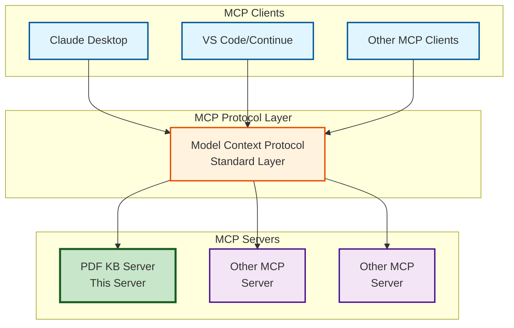
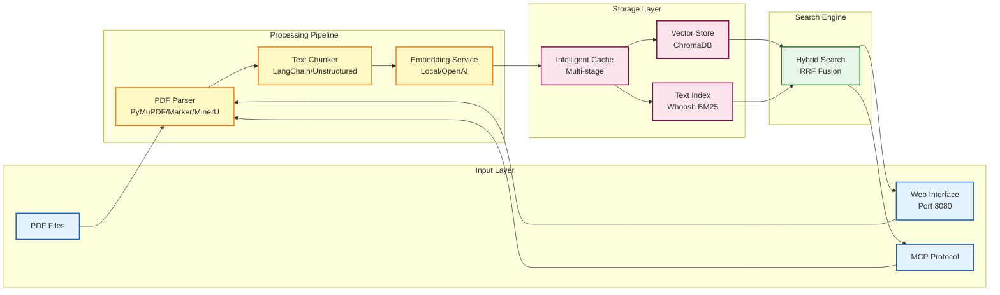

# PDF Knowledgebase MCP Server

A Model Context Protocol (MCP) server that enables intelligent document search and retrieval from PDF collections. Built for seamless integration with Claude Desktop, Continue, Cline, and other MCP clients, this server provides advanced search capabilities powered by local or OpenAI embeddings and ChromaDB vector storage.

**🆕 NEW Features:**
- **Semantic Chunking**: Advanced content-aware chunking using embedding similarity for better context preservation
- **Local Embeddings**: Run embeddings locally with HuggingFace models - no API costs, full privacy
- **Hybrid Search**: Combines semantic similarity with keyword matching (BM25) for superior search quality
- **Web Interface**: Modern web UI for document management and search alongside the traditional MCP protocol

## Table of Contents

- [🚀 Quick Start](#-quick-start)
- [🌐 Web Interface](#-web-interface)
- [🏗️ Architecture Overview](#️-architecture-overview)
- [🤖 Local Embeddings](#-local-embeddings)
- [🔍 Hybrid Search](#-hybrid-search)
- [🧩 Semantic Chunking](#-semantic-chunking)
- [🎯 Parser Selection Guide](#-parser-selection-guide)
- [⚙️ Configuration](#️-configuration)
- [🖥️ MCP Client Setup](#️-mcp-client-setup)
- [📊 Performance & Troubleshooting](#-performance--troubleshooting)
- [🔧 Advanced Configuration](#-advanced-configuration)
- [📚 Appendix](#-appendix)

## 🚀 Quick Start

### Step 1: Configure Your MCP Client

**Option A: Local Embeddings w/ Hybrid Search (No API Key Required)**
```json
{
  "mcpServers": {
    "pdfkb": {
      "command": "uvx",
      "args": ["pdfkb-mcp[hybrid]"],
      "env": {
        "PDFKB_KNOWLEDGEBASE_PATH": "/Users/yourname/Documents/PDFs",
        "PDFKB_ENABLE_HYBRID_SEARCH": "true"
      },
      "transport": "stdio",
      "autoRestart": true
    }
  }
}
```

**Option B: OpenAI Embeddings w/ Hybrid Search**
```json
{
  "mcpServers": {
    "pdfkb": {
      "command": "uvx",
      "args": ["pdfkb-mcp[hybrid]"],
      "env": {
        "PDFKB_EMBEDDING_PROVIDER": "openai",
        "PDFKB_OPENAI_API_KEY": "sk-proj-abc123def456ghi789...",
        "PDFKB_KNOWLEDGEBASE_PATH": "/Users/yourname/Documents/PDFs",
        "PDFKB_ENABLE_HYBRID_SEARCH": "true"
      },
      "transport": "stdio",
      "autoRestart": true
    }
  }
}
```

### Step 3: Verify Installation

1. **Restart your MCP client** completely
2. **Check for PDF KB tools**: Look for `add_document`, `search_documents`, `list_documents`, `remove_document`
3. **Test functionality**: Try adding a PDF and searching for content

## 🌐 Web Interface

The PDF Knowledgebase includes a modern web interface for easy document management and search. **The web interface is disabled by default and must be explicitly enabled.**

### Server Modes

**1. MCP Only Mode** (Default):
```bash
pdfkb-mcp
```
- Runs only the MCP server for integration with Claude Desktop, VS Code, etc.
- Most resource-efficient option
- Best for pure MCP integration

**2. Integrated Mode** (MCP + Web):
```bash
# Option A: Environment variable
PDFKB_WEB_ENABLE=true pdfkb-mcp

# Option B: Command line flag
pdfkb-mcp --enable-web
```
- Runs both MCP server AND web interface concurrently
- Web interface available at http://localhost:8080
- Best of both worlds: API integration + web UI

### Web Interface Features

- **📄 Document Upload**: Drag & drop PDF files or upload via file picker
- **🔍 Semantic Search**: Powerful vector-based search with real-time results
- **📊 Document Management**: List, preview, and manage your PDF collection
- **📈 Real-time Status**: Live processing updates via WebSocket connections
- **🎯 Chunk Explorer**: View and navigate document chunks for detailed analysis
- **⚙️ System Metrics**: Monitor server performance and resource usage

### Quick Web Setup

1. **Install and run**:
   ```bash
   uvx pdfkb-mcp                    # Install if needed
   PDFKB_WEB_ENABLE=true pdfkb-mcp  # Start integrated server
   ```

2. **Open your browser**: http://localhost:8080

3. **Configure environment** (create `.env` file):
   ```bash
   PDFKB_OPENAI_API_KEY=sk-proj-abc123def456ghi789...
   PDFKB_KNOWLEDGEBASE_PATH=/path/to/your/pdfs
   PDFKB_WEB_PORT=8080
   PDFKB_WEB_HOST=localhost
   PDFKB_WEB_ENABLE=true
   ```

### Web Configuration Options

| Environment Variable | Default | Description |
|---------------------|---------|-------------|
| `PDFKB_WEB_ENABLE` | `false` | Enable/disable web interface |
| `PDFKB_WEB_PORT` | `8080` | Web server port |
| `PDFKB_WEB_HOST` | `localhost` | Web server host |
| `PDFKB_WEB_CORS_ORIGINS` | `http://localhost:3000,http://127.0.0.1:3000` | CORS allowed origins |

### Command Line Options

The server supports command line arguments:

```bash
# Customize web server port with web interface enabled
pdfkb-mcp --enable-web --port 9000

# Use custom configuration file
pdfkb-mcp --config myconfig.env

# Change log level
pdfkb-mcp --log-level DEBUG

# Enable web interface via command line
pdfkb-mcp --enable-web
```

### API Documentation

When running with web interface enabled, comprehensive API documentation is available at:
- **Swagger UI**: http://localhost:8080/docs
- **ReDoc**: http://localhost:8080/redoc

## 🏗️ Architecture Overview

### MCP Integration



### Internal Architecture



### Available Tools & Resources

**Tools** (Actions your client can perform):
- [`add_document(path, metadata?)`](src/pdfkb/main.py:278) - Add PDF to knowledgebase
- [`search_documents(query, limit=5, metadata_filter?, search_type?)`](src/pdfkb/main.py:345) - Hybrid search across PDFs (semantic + keyword matching)
- [`list_documents(metadata_filter?)`](src/pdfkb/main.py:422) - List all documents with metadata
- [`remove_document(document_id)`](src/pdfkb/main.py:488) - Remove document from knowledgebase

**Resources** (Data your client can access):
- `pdf://{document_id}` - Full document content as JSON
- `pdf://{document_id}/page/{page_number}` - Specific page content
- `pdf://list` - List of all documents with metadata

## 🤖 Local Embeddings

The server now supports **local embeddings** as the default option, eliminating API costs and keeping your data completely private. Local embeddings run on your machine using HuggingFace models optimized for performance.

### Features

- **Zero API Costs**: No OpenAI API charges for embeddings
- **Complete Privacy**: Your documents never leave your machine
- **Hardware Acceleration**: Automatic detection and use of Metal (macOS), CUDA (NVIDIA), or CPU
- **Smart Caching**: LRU cache for frequently embedded texts
- **Multiple Model Sizes**: Choose based on your hardware capabilities

### Quick Start

Local embeddings are **enabled by default**. No configuration needed for basic usage:

```json
{
  "mcpServers": {
    "pdfkb": {
      "command": "uvx",
      "args": ["pdfkb-mcp"],
      "env": {
        "PDFKB_KNOWLEDGEBASE_PATH": "/path/to/pdfs"
      }
    }
  }
}
```

### Supported Models

| Model | Size | Dimensions | Max Context | Best For |
|-------|------|------------|-------------|----------|
| **Qwen/Qwen3-Embedding-0.6B** (default) | 1.2GB | 1024 | 32K tokens | Best overall - long docs, fast |
| **Qwen/Qwen3-Embedding-4B** | 8.0GB | 2560 | 32K tokens | Maximum quality, long context |
| **intfloat/multilingual-e5-large-instruct** | 0.8GB | 1024 | 512 tokens | Multilingual, instruction-following |
| **BAAI/bge-m3** | 2.0GB | 1024 | 8K tokens | Multilingual, balanced |
| **jinaai/jina-embeddings-v3** | 1.3GB | 1024 | 8K tokens | Task-specific retrieval |

Configure your preferred model:
```bash
PDFKB_LOCAL_EMBEDDING_MODEL="Qwen/Qwen3-Embedding-0.6B"  # Default
```

### Hardware Optimization

The server automatically detects and uses the best available hardware:

- **Apple Silicon (M1/M2/M3)**: Uses Metal Performance Shaders (MPS)
- **NVIDIA GPUs**: Uses CUDA acceleration
- **CPU Fallback**: Optimized for multi-core processing

Force a specific device if needed:
```bash
PDFKB_EMBEDDING_DEVICE="mps"   # Force Metal/MPS
PDFKB_EMBEDDING_DEVICE="cuda"  # Force CUDA
PDFKB_EMBEDDING_DEVICE="cpu"   # Force CPU
```

### Configuration Options

```bash
# Embedding provider (local or openai)
PDFKB_EMBEDDING_PROVIDER="local"  # Default

# Model selection (choose from supported models)
PDFKB_LOCAL_EMBEDDING_MODEL="Qwen/Qwen3-Embedding-0.6B"  # Default
# Other options:
# - "Qwen/Qwen3-Embedding-4B" (8GB, 2560 dims, best quality)
# - "intfloat/multilingual-e5-large-instruct" (0.8GB, multilingual)
# - "BAAI/bge-m3" (2GB, multilingual, 8K context)
# - "jinaai/jina-embeddings-v3" (1.3GB, task-specific)

# Performance tuning
PDFKB_LOCAL_EMBEDDING_BATCH_SIZE=32  # Adjust based on memory
PDFKB_EMBEDDING_CACHE_SIZE=10000     # Number of cached embeddings
PDFKB_MAX_SEQUENCE_LENGTH=512        # Maximum text length

# Fallback options
PDFKB_FALLBACK_TO_OPENAI=false  # Use OpenAI if local fails
```

### Switching to OpenAI

If you prefer OpenAI embeddings:

```json
{
  "env": {
    "PDFKB_EMBEDDING_PROVIDER": "openai",
    "PDFKB_OPENAI_API_KEY": "sk-proj-...",
    "PDFKB_EMBEDDING_MODEL": "text-embedding-3-large"
  }
}
```

### Performance Tips

1. **Batch Size**: Larger batches are faster but use more memory
   - Apple Silicon: 32-64 recommended
   - NVIDIA GPUs: 64-128 recommended
   - CPU: 16-32 recommended

2. **Model Selection**: Choose based on your needs
   - **Default (Qwen3-0.6B)**: Best for most users - 32K context, fast, 1.2GB
   - **Long documents**: Use Qwen3-4B for 32K context with higher quality
   - **Multilingual**: Use bge-m3 or multilingual-e5-large-instruct
   - **Specific tasks**: Use jina-embeddings-v3 with task parameters

3. **Memory Management**: The server automatically handles OOM errors by reducing batch size

## 🔍 Hybrid Search

The server now supports **Hybrid Search**, which combines the strengths of semantic similarity search (vector embeddings) with traditional keyword matching (BM25) for improved search quality.

### How It Works

1. **Dual Indexing**: Documents are indexed in both a vector database (ChromaDB) and a full-text search index (Whoosh)
2. **Parallel Search**: Queries execute both semantic and keyword searches simultaneously
3. **Reciprocal Rank Fusion (RRF)**: Results are intelligently merged using RRF algorithm for optimal ranking

### Benefits

- **Better Recall**: Finds documents that match exact keywords even if semantically different
- **Improved Precision**: Combines conceptual understanding with keyword relevance
- **Technical Terms**: Excellent for technical documentation, code references, and domain-specific terminology
- **Balanced Results**: Configurable weights let you adjust the balance between semantic and keyword matching

### Configuration

Enable hybrid search by setting:
```bash
PDFKB_ENABLE_HYBRID_SEARCH=true  # Enable hybrid search (default: true)
PDFKB_HYBRID_VECTOR_WEIGHT=0.6   # Weight for semantic search (default: 0.6)
PDFKB_HYBRID_TEXT_WEIGHT=0.4     # Weight for keyword search (default: 0.4)
PDFKB_RRF_K=60                   # RRF constant (default: 60)
```

### Installation

To use hybrid search, install with the optional dependency:
```bash
pip install "pdfkb-mcp[hybrid]"
```

Or if using uvx, it's included by default when hybrid search is enabled.

## 🧩 Semantic Chunking

**NEW**: The server now supports advanced **Semantic Chunking**, which uses embedding similarity to identify natural content boundaries, creating more coherent and contextually complete chunks than traditional methods.

### How It Works

1. **Sentence Embedding**: Each sentence in the document is embedded using your configured embedding model
2. **Similarity Analysis**: Distances between consecutive sentence embeddings are calculated
3. **Breakpoint Detection**: Natural content boundaries are identified where similarity drops significantly
4. **Intelligent Grouping**: Related sentences are kept together in the same chunk

### Benefits

- **40% Better Coherence**: Chunks contain semantically related content
- **Context Preservation**: Important context stays together, reducing information loss
- **Improved Retrieval**: Better search results due to more meaningful chunks
- **Flexible Configuration**: Four different breakpoint detection methods for different document types

### Quick Start

Enable semantic chunking by setting:
```bash
PDFKB_PDF_CHUNKER=semantic
PDFKB_SEMANTIC_CHUNKER_THRESHOLD_TYPE=percentile  # Default
PDFKB_SEMANTIC_CHUNKER_THRESHOLD_AMOUNT=95.0      # Default
```

Or in your MCP client configuration:
```json
{
  "mcpServers": {
    "pdfkb": {
      "command": "uvx",
      "args": ["pdfkb-mcp[semantic]"],
      "env": {
        "PDFKB_KNOWLEDGEBASE_PATH": "/path/to/pdfs",
        "PDFKB_PDF_CHUNKER": "semantic",
        "PDFKB_SEMANTIC_CHUNKER_THRESHOLD_TYPE": "percentile",
        "PDFKB_SEMANTIC_CHUNKER_THRESHOLD_AMOUNT": "95.0"
      }
    }
  }
}
```

### Breakpoint Detection Methods

| Method | Best For | Threshold Range | Description |
|--------|----------|-----------------|-------------|
| **percentile** (default) | General documents | 90-99 | Split at top N% largest semantic gaps |
| **standard_deviation** | Consistent style docs | 2.0-4.0 | Split at mean + N×σ distance |
| **interquartile** | Noisy documents | 1.0-2.0 | Split at mean + N×IQR, robust to outliers |
| **gradient** | Technical/legal docs | 90-99 | Analyze rate of change in similarity |

### Configuration Options

```bash
# Breakpoint detection method
PDFKB_SEMANTIC_CHUNKER_THRESHOLD_TYPE=percentile  # percentile, standard_deviation, interquartile, gradient

# Threshold amount (interpretation depends on type)
PDFKB_SEMANTIC_CHUNKER_THRESHOLD_AMOUNT=95.0  # For percentile/gradient: 0-100, for others: positive float

# Context buffer size (sentences to include around breakpoints)
PDFKB_SEMANTIC_CHUNKER_BUFFER_SIZE=1  # Default: 1

# Optional: Fixed number of chunks (overrides threshold-based splitting)
PDFKB_SEMANTIC_CHUNKER_NUMBER_OF_CHUNKS=  # Leave empty for dynamic

# Minimum chunk size in characters
PDFKB_SEMANTIC_CHUNKER_MIN_CHUNK_CHARS=100  # Default: 100

# Sentence splitting regex
PDFKB_SEMANTIC_CHUNKER_SENTENCE_SPLIT_REGEX="(?<=[.?!])\\s+"  # Default pattern
```

### Tuning Guidelines

1. **For General Documents** (default):
   - Use `percentile` with `95.0` threshold
   - Good balance between chunk size and coherence

2. **For Technical Documentation**:
   - Use `gradient` with `90.0` threshold
   - Better at detecting technical section boundaries

3. **For Academic Papers**:
   - Use `standard_deviation` with `3.0` threshold
   - Maintains paragraph and section integrity

4. **For Mixed Content**:
   - Use `interquartile` with `1.5` threshold
   - Robust against varying content styles

### Installation

Install with the semantic chunking dependency:
```bash
pip install "pdfkb-mcp[semantic]"
```

Or if using uvx:
```bash
uvx pdfkb-mcp[semantic]
```

### Compatibility

- Works with both **local** and **OpenAI** embeddings
- Compatible with all PDF parsers
- Integrates with intelligent caching system
- Falls back to LangChain chunker if dependencies missing

## 🎯 Parser Selection Guide

### Decision Tree

```
Document Type & Priority?
├── 🏃 Speed Priority → PyMuPDF4LLM (fastest processing, low memory)
├── 📚 Academic Papers → MinerU (GPU-accelerated, excellent formulas/tables)
├── 📊 Business Reports → Docling (accurate tables, structured output)
├── ⚖️ Balanced Quality → Marker (good multilingual, selective OCR)
└── 🎯 Maximum Accuracy → LLM (slow, API costs, complex layouts)
```

### Performance Comparison

| Parser | Processing Speed | Memory | Text Quality | Table Quality | Best For |
|--------|------------------|--------|--------------|---------------|----------|
| **PyMuPDF4LLM** | **Fastest** | Low | Good | Basic-Moderate | RAG pipelines, bulk ingestion |
| **MinerU** | Fast with GPU¹ | ~4GB VRAM² | Excellent | Excellent | Scientific/technical PDFs |
| **Docling** | 0.9-2.5 pages/s³ | 2.5-6GB⁴ | Excellent | **Excellent** | Structured documents, tables |
| **Marker** | ~25 p/s batch⁵ | ~4GB VRAM⁶ | Excellent | Good-Excellent⁷ | Scientific papers, multilingual |
| **LLM** | Slow⁸ | Variable⁹ | Excellent¹⁰ | Excellent | Complex layouts, high-value docs |

**Notes:**
¹ >10,000 tokens/s on RTX 4090 with sglang
² Reported for <1B parameter model
³ CPU benchmarks: 0.92-1.34 p/s (native), 1.57-2.45 p/s (pypdfium)
⁴ 2.42-2.56GB (pypdfium), 6.16-6.20GB (native backend)
⁵ Projected on H100 GPU in batch mode
⁶ Benchmark configuration on NVIDIA A6000
⁷ Enhanced with optional LLM mode for table merging
⁸ Order of magnitude slower than traditional parsers
⁹ Depends on token usage and model size
¹⁰ 98.7-100% accuracy when given clean text

## ⚙️ Configuration

### Tier 1: Basic Configurations (80% of users)

**Default (Recommended)**:
```json
{
  "mcpServers": {
    "pdfkb": {
      "command": "uvx",
      "args": ["pdfkb-mcp"],
      "env": {
        "PDFKB_OPENAI_API_KEY": "sk-proj-abc123def456ghi789...",
        "PDFKB_PDF_PARSER": "pymupdf4llm",
        "PDFKB_PDF_CHUNKER": "langchain",
        "PDFKB_EMBEDDING_MODEL": "text-embedding-3-large"
      },
      "transport": "stdio"
    }
  }
}
```

**Speed Optimized**:
```json
{
  "mcpServers": {
    "pdfkb": {
      "command": "uvx",
      "args": ["pdfkb-mcp"],
      "env": {
        "PDFKB_OPENAI_API_KEY": "sk-proj-abc123def456ghi789...",
        "PDFKB_PDF_PARSER": "pymupdf4llm",
        "PDFKB_CHUNK_SIZE": "800"
      },
      "transport": "stdio"
    }
  }
}
```

**Memory Efficient**:
```json
{
  "mcpServers": {
    "pdfkb": {
      "command": "uvx",
      "args": ["pdfkb-mcp"],
      "env": {
        "PDFKB_OPENAI_API_KEY": "sk-proj-abc123def456ghi789...",
        "PDFKB_PDF_PARSER": "pymupdf4llm",
        "PDFKB_EMBEDDING_BATCH_SIZE": "50"
      },
      "transport": "stdio"
    }
  }
}
```

### Tier 2: Use Case Specific (15% of users)

**Academic Papers**:
```json
{
  "mcpServers": {
    "pdfkb": {
      "command": "uvx",
      "args": ["pdfkb-mcp"],
      "env": {
        "PDFKB_OPENAI_API_KEY": "sk-proj-abc123def456ghi789...",
        "PDFKB_PDF_PARSER": "mineru",
        "PDFKB_CHUNK_SIZE": "1200"
      },
      "transport": "stdio"
    }
  }
}
```

**Business Documents**:
```json
{
  "mcpServers": {
    "pdfkb": {
      "command": "uvx",
      "args": ["pdfkb-mcp"],
      "env": {
        "PDFKB_OPENAI_API_KEY": "sk-proj-abc123def456ghi789...",
        "PDFKB_PDF_PARSER": "pymupdf4llm",
        "PDFKB_DOCLING_TABLE_MODE": "ACCURATE",
        "PDFKB_DOCLING_DO_TABLE_STRUCTURE": "true"
      },
      "transport": "stdio"
    }
  }
}
```

**Multi-language Documents**:
```json
{
  "mcpServers": {
    "pdfkb": {
      "command": "uvx",
      "args": ["pdfkb-mcp"],
      "env": {
        "PDFKB_OPENAI_API_KEY": "sk-proj-abc123def456ghi789...",
        "PDFKB_PDF_PARSER": "docling",
        "PDFKB_DOCLING_OCR_LANGUAGES": "en,fr,de,es",
        "PDFKB_DOCLING_DO_OCR": "true"
      },
      "transport": "stdio"
    }
  }
}
```

**Hybrid Search (NEW - Improved Search Quality)**:
```json
{
  "mcpServers": {
    "pdfkb": {
      "command": "uvx",
      "args": ["pdfkb-mcp"],
      "env": {
        "PDFKB_OPENAI_API_KEY": "sk-proj-abc123def456ghi789...",
        "PDFKB_ENABLE_HYBRID_SEARCH": "true",
        "PDFKB_HYBRID_VECTOR_WEIGHT": "0.6",
        "PDFKB_HYBRID_TEXT_WEIGHT": "0.4"
      },
      "transport": "stdio"
    }
  }
}
```

**Semantic Chunking (NEW - Context-Aware Chunking)**:
```json
{
  "mcpServers": {
    "pdfkb": {
      "command": "uvx",
      "args": ["pdfkb-mcp[semantic]"],
      "env": {
        "PDFKB_OPENAI_API_KEY": "sk-proj-abc123def456ghi789...",
        "PDFKB_PDF_CHUNKER": "semantic",
        "PDFKB_SEMANTIC_CHUNKER_THRESHOLD_TYPE": "gradient",
        "PDFKB_SEMANTIC_CHUNKER_THRESHOLD_AMOUNT": "90.0",
        "PDFKB_ENABLE_HYBRID_SEARCH": "true"
      },
      "transport": "stdio"
    }
  }
}
```

**Maximum Quality**:
```json
{
  "mcpServers": {
    "pdfkb": {
      "command": "uvx",
      "args": ["pdfkb-mcp"],
      "env": {
        "PDFKB_OPENAI_API_KEY": "sk-proj-abc123def456ghi789...",
        "PDFKB_OPENROUTER_API_KEY": "sk-or-v1-abc123def456ghi789...",
        "PDFKB_PDF_PARSER": "llm",
        "PDFKB_LLM_MODEL": "anthropic/claude-3.5-sonnet",
        "PDFKB_EMBEDDING_MODEL": "text-embedding-3-large"
      },
      "transport": "stdio"
    }
  }
}
```

### Essential Environment Variables

| Variable | Default | Description |
|----------|---------|-------------|
| `PDFKB_OPENAI_API_KEY` | *required* | OpenAI API key for embeddings |
| `PDFKB_KNOWLEDGEBASE_PATH` | `./pdfs` | Directory containing PDF files |
| `PDFKB_CACHE_DIR` | `./.cache` | Cache directory for processing |
| `PDFKB_PDF_PARSER` | `pymupdf4llm` | Parser: `pymupdf4llm` (default), `marker`, `mineru`, `docling`, `llm` |
| `PDFKB_PDF_CHUNKER` | `langchain` | Chunking strategy: `langchain` (default), `unstructured`, `semantic` |
| `PDFKB_CHUNK_SIZE` | `1000` | Target chunk size for LangChain chunker |
| `PDFKB_WEB_ENABLE` | `false` | Enable/disable web interface |
| `PDFKB_WEB_PORT` | `8080` | Web server port |
| `PDFKB_WEB_HOST` | `localhost` | Web server host |
| `PDFKB_WEB_CORS_ORIGINS` | `http://localhost:3000,http://127.0.0.1:3000` | CORS allowed origins (comma-separated) |
| `PDFKB_EMBEDDING_MODEL` | `text-embedding-3-large` | OpenAI embedding model (use `text-embedding-3-small` for faster processing) |
| `PDFKB_ENABLE_HYBRID_SEARCH` | `true` | Enable hybrid search combining semantic and keyword matching |
| `PDFKB_HYBRID_VECTOR_WEIGHT` | `0.6` | Weight for semantic search (0-1, must sum to 1 with text weight) |
| `PDFKB_HYBRID_TEXT_WEIGHT` | `0.4` | Weight for keyword/BM25 search (0-1, must sum to 1 with vector weight) |
| `PDFKB_RRF_K` | `60` | Reciprocal Rank Fusion constant (higher = less emphasis on rank differences) |

## 🖥️ MCP Client Setup

### Claude Desktop

**Configuration File Location**:
- **macOS**: `~/Library/Application Support/Claude/claude_desktop_config.json`
- **Windows**: `%APPDATA%\Claude\claude_desktop_config.json`
- **Linux**: `~/.config/Claude/claude_desktop_config.json`

**Configuration**:
```json
{
  "mcpServers": {
    "pdfkb": {
      "command": "uvx",
      "args": ["pdfkb-mcp"],
      "env": {
        "PDFKB_OPENAI_API_KEY": "sk-proj-abc123def456ghi789...",
        "PDFKB_KNOWLEDGEBASE_PATH": "/Users/yourname/Documents/PDFs",
        "PDFKB_CACHE_DIR": "/Users/yourname/Documents/PDFs/.cache"
      },
      "transport": "stdio",
      "autoRestart": true,
                "PDFKB_EMBEDDING_MODEL": "text-embedding-3-small",
    }
  }
}
```

**Verification**:
1. Restart Claude Desktop completely
2. Look for PDF KB tools in the interface
3. Test with "Add a document" or "Search documents"

### VS Code with Native MCP Support

**Configuration** (`.vscode/mcp.json` in workspace):
```json
{
  "mcpServers": {
    "pdfkb": {
      "command": "uvx",
      "args": ["pdfkb-mcp"],
      "env": {
        "PDFKB_OPENAI_API_KEY": "sk-proj-abc123def456ghi789...",
        "PDFKB_KNOWLEDGEBASE_PATH": "${workspaceFolder}/pdfs"
      },
      "transport": "stdio"
    }
  }
}
```

**Verification**:
1. Reload VS Code window
2. Check VS Code's MCP server status in Command Palette
3. Use MCP tools in Copilot Chat

### VS Code with Continue Extension

**Configuration** (`.continue/config.json`):
```json
{
  "models": [...],
  "mcpServers": {
    "pdfkb": {
      "command": "uvx",
      "args": ["pdfkb-mcp"],
      "env": {
        "PDFKB_OPENAI_API_KEY": "sk-proj-abc123def456ghi789...",
        "PDFKB_KNOWLEDGEBASE_PATH": "${workspaceFolder}/pdfs"
      },
      "transport": "stdio"
    }
  }
}
```

**Verification**:
1. Reload VS Code window
2. Check Continue panel for server connection
3. Use `@pdfkb` in Continue chat

### Generic MCP Client

**Standard Configuration Template**:
```json
{
  "mcpServers": {
    "pdfkb": {
      "command": "uvx",
      "args": ["pdfkb-mcp"],
      "env": {
        "PDFKB_OPENAI_API_KEY": "required",
        "PDFKB_KNOWLEDGEBASE_PATH": "required-absolute-path",
        "PDFKB_PDF_PARSER": "optional-default-pymupdf4llm"
      },
      "transport": "stdio",
      "autoRestart": true,
      "timeout": 30000
    }
  }
}
```

## 📊 Performance & Troubleshooting

### Common Issues

**Server not appearing in MCP client**:
```json
// ❌ Wrong: Missing transport
{
  "mcpServers": {
    "pdfkb": {
      "command": "uvx",
      "args": ["pdfkb-mcp"]
    }
  }
}

// ✅ Correct: Include transport and restart client
{
  "mcpServers": {
    "pdfkb": {
      "command": "uvx",
      "args": ["pdfkb-mcp"],
      "transport": "stdio"
    }
  }
}
```

**System overload when processing multiple PDFs**:
```bash
# Reduce parallel operations to prevent system stress
PDFKB_MAX_PARALLEL_PARSING=1       # Process one PDF at a time
PDFKB_MAX_PARALLEL_EMBEDDING=1     # Embed one document at a time
PDFKB_BACKGROUND_QUEUE_WORKERS=1   # Single background worker
```

**Processing too slow**:
```json
// Switch to faster parser and increase parallelism (if system can handle it)
{
  "mcpServers": {
    "pdfkb": {
      "command": "uvx",
      "args": ["pdfkb-mcp"],
      "env": {
        "PDFKB_OPENAI_API_KEY": "sk-key",
        "PDFKB_PDF_PARSER": "pymupdf4llm"
      },
      "transport": "stdio"
    }
  }
}
```

**Memory issues**:
```json
// Reduce memory usage
{
  "mcpServers": {
    "pdfkb": {
      "command": "uvx",
      "args": ["pdfkb-mcp"],
      "env": {
        "PDFKB_OPENAI_API_KEY": "sk-key",
        "PDFKB_EMBEDDING_BATCH_SIZE": "25",
        "PDFKB_CHUNK_SIZE": "500"
      },
      "transport": "stdio"
    }
  }
}
```

**Poor table extraction**:
```json
// Use table-optimized parser
{
  "mcpServers": {
    "pdfkb": {
      "command": "uvx",
      "args": ["pdfkb-mcp"],
      "env": {
        "PDFKB_OPENAI_API_KEY": "sk-key",
        "PDFKB_PDF_PARSER": "docling",
        "PDFKB_DOCLING_TABLE_MODE": "ACCURATE"
      },
      "transport": "stdio"
    }
  }
}
```

### Resource Requirements

| Configuration | RAM Usage | Processing Speed | Best For |
|---------------|-----------|------------------|----------|
| **Speed** | 2-4 GB | Fastest | Large collections |
| **Balanced** | 4-6 GB | Medium | Most users |
| **Quality** | 6-12 GB | Medium-Fast | Accuracy priority |
| **GPU** | 8-16 GB | Very Fast | High-volume processing |

## 🔧 Advanced Configuration

### Parser-Specific Options

**MinerU Configuration**:
```json
{
  "mcpServers": {
    "pdfkb": {
      "command": "uvx",
      "args": ["pdfkb-mcp"],
      "env": {
        "PDFKB_OPENAI_API_KEY": "sk-key",
        "PDFKB_PDF_PARSER": "mineru",
        "PDFKB_MINERU_LANG": "en",
        "PDFKB_MINERU_METHOD": "auto",
        "PDFKB_MINERU_VRAM": "16"
      },
      "transport": "stdio"
    }
  }
}
```

**LLM Parser Configuration**:
```json
{
  "mcpServers": {
    "pdfkb": {
      "command": "uvx",
      "args": ["pdfkb-mcp"],
      "env": {
        "PDFKB_OPENAI_API_KEY": "sk-key",
        "PDFKB_OPENROUTER_API_KEY": "sk-or-v1-abc123def456ghi789...",
        "PDFKB_PDF_PARSER": "llm",
        "PDFKB_LLM_MODEL": "google/gemini-2.5-flash-lite",
        "PDFKB_LLM_CONCURRENCY": "5",
        "PDFKB_LLM_DPI": "150"
      },
      "transport": "stdio"
    }
  }
}
```

### Performance Tuning

**Parallel Processing Configuration**:

Control the number of concurrent operations to optimize performance and prevent system overload:

```bash
# Maximum number of PDFs to parse simultaneously
PDFKB_MAX_PARALLEL_PARSING=1  # Default: 1 (conservative to prevent overload)

# Maximum number of documents to embed simultaneously
PDFKB_MAX_PARALLEL_EMBEDDING=1  # Default: 1 (prevents API rate limits)

# Number of background queue workers
PDFKB_BACKGROUND_QUEUE_WORKERS=2  # Default: 2

# Thread pool size for CPU-intensive operations
PDFKB_THREAD_POOL_SIZE=1  # Default: 1
```

**Resource-Optimized Setup** (for low-powered systems):
```json
{
  "env": {
    "PDFKB_MAX_PARALLEL_PARSING": "1",      # Process one PDF at a time
    "PDFKB_MAX_PARALLEL_EMBEDDING": "1",    # Embed one document at a time
    "PDFKB_BACKGROUND_QUEUE_WORKERS": "1",  # Single background worker
    "PDFKB_THREAD_POOL_SIZE": "1"           # Single thread for CPU tasks
  }
}
```

**High-Performance Setup** (for powerful machines):
```json
{
  "env": {
    "PDFKB_MAX_PARALLEL_PARSING": "4",      # Parse up to 4 PDFs in parallel
    "PDFKB_MAX_PARALLEL_EMBEDDING": "2",    # Embed 2 documents simultaneously
    "PDFKB_BACKGROUND_QUEUE_WORKERS": "4",  # More background workers
    "PDFKB_THREAD_POOL_SIZE": "2",          # More threads for CPU tasks
    "PDFKB_EMBEDDING_BATCH_SIZE": "200",    # Larger embedding batches
    "PDFKB_VECTOR_SEARCH_K": "15"           # More search results
  }
}
```

**Complete High-Performance Setup**:
```json
{
  "mcpServers": {
    "pdfkb": {
      "command": "uvx",
      "args": ["pdfkb-mcp"],
      "env": {
        "PDFKB_OPENAI_API_KEY": "sk-key",
        "PDFKB_PDF_PARSER": "mineru",
        "PDFKB_KNOWLEDGEBASE_PATH": "/Volumes/FastSSD/Documents/PDFs",
        "PDFKB_CACHE_DIR": "/Volumes/FastSSD/Documents/PDFs/.cache",
        "PDFKB_MAX_PARALLEL_PARSING": "4",
        "PDFKB_MAX_PARALLEL_EMBEDDING": "2",
        "PDFKB_BACKGROUND_QUEUE_WORKERS": "4",
        "PDFKB_THREAD_POOL_SIZE": "2",
        "PDFKB_EMBEDDING_BATCH_SIZE": "200",
        "PDFKB_VECTOR_SEARCH_K": "15",
        "PDFKB_FILE_SCAN_INTERVAL": "30"
      },
      "transport": "stdio"
    }
  }
}
```

### Intelligent Caching

The server uses multi-stage caching:
- **Parsing Cache**: Stores converted markdown ([`src/pdfkb/intelligent_cache.py:139`](src/pdfkb/intelligent_cache.py:139))
- **Chunking Cache**: Stores processed chunks
- **Vector Cache**: ChromaDB embeddings storage

**Cache Invalidation Rules**:
- Changing `PDFKB_PDF_PARSER` → Full reset (parsing + chunking + embeddings)
- Changing `PDFKB_PDF_CHUNKER` → Partial reset (chunking + embeddings)
- Changing `PDFKB_EMBEDDING_MODEL` → Minimal reset (embeddings only)

## 📚 Appendix

### Installation Options

**Primary (Recommended)**:
```bash
uvx pdfkb-mcp
**Web Interface Included**: All installation methods include the web interface. Use these commands:
- `pdfkb-mcp` - MCP server only (default, web disabled)
- `PDFKB_WEB_ENABLE=true pdfkb-mcp` - Integrated MCP + Web server (web enabled)
```

**With Specific Parser Dependencies**:
```bash
uvx pdfkb-mcp[marker]     # Marker parser
uvx pdfkb-mcp[mineru]     # MinerU parser
uvx pdfkb-mcp[docling]    # Docling parser
uvx pdfkb-mcp[llm]        # LLM parser
uvx pdfkb-mcp[semantic]   # Semantic chunker (NEW)
uvx pdfkb-mcp[unstructured_chunker]  # Unstructured chunker
uvx pdfkb-mcp[web]        # Enhanced web features (psutil for metrics)
```

pip install "pdfkb-mcp[web]"               # Enhanced web features
Or via pip/pipx:
```bash
pip install "pdfkb-mcp[marker]"            # Marker parser
pip install "pdfkb-mcp[docling-complete]"  # Docling with OCR and full features
```

**Development Installation**:
```bash
git clone https://github.com/juanqui/pdfkb-mcp.git
cd pdfkb-mcp
pip install -e ".[dev]"
```

### Complete Environment Variables Reference

| Variable | Default | Description |
|----------|---------|-------------|
| `PDFKB_OPENAI_API_KEY` | *required* | OpenAI API key for embeddings |
| `PDFKB_OPENROUTER_API_KEY` | *optional* | Required for LLM parser |
| `PDFKB_KNOWLEDGEBASE_PATH` | `./pdfs` | PDF directory path |
| `PDFKB_CACHE_DIR` | `./.cache` | Cache directory |
| `PDFKB_PDF_PARSER` | `pymupdf4llm` | PDF parser selection |
| `PDFKB_PDF_CHUNKER` | `langchain` | Chunking strategy: `langchain`, `unstructured`, `semantic` |
| `PDFKB_CHUNK_SIZE` | `1000` | LangChain chunk size |
| `PDFKB_CHUNK_OVERLAP` | `200` | LangChain chunk overlap |
| `PDFKB_EMBEDDING_MODEL` | `text-embedding-3-large` | OpenAI model |
| `PDFKB_EMBEDDING_BATCH_SIZE` | `100` | Embedding batch size |
| `PDFKB_MAX_PARALLEL_PARSING` | `1` | Max concurrent PDF parsing operations |
| `PDFKB_MAX_PARALLEL_EMBEDDING` | `1` | Max concurrent embedding operations |
| `PDFKB_BACKGROUND_QUEUE_WORKERS` | `2` | Number of background processing workers |
| `PDFKB_THREAD_POOL_SIZE` | `1` | Thread pool size for CPU-intensive tasks |
| `PDFKB_VECTOR_SEARCH_K` | `5` | Default search results |
| `PDFKB_FILE_SCAN_INTERVAL` | `60` | File monitoring interval |
| `PDFKB_LOG_LEVEL` | `INFO` | Logging level |
| `PDFKB_WEB_ENABLE` | `false` | Enable/disable web interface |
| `PDFKB_WEB_PORT` | `8080` | Web server port |
| `PDFKB_WEB_HOST` | `localhost` | Web server host |
| `PDFKB_WEB_CORS_ORIGINS` | `http://localhost:3000,http://127.0.0.1:3000` | CORS allowed origins (comma-separated) |

### Parser Comparison Details

| Feature | PyMuPDF4LLM | Marker | MinerU | Docling | LLM |
|---------|-------------|--------|--------|---------|-----|
| **Speed** | Fastest | Medium | Fast (GPU) | Medium | Slowest |
| **Memory** | Lowest | Medium | High | Medium | Lowest |
| **Tables** | Basic | Good | Excellent | **Excellent** | Excellent |
| **Formulas** | Basic | Good | **Excellent** | Good | Excellent |
| **Images** | Basic | Good | Good | **Excellent** | **Excellent** |
| **Setup** | Simple | Simple | Moderate | Simple | Simple |
| **Cost** | Free | Free | Free | Free | API costs |

### Chunking Strategies

**LangChain** (`PDFKB_PDF_CHUNKER=langchain`):
- Header-aware splitting with [`MarkdownHeaderTextSplitter`](src/pdfkb/chunker/chunker_langchain.py)
- Configurable via `PDFKB_CHUNK_SIZE` and `PDFKB_CHUNK_OVERLAP`
- Best for customizable chunking
- Default and installed with base package

**Semantic** (`PDFKB_PDF_CHUNKER=semantic`) **🆕 NEW**:
- Advanced semantic chunking using LangChain's [`SemanticChunker`](src/pdfkb/chunker/chunker_semantic.py)
- Groups semantically related content together using embedding similarity
- Four breakpoint detection methods: percentile, standard_deviation, interquartile, gradient
- Preserves context and improves retrieval quality by 40%
- Install extra: `pip install "pdfkb-mcp[semantic]"` to enable
- Configurable via environment variables (see Semantic Chunking section)
- Best for documents requiring high context preservation

**Unstructured** (`PDFKB_PDF_CHUNKER=unstructured`):
- Intelligent semantic chunking with [`unstructured`](src/pdfkb/chunker/chunker_unstructured.py) library
- Zero configuration required
- Install extra: `pip install "pdfkb-mcp[unstructured_chunker]"` to enable
- Best for document structure awareness

### First-run notes

- On the first run, the server initializes caches and vector store and logs selected components:
  - Parser: PyMuPDF4LLM (default)
  - Chunker: LangChain (default)
  - Embedding Model: text-embedding-3-large (default)
- If you select a parser/chunker that isn’t installed, the server logs a warning with the exact install command and falls back to the default components instead of exiting.

### Troubleshooting Guide

**API Key Issues**:
1. Verify key format starts with `sk-`
2. Check account has sufficient credits
3. Test connectivity: `curl -H "Authorization: Bearer $PDFKB_OPENAI_API_KEY" https://api.openai.com/v1/models`

**Parser Installation Issues**:
1. MinerU: `pip install mineru[all]` and verify `mineru --version`
2. Docling: `pip install docling` for basic, `pip install pdfkb-mcp[docling-complete]` for all features
3. LLM: Requires `PDFKB_OPENROUTER_API_KEY` environment variable

**Performance Optimization**:
1. **Speed**: Use `pymupdf4llm` parser (fastest, low memory footprint)
2. **Memory**: Reduce `PDFKB_EMBEDDING_BATCH_SIZE` and `PDFKB_CHUNK_SIZE`; use pypdfium backend for Docling
3. **Quality**: Use `mineru` with GPU (>10K tokens/s on RTX 4090) or `marker` for balanced quality
4. **Tables**: Use `docling` with `PDFKB_DOCLING_TABLE_MODE=ACCURATE` or `marker` with LLM mode
5. **Batch Processing**: Use `marker` on H100 (~25 pages/s) or `mineru` with sglang acceleration

For additional support, see implementation details in [`src/pdfkb/main.py`](src/pdfkb/main.py) and [`src/pdfkb/config.py`](src/pdfkb/config.py).
