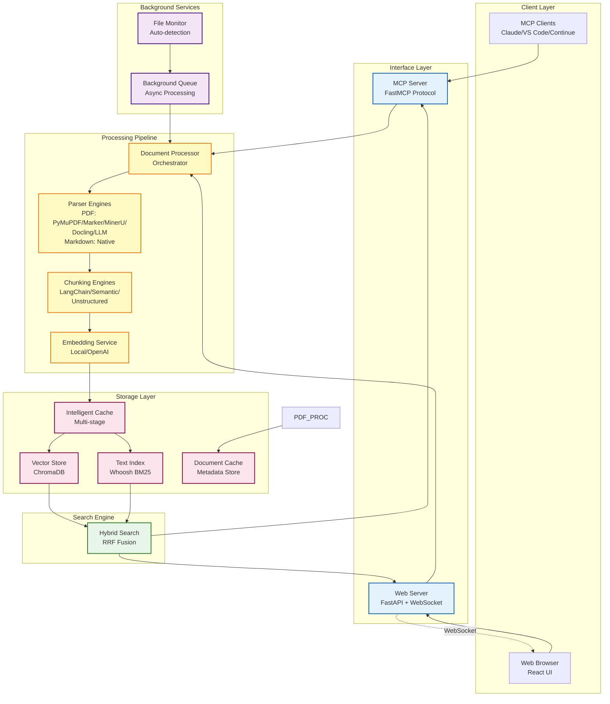
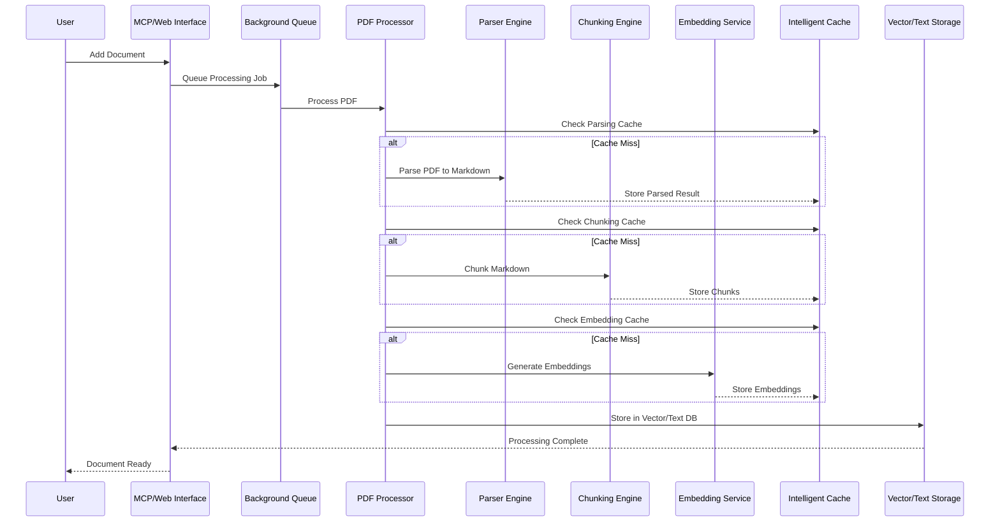

# Document Knowledgebase MCP Server - System Design

## Executive Summary

Document Knowledgebase MCP Server is a sophisticated document processing and retrieval system supporting both PDF and Markdown formats that implements the Model Context Protocol (MCP) for seamless integration with AI assistants like Claude Desktop. The system provides intelligent PDF processing, multiple embedding strategies, hybrid search capabilities, and both MCP protocol and web interfaces for maximum flexibility.

## Architecture Overview

### System Components



## Core Components

### 1. MCP Server Implementation

**Location**: `src/pdfkb/main.py`

The MCP server is built using FastMCP and provides the following tools:
- `add_document`: Add documents (PDFs or Markdown) to the knowledgebase with optional metadata
- `search_documents`: Hybrid search combining semantic and keyword matching
- `list_documents`: List all documents with filtering capabilities
- `remove_document`: Remove documents from the knowledgebase

**Key Features**:
- Asynchronous processing with background queue
- Intelligent configuration change detection
- Multi-stage cache management
- File monitoring for auto-processing

### 2. Web Interface

**Location**: `src/pdfkb/web/`

A modern FastAPI-based web server providing:
- RESTful API endpoints for document management
- WebSocket support for real-time updates
- File upload and drag-and-drop functionality
- Interactive search with suggestions
- System metrics and monitoring

**Architecture**:
- **Server**: `web/server.py` - FastAPI application setup
- **Services**: `web/services/` - Business logic layer
  - `web_document_service.py`: Document operations
  - `web_search_service.py`: Search functionality
  - `web_status_service.py`: System monitoring
  - `websocket_manager.py`: Real-time communication
- **Models**: `web/models/` - Pydantic models for API contracts

### 3. Document Processing Pipeline

**Location**: `src/pdfkb/document_processor.py`

The processing pipeline implements a sophisticated two-step architecture:

#### Step 1: Document Parsing

All parsers now output page-aware content, providing a list of pages with individual markdown content and metadata, enabling better document structure preservation.

**For PDF Documents:**
Converts PDF documents to page-aware Markdown format using various parser engines:

**Available Parsers** (`src/pdfkb/parsers/`):
1. **PyMuPDF4LLM** (`parser_pymupdf4llm.py`)
   - Fastest processing, low memory footprint
   - Good for general documents and bulk ingestion
   - Header detection and hierarchy preservation

2. **Marker** (`parser_marker.py`)
   - High accuracy with optional LLM enhancement
   - Excellent for scientific papers
   - Rich metadata extraction including TOC

3. **MinerU** (`parser_mineru.py`)
   - GPU-accelerated processing
   - Superior formula and table extraction
   - Best for technical/academic documents

4. **Docling** (`parser_docling.py`)
   - IBM's advanced parser
   - Excellent table structure preservation
   - Multi-language OCR support

5. **LLM** (`parser_llm.py`)
   - Vision-based transcription using OpenRouter
   - Perfect for complex layouts
   - Handles any document type with high accuracy

**For Markdown Documents:**
- **Native Parser** (`parser_markdown.py`)
  - Direct reading with no conversion needed
  - Page boundary detection using configurable regex patterns
  - Splits on patterns like `--[PAGE: 142]--` for page-aware output
  - YAML/TOML frontmatter extraction
  - Title extraction from H1 headers
  - Metadata statistics (word count, headings, etc.)

#### Step 2: Text Chunking
Splits content (whether from PDF or native Markdown) into semantically meaningful chunks:

**Available Chunkers** (`src/pdfkb/chunker/`):
1. **LangChain** (`chunker_langchain.py`)
   - Header-aware splitting using MarkdownHeaderTextSplitter
   - Configurable chunk size and overlap
   - Preserves document hierarchy

2. **Page** (`chunker_page.py`)
   - Page-based chunking for page-aware documents
   - Creates chunks on natural page boundaries
   - Supports merging small pages and splitting large ones
   - Preserves page metadata in chunks

3. **Semantic** (`chunker_semantic.py`)
   - Advanced embedding-based chunking
   - Groups semantically related content
   - Multiple breakpoint detection methods

4. **Unstructured** (`chunker_unstructured.py`)
   - Zero-configuration intelligent chunking
   - Uses "by_title" strategy
   - Optimal default parameters

### 4. Embedding Services

**Location**: `src/pdfkb/embeddings_*.py`

Flexible embedding generation with multiple providers:

#### Local Embeddings (`embeddings_local.py`)
- **Default Provider**: No API costs, complete privacy
- **Supported Models**:
  - Qwen/Qwen3-Embedding-0.6B (default, 32K context)
  - Qwen/Qwen3-Embedding-4B (highest quality)
  - intfloat/multilingual-e5-large-instruct
  - BAAI/bge-m3
  - jinaai/jina-embeddings-v3
- **Hardware Acceleration**: Auto-detects Metal/CUDA/CPU
- **Smart Caching**: LRU cache for frequent embeddings

#### OpenAI Embeddings (`embeddings_openai.py`)
- **Models**: text-embedding-3-large/small
- **Batch Processing**: Efficient API usage
- **Error Handling**: Retry logic with exponential backoff

### 5. Hybrid Search System

**Location**: `src/pdfkb/hybrid_search.py`

Combines semantic and keyword search for superior results:

#### Components:
1. **Vector Search** (`vector_store.py`)
   - ChromaDB-based semantic similarity
   - Efficient nearest neighbor search
   - Metadata filtering support

2. **Text Search** (`text_index.py`)
   - Whoosh-based BM25 ranking
   - Traditional keyword matching
   - Handles exact terms and phrases

3. **RRF Fusion**
   - Reciprocal Rank Fusion algorithm
   - Configurable weights for each search type
   - Optimal result merging

### 6. Intelligent Caching System

**Location**: `src/pdfkb/intelligent_cache.py`

Multi-stage caching with selective invalidation:

#### Cache Stages:
1. **Parsing Cache**: Stores PDF→Markdown conversion
2. **Chunking Cache**: Stores text chunks
3. **Embedding Cache**: Stores vector embeddings

#### Configuration Fingerprinting:
- **Parsing Fingerprint**: Parser type, strategy settings
- **Chunking Fingerprint**: Chunk size, overlap, chunker type
- **Embedding Fingerprint**: Model selection

#### Invalidation Strategy:
```
Parser Change → Invalidate All (100% reprocessing)
Chunker Change → Keep Parsing (50-60% faster)
Embedding Change → Keep Parsing + Chunking (70-80% faster)
```

### 7. Background Processing

**Location**: `src/pdfkb/background_queue.py`

Asynchronous task processing system:
- **Queue Management**: Priority-based task scheduling
- **Worker Pool**: Configurable concurrent workers
- **Job Tracking**: Status monitoring and cancellation
- **Error Recovery**: Automatic retry with backoff

### 8. Configuration Management

**Location**: `src/pdfkb/config.py`

Comprehensive configuration system:
- **Environment Variables**: All settings via `PDFKB_*` prefix
- **Validation**: Type checking and constraint validation
- **Defaults**: Sensible defaults for all settings
- **Hot Reload**: Dynamic configuration updates

## Data Flow

### Document Processing Flow



### Search Flow


## Performance Characteristics

### Processing Performance

| Component | Throughput | Memory Usage | Latency |
|-----------|------------|--------------|---------|
| PyMuPDF4LLM Parser | 50-100 pages/sec | 200-500 MB | <100ms/page |
| Marker Parser | 25 pages/sec (batch) | 4 GB VRAM | 40ms/page |
| MinerU Parser | >10K tokens/sec (GPU) | 4 GB VRAM | Variable |
| Docling Parser | 1-2.5 pages/sec | 2.5-6 GB | 400-1000ms/page |
| LLM Parser | 0.1-0.5 pages/sec | Variable | 2-10s/page |
| LangChain Chunker | 1000 chunks/sec | <100 MB | <1ms/chunk |
| Semantic Chunker | 100 chunks/sec | 500 MB | 10ms/chunk |
| Local Embeddings | 50-200 chunks/sec | 1-2 GB | 5-20ms/chunk |
| OpenAI Embeddings | 100 chunks/batch | <100 MB | API dependent |

### Cache Performance

| Configuration Change | Cache Impact | Time Savings |
|---------------------|--------------|--------------|
| Embedding Model Only | Keep parsing + chunking | 70-80% faster |
| Chunk Settings Only | Keep parsing | 50-60% faster |
| Parser Settings | Full reprocess | 0% (baseline) |

### Search Performance

| Search Type | Response Time | Quality | Best For |
|-------------|--------------|---------|----------|
| Vector Only | 50-100ms | Good for concepts | Semantic similarity |
| Text Only | 20-50ms | Good for keywords | Exact matches |
| Hybrid (RRF) | 100-150ms | Best overall | Balanced results |

## Scalability Considerations

### Horizontal Scaling
- **Stateless Design**: MCP server can be replicated
- **Shared Storage**: ChromaDB and cache on network storage
- **Load Balancing**: Multiple server instances behind proxy

### Vertical Scaling
- **Parallel Processing**: Configurable worker pools
- **Batch Operations**: Efficient resource utilization
- **Memory Management**: Streaming and chunked processing

### Resource Optimization
- **Adaptive Batch Sizing**: Prevents OOM errors
- **Queue Management**: Priority-based scheduling
- **Cache Eviction**: LRU policies for memory efficiency

## Security & Privacy

### Data Privacy
- **Local Processing**: Optional local embeddings
- **No External Dependencies**: Can run fully offline
- **Data Isolation**: Per-instance vector stores

### API Security
- **CORS Configuration**: Restrictive by default
- **WebSocket Authentication**: Token-based auth support
- **Rate Limiting**: Configurable limits per endpoint

## Deployment Options

### 1. Standalone MCP Server
```bash
pdfkb-mcp  # MCP protocol only
```

### 2. Integrated Mode (MCP + Web)
```bash
PDFKB_WEB_ENABLE=true pdfkb-mcp  # Both interfaces
```

### 3. Docker Deployment
```dockerfile
FROM python:3.11-slim
RUN pip install pdfkb-mcp[all]
ENV PDFKB_WEB_ENABLE=true
CMD ["pdfkb-mcp"]
```

### 4. Kubernetes Deployment
- ConfigMap for environment variables
- PersistentVolume for cache and storage
- Service for load balancing
- HorizontalPodAutoscaler for scaling

## Monitoring & Observability

### Metrics Collection
- **Processing Metrics**: Documents/hour, chunks/sec
- **Cache Hit Rates**: Per-stage cache effectiveness
- **Search Latency**: P50/P95/P99 percentiles
- **Resource Usage**: CPU, memory, disk I/O

### Logging
- **Structured Logging**: JSON format for analysis
- **Log Levels**: Configurable per component
- **Correlation IDs**: Request tracing

### Health Checks
- **Liveness**: Basic server availability
- **Readiness**: Component initialization status
- **Dependencies**: External service connectivity

## Future Enhancements

### Planned Features
1. **Multi-modal Processing**: Image and table extraction
2. **Graph RAG**: Knowledge graph construction
3. **Streaming Responses**: Real-time document processing
4. **Collaborative Features**: Multi-user document sharing
5. **Advanced Analytics**: Usage patterns and insights

### Architecture Evolution
1. **Microservices**: Separate processing services
2. **Event-Driven**: Pub/sub for loose coupling
3. **Cloud-Native**: Serverless function support
4. **Federation**: Multi-instance coordination

## Conclusion

The PDF Knowledgebase MCP Server represents a sophisticated, production-ready document processing system that balances performance, flexibility, and ease of use. Its modular architecture, intelligent caching, and dual-interface design make it suitable for both individual developers and enterprise deployments. The system's emphasis on extensibility and standards compliance (MCP protocol) ensures it can evolve with changing requirements while maintaining backward compatibility.

Key architectural decisions—such as the two-step processing pipeline, multi-stage caching, and hybrid search—provide significant performance benefits while maintaining simplicity. The system successfully abstracts complex PDF processing behind simple, well-defined interfaces, making it accessible to users while providing power users with extensive configuration options.
