# Document Knowledgebase MCP Server - System Design

## Executive Summary

Document Knowledgebase MCP Server is a sophisticated document processing and retrieval system supporting both PDF and Markdown formats that implements the Model Context Protocol (MCP) for seamless integration with AI assistants like Claude Desktop. The system provides intelligent PDF processing, multiple embedding strategies, hybrid search capabilities, and both MCP protocol and web interfaces for maximum flexibility.

## Architecture Overview

### System Components


## Core Components

### 1. Unified Server Architecture

**Location**: `src/pdfkb/web_server.py` + `src/pdfkb/main.py`

The system uses a unified server architecture that combines FastMCP and FastAPI in a single Hypercorn process:

**MCP Server Component** (`src/pdfkb/main.py`):
- Built using FastMCP and provides the following tools:
  - `add_document`: Add documents (PDFs or Markdown) to the knowledgebase with optional metadata
  - `search_documents`: Hybrid search combining semantic and keyword matching
  - `list_documents`: List all documents with filtering capabilities
  - `remove_document`: Remove documents from the knowledgebase
  - `rescan_documents`: Manual directory scan to detect new/modified/deleted files
- **MCP Resources**: Chunk-based document access via `doc://<name>/chunk/<indices>` URIs
  - Supports single chunks: `doc://document.pdf/chunk/0`
  - Supports multiple chunks: `doc://document.pdf/chunk/1,2,3`
  - Direct access to specific document chunks from vector store
- Exposed as ASGI application via `get_http_app()` method with proper lifespan integration

**Web Interface Component** (`src/pdfkb/web/`):
- Modern FastAPI-based web server providing:
  - RESTful API endpoints for document management
  - WebSocket support for real-time updates
  - File upload and drag-and-drop functionality
  - Interactive search with suggestions
  - System metrics and monitoring

**Unified Integration** (`src/pdfkb/web_server.py`):
- Mounts FastMCP ASGI app into FastAPI at `/mcp/` (HTTP) or `/sse/` (SSE)
- **Fixed FastMCP Integration**: Proper lifespan parameter handling for session manager initialization
- Serves all endpoints on single port (default 8000)
- Uses Hypercorn ASGI server for optimal WebSocket support
- Eliminates resource overhead of dual servers

**Key Features**:
- Asynchronous processing with background queue
- Intelligent configuration change detection
- Multi-stage cache management
- File monitoring for auto-processing
- Single-port deployment for simplified networking

**Architecture**:
- **Server**: `web/server.py` - FastAPI application setup
- **Services**: `web/services/` - Business logic layer
  - `web_document_service.py`: Document operations
  - `web_search_service.py`: Search functionality
  - `web_status_service.py`: System monitoring
  - `websocket_manager.py`: Real-time communication
- **Models**: `web/models/` - Pydantic models for API contracts

### 2. Document Processing Pipeline

**Location**: `src/pdfkb/document_processor.py`

The processing pipeline implements a sophisticated two-step architecture:

#### Step 1: Document Parsing

All parsers now output page-aware content, providing a list of pages with individual markdown content and metadata, enabling better document structure preservation.

**For PDF Documents:**
Converts PDF documents to page-aware Markdown format using various parser engines:

**Available Parsers** (`src/pdfkb/parsers/`):
1. **PyMuPDF4LLM** (`parser_pymupdf4llm.py`)
   - Fastest processing, low memory footprint
   - Good for general documents and bulk ingestion
   - Header detection and hierarchy preservation

2. **Marker** (`parser_marker.py`)
   - High accuracy with optional LLM enhancement
   - Excellent for scientific papers
   - Rich metadata extraction including TOC

3. **MinerU** (`parser_mineru.py`)
   - GPU-accelerated processing
   - Superior formula and table extraction
   - Best for technical/academic documents

4. **Docling** (`parser_docling.py`)
   - IBM's advanced parser
   - Excellent table structure preservation
   - Multi-language OCR support

5. **LLM** (`parser_llm.py`)
   - Vision-based transcription using OpenRouter
   - Perfect for complex layouts
   - Handles any document type with high accuracy

**For Markdown Documents:**
- **Native Parser** (`parser_markdown.py`)
  - Direct reading with no conversion needed
  - Page boundary detection using configurable regex patterns
  - Splits on patterns like `--[PAGE: 142]--` for page-aware output
  - YAML/TOML frontmatter extraction
  - Title extraction from H1 headers
  - Metadata statistics (word count, headings, etc.)

#### Step 2: Text Chunking
Splits content (whether from PDF or native Markdown) into semantically meaningful chunks:

**Available Chunkers** (`src/pdfkb/chunker/`):
1. **LangChain** (`chunker_langchain.py`)
   - Header-aware splitting using MarkdownHeaderTextSplitter
   - Configurable chunk size and overlap
   - Preserves document hierarchy

2. **Page** (`chunker_page.py`)
   - Page-based chunking for page-aware documents
   - Creates chunks on natural page boundaries
   - Supports merging small pages and splitting large ones
   - Preserves page metadata in chunks

3. **Semantic** (`chunker_semantic.py`)
   - Advanced embedding-based chunking
   - Groups semantically related content
   - Multiple breakpoint detection methods

4. **Unstructured** (`chunker_unstructured.py`)
   - Zero-configuration intelligent chunking
   - Uses "by_title" strategy
   - Optimal default parameters

### 4. Embedding Services

**Location**: `src/pdfkb/embeddings_*.py`

Flexible embedding generation with multiple providers:

#### Local Embeddings (`embeddings_local.py`)
- **Default Provider**: No API costs, complete privacy
- **Supported Models**:
  - Qwen/Qwen3-Embedding-0.6B (default, 32K context)
  - Qwen/Qwen3-Embedding-4B (highest quality)
  - intfloat/multilingual-e5-large-instruct
  - BAAI/bge-m3
  - jinaai/jina-embeddings-v3
- **Hardware Acceleration**: Auto-detects Metal/CUDA/CPU
- **Smart Caching**: LRU cache for frequent embeddings

#### OpenAI Embeddings (`embeddings_openai.py`)
- **Models**: text-embedding-3-large/small
- **Batch Processing**: Efficient API usage
- **Error Handling**: Retry logic with exponential backoff

### 5. Hybrid Search System

**Location**: `src/pdfkb/hybrid_search.py`

Combines semantic and keyword search for superior results:

#### Components:
1. **Vector Search** (`vector_store.py`)
   - ChromaDB-based semantic similarity
   - Efficient nearest neighbor search
   - Metadata filtering support

2. **Text Search** (`text_index.py`)
   - Whoosh-based BM25 ranking
   - Traditional keyword matching
   - Handles exact terms and phrases

3. **RRF Fusion**
   - Reciprocal Rank Fusion algorithm
   - Configurable weights for each search type
   - Optimal result merging

### 6. Intelligent Caching System

**Location**: `src/pdfkb/intelligent_cache.py`

Multi-stage caching with selective invalidation:

#### Cache Stages:
1. **Parsing Cache**: Stores PDF→Markdown conversion
2. **Chunking Cache**: Stores text chunks
3. **Embedding Cache**: Stores vector embeddings

#### Configuration Fingerprinting:
- **Parsing Fingerprint**: Parser type, strategy settings
- **Chunking Fingerprint**: Chunk size, overlap, chunker type
- **Embedding Fingerprint**: Model selection

#### Invalidation Strategy:
```
Parser Change → Invalidate All (100% reprocessing)
Chunker Change → Keep Parsing (50-60% faster)
Embedding Change → Keep Parsing + Chunking (70-80% faster)
```

### 7. Background Processing

**Location**: `src/pdfkb/background_queue.py`

Asynchronous task processing system:
- **Queue Management**: Priority-based task scheduling
- **Worker Pool**: Configurable concurrent workers
- **Job Tracking**: Status monitoring and cancellation
- **Error Recovery**: Automatic retry with backoff

### 8. File Monitoring and Rescan System

**Location**: `src/pdfkb/file_monitor.py`

**Automatic File Detection**:
- **Watchdog Integration**: Real-time file system event monitoring
- **Periodic Scanner**: Configurable interval-based directory scanning (default: 60s)
- **Background Processing**: Non-blocking file change detection and processing

**Manual Rescan Functionality** (New in v0.7.0+):
- **Manual Trigger**: `manual_rescan()` method with detailed result reporting
- **MCP Integration**: `rescan_documents` tool for programmatic access
- **Web Interface**: `/api/documents/rescan` endpoint with loading states
- **Real-time Updates**: WebSocket broadcasts for rescan completion events
- **Configuration Options**: Control for periodic and manual scanning behaviors

**Rescan Results**:
```python
{
  "summary": "Found 2 new, 1 modified, 0 deleted files",
  "new_files": ["document1.pdf", "document2.md"],
  "modified_files": ["document3.pdf"],
  "deleted_files": [],
  "scan_duration_seconds": 0.15
}
```

### 9. Configuration Management

**Location**: `src/pdfkb/config.py`

Comprehensive configuration system:
- **Environment Variables**: All settings via `PDFKB_*` prefix
- **Validation**: Type checking and constraint validation
- **Defaults**: Sensible defaults for all settings
- **Hot Reload**: Dynamic configuration updates
- **File Monitoring Control**: Configure periodic scanning intervals and manual rescan behavior

## MCP Resources and Document Access

### Chunk-Based Document Access (New in v0.7.0+)

The system provides granular document access through MCP resources using a chunk-based URI scheme:

#### Resource URI Format
```
doc://<document_name_or_id>/chunk/<chunk_indices>
```

#### Examples
- **Single chunk**: `doc://my_document.pdf/chunk/0`
- **Multiple chunks**: `doc://my_document.pdf/chunk/1,2,3`
- **By document ID**: `doc://doc-123/chunk/5`

#### Implementation Details
**Location**: `src/pdfkb/main.py` (resource handler)


#### Benefits Over Page-Based Access
1. **Precision**: Access specific semantic chunks rather than arbitrary pages
2. **Efficiency**: Direct vector store retrieval without page reconstruction
3. **Flexibility**: Multi-chunk access for context-aware AI interactions
4. **Architecture Alignment**: Matches underlying chunking and embedding strategy

## Data Flow

### Document Processing Flow

```mermaid
sequenceDiagram
    participant User
    participant Interface as MCP/Web Interface
    participant Queue as Background Queue
    participant Processor as PDF Processor
    participant Parser as Parser Engine
    participant Chunker as Chunking Engine
    participant Embedder as Embedding Service
    participant Cache as Intelligent Cache
    participant Storage as Vector/Text Storage

    User->>Interface: Add Document
    Interface->>Queue: Queue Processing Job
    Queue->>Processor: Process PDF

    Processor->>Cache: Check Parsing Cache
    alt Cache Miss
        Processor->>Parser: Parse PDF to Markdown
        Parser-->>Cache: Store Parsed Result
    end

    Processor->>Cache: Check Chunking Cache
    alt Cache Miss
        Processor->>Chunker: Chunk Markdown
        Chunker-->>Cache: Store Chunks
    end

    Processor->>Cache: Check Embedding Cache
    alt Cache Miss
        Processor->>Embedder: Generate Embeddings
        Embedder-->>Cache: Store Embeddings
    end

    Processor->>Storage: Store in Vector/Text DB
    Storage-->>Interface: Processing Complete
    Interface-->>User: Document Ready

### File Monitor and Rescan Flow

```mermaid
sequenceDiagram
    participant User
    participant Interface as MCP/Web Interface
    participant Monitor as File Monitor
    participant Scanner as Directory Scanner
    participant Queue as Background Queue
    participant WebSocket as WebSocket Manager

    User->>Interface: Trigger Manual Rescan
    Interface->>Monitor: manual_rescan()
    Monitor->>Scanner: Scan directory
    Scanner-->>Monitor: File changes detected

    par New Files
        Monitor->>Queue: Queue new files for processing
    and Modified Files
        Monitor->>Queue: Queue modified files for reprocessing
    and Deleted Files
        Monitor->>Storage: Remove deleted files from storage
    end

    Monitor-->>Interface: Rescan results summary
    Interface->>WebSocket: Broadcast rescan completion
    WebSocket-->>User: Real-time notification
    Interface-->>User: Display rescan results
```

### Search Flow


## Performance Characteristics

### Processing Performance

| Component | Throughput | Memory Usage | Latency |
|-----------|------------|--------------|---------|
| PyMuPDF4LLM Parser | 50-100 pages/sec | 200-500 MB | <100ms/page |
| Marker Parser | 25 pages/sec (batch) | 4 GB VRAM | 40ms/page |
| MinerU Parser | >10K tokens/sec (GPU) | 4 GB VRAM | Variable |
| Docling Parser | 1-2.5 pages/sec | 2.5-6 GB | 400-1000ms/page |
| LLM Parser | 0.1-0.5 pages/sec | Variable | 2-10s/page |
| LangChain Chunker | 1000 chunks/sec | <100 MB | <1ms/chunk |
| Semantic Chunker | 100 chunks/sec | 500 MB | 10ms/chunk |
| Local Embeddings | 50-200 chunks/sec | 1-2 GB | 5-20ms/chunk |
| OpenAI Embeddings | 100 chunks/batch | <100 MB | API dependent |

### Cache Performance

| Configuration Change | Cache Impact | Time Savings |
|---------------------|--------------|--------------|
| Embedding Model Only | Keep parsing + chunking | 70-80% faster |
| Chunk Settings Only | Keep parsing | 50-60% faster |
| Parser Settings | Full reprocess | 0% (baseline) |

### Search Performance

| Search Type | Response Time | Quality | Best For |
|-------------|--------------|---------|----------|
| Vector Only | 50-100ms | Good for concepts | Semantic similarity |
| Text Only | 20-50ms | Good for keywords | Exact matches |
| Hybrid (RRF) | 100-150ms | Best overall | Balanced results |

## Docker Deployment Architecture

### Container Design Philosophy

The pdfkb-mcp system is designed with containerization as a first-class deployment option, providing secure, scalable, and maintainable deployment patterns for various environments.

#### Multi-Stage Build Strategy


#### Container Security Model

- **Non-root Execution**: All processes run as dedicated `pdfkb` user (UID 1001)
- **Read-only Root Filesystem**: Prevents container modification attacks
- **Minimal Attack Surface**: Only essential system packages included
- **No Package Managers**: APT/pip removed from final image
- **Resource Isolation**: Explicit CPU/memory limits via Docker

#### Volume Management Strategy

```mermaid
graph TB
    subgraph "Host System"
        HOST_DOCS["📁 Host Documents<br/>/home/user/documents"]
        HOST_CACHE["💾 Host Cache<br/>./cache (or named volume)"]
        HOST_LOGS["📊 Host Logs<br/>./logs"]
    end

    subgraph "Container"
        CONT_DOCS["📁 /app/documents<br/>(read-write)"]
        CONT_CACHE["💾 /app/cache<br/>(read-write)"]
        CONT_LOGS["📊 /app/logs<br/>(read-write)"]
        APP["🚀 pdfkb-mcp<br/>Application"]
    end

    HOST_DOCS --> CONT_DOCS
    HOST_CACHE --> CONT_CACHE
    HOST_LOGS --> CONT_LOGS

    CONT_DOCS --> APP
    CONT_CACHE --> APP
    CONT_LOGS --> APP

    classDef host fill:#fce4ec,stroke:#880e4f,stroke-width:2px
    classDef container fill:#e8f5e9,stroke:#2e7d32,stroke-width:2px

    class HOST_DOCS,HOST_CACHE,HOST_LOGS host
    class CONT_DOCS,CONT_CACHE,CONT_LOGS,APP container
```



#### Network Architecture

**Unified Server Architecture:**
- **Port 8000**: Unified server port serving both web interface and MCP endpoints
  - Web interface: `http://localhost:8000/`
  - MCP HTTP endpoints: `http://localhost:8000/mcp/` (Fixed lifespan integration)
  - MCP SSE endpoints: `http://localhost:8000/sse/`
  - API documentation: `http://localhost:8000/docs`
  - Health endpoint: `http://localhost:8000/health`
  - Document rescan: `http://localhost:8000/api/documents/rescan`

**Transport Modes:**
- **HTTP Mode**: RESTful MCP protocol mounted at `/mcp/` for modern clients (Cline)
  - **Fixed Integration**: Proper FastMCP lifespan parameter handling eliminates session manager errors
  - **Resource Support**: Chunk-based document access via MCP resources
- **SSE Mode**: Server-Sent Events mounted at `/sse/` for legacy clients (Roo)
- **Stdio Mode**: Standard I/O transport for local MCP clients (Claude Desktop)

#### Environment Configuration Management

```yaml
# Core Configuration Variables
PDFKB_KNOWLEDGEBASE_PATH: "/app/documents"
PDFKB_CACHE_DIR: "/app/cache"
PDFKB_TRANSPORT: "stdio"  # "stdio", "http", or "sse"

# Unified Server Configuration
PDFKB_WEB_ENABLE: "false"  # Enable unified server (web + MCP endpoints)
PDFKB_WEB_HOST: "0.0.0.0"
PDFKB_WEB_PORT: "8000"

# Embedding Provider Selection
PDFKB_EMBEDDING_PROVIDER: "local"  # "openai", "huggingface"
PDFKB_LOCAL_EMBEDDING_MODEL: "Qwen/Qwen3-Embedding-0.6B"

# Feature Toggles
PDFKB_ENABLE_HYBRID_SEARCH: "true"
PDFKB_ENABLE_RERANKER: "false"
```

#### Deployment Patterns

**1. Single Container Deployment**
```bash
# Production deployment with local embeddings
docker run -d \
  --name pdfkb-mcp \
  -p 8000:8000 \
  -v /path/to/documents:/app/documents:ro \
  -v pdfkb-cache:/app/cache \
  -e PDFKB_EMBEDDING_PROVIDER=local \
  pdfkb-mcp:latest
```

**3. Docker Compose Deployment**
```yaml
# docker-compose.yml with volume mounts and environment
services:
  pdfkb-mcp:
    image: pdfkb-mcp:latest
    ports:
      - "8000:8000"
    volumes:
      - "./documents:/app/documents:rw"
      - "pdfkb-cache:/app/cache"
    environment:
      - PDFKB_TRANSPORT=http
      - PDFKB_EMBEDDING_PROVIDER=local
    healthcheck:
      test: ["CMD", "curl", "-f", "http://localhost:8000/health"]
```

**4. Container Management (Podman Support)**
```bash
# Build with Podman (recommended for security)
podman build -t pdfkb-mcp:latest .

# Run with Podman Compose
podman compose up -d

# Container lifecycle management
podman compose down && podman compose up -d  # Restart
podman logs pdfkb-mcp                        # View logs
podman ps                                    # Check status
```

**3. Kubernetes Deployment**
```yaml
# k8s deployment with resource limits and health checks
apiVersion: apps/v1
kind: Deployment
spec:
  template:
    spec:
      containers:
      - name: pdfkb-mcp
        image: pdfkb-mcp:latest
        resources:
          requests: {memory: "1Gi", cpu: "500m"}
          limits: {memory: "4Gi", cpu: "2000m"}
        readinessProbe:
          httpGet: {path: "/health", port: 8000}
```

#### Health Monitoring & Diagnostics

**Built-in Health Checks:**
- **Container Health**: Docker/Kubernetes health probes
- **Service Health**: MCP server connectivity
- **Storage Health**: Vector store and cache accessibility
- **Resource Monitoring**: CPU/memory usage tracking

**Logging Strategy:**
- **Structured Logging**: JSON format for log aggregation
- **Log Levels**: Configurable via `PDFKB_LOG_LEVEL`
- **Performance Metrics**: Request timing and resource usage
- **Error Tracking**: Detailed error information with stack traces

#### Resource Requirements

| Configuration | CPU | Memory | Storage | Use Case |
|---------------|-----|--------|---------|----------|
| Minimal | 0.5 cores | 1 GB | 500 MB | Small document collections |
| Standard | 1 core | 2 GB | 2 GB | Medium document collections |
| Performance | 2 cores | 4 GB | 10 GB | Large document collections |
| Enterprise | 4+ cores | 8+ GB | 50+ GB | Production workloads |

#### Backup and Recovery

**Data Persistence Strategy:**
- **Documents**: Mount host directories (backup responsibility on host)
- **Vector Database**: Stored in `/app/cache/chroma` (persistent volume)
- **Processing Cache**: Stored in `/app/cache/processing` (can be ephemeral)
- **Configuration**: Environment variables (version controlled)

**Recovery Procedures:**
1. **Cache Recovery**: Container restart automatically rebuilds cache
2. **Configuration Recovery**: Environment variables restore settings
3. **Document Recovery**: Host-based backup/restore of document directories
4. **Complete Recovery**: Rebuild container with same environment and volumes

## Scalability Considerations

### Horizontal Scaling
- **Stateless Design**: MCP server can be replicated
- **Shared Storage**: ChromaDB and cache on network storage
- **Load Balancing**: Multiple server instances behind proxy
- **Container Orchestration**: Kubernetes-based auto-scaling

### Vertical Scaling
- **Parallel Processing**: Configurable worker pools
- **Batch Operations**: Efficient resource utilization
- **Memory Management**: Streaming and chunked processing
- **Resource Limits**: Docker-based CPU/memory constraints

### Resource Optimization
- **Adaptive Batch Sizing**: Prevents OOM errors
- **Container Right-sizing**: Optimal resource allocation
- **Queue Management**: Priority-based scheduling
- **Cache Eviction**: LRU policies for memory efficiency

## Security & Privacy

### Data Privacy
- **Local Processing**: Optional local embeddings
- **No External Dependencies**: Can run fully offline
- **Data Isolation**: Per-instance vector stores

### API Security
- **CORS Configuration**: Restrictive by default
- **WebSocket Authentication**: Token-based auth support
- **Rate Limiting**: Configurable limits per endpoint

## Deployment Options

### 1. Standalone MCP Server
```bash
pdfkb-mcp  # MCP protocol only
```

### 2. Integrated Mode (MCP + Web)
```bash
PDFKB_WEB_ENABLE=true pdfkb-mcp  # Both interfaces
```

### 3. Docker Deployment
```dockerfile
FROM python:3.11-slim
RUN pip install pdfkb-mcp[all]
ENV PDFKB_WEB_ENABLE=true
CMD ["pdfkb-mcp"]
```

### 4. Kubernetes Deployment
- ConfigMap for environment variables
- PersistentVolume for cache and storage
- Service for load balancing
- HorizontalPodAutoscaler for scaling

## Monitoring & Observability

### Metrics Collection
- **Processing Metrics**: Documents/hour, chunks/sec
- **Cache Hit Rates**: Per-stage cache effectiveness
- **Search Latency**: P50/P95/P99 percentiles
- **Resource Usage**: CPU, memory, disk I/O

### Logging
- **Structured Logging**: JSON format for analysis
- **Log Levels**: Configurable per component
- **Correlation IDs**: Request tracing

### Health Checks
- **Liveness**: Basic server availability
- **Readiness**: Component initialization status
- **Dependencies**: External service connectivity

## Recent Enhancements (v0.7.0+)

### Recently Implemented Features
1. **✅ Chunk-Based MCP Resources**: Granular document access via `doc://<name>/chunk/<indices>` URIs
2. **✅ Manual Document Rescan**: Programmatic and web-based directory scanning
3. **✅ FastMCP Integration Fixes**: Proper lifespan handling for HTTP endpoints
4. **✅ Enhanced Web Interface**: Rescan functionality with real-time updates
5. **✅ Container Management**: Improved Docker/Podman deployment workflows

## Future Enhancements

### Planned Features
1. **Multi-modal Processing**: Image and table extraction from PDFs
2. **Graph RAG**: Knowledge graph construction from document relationships
3. **Streaming Responses**: Real-time document processing with progress updates
4. **Collaborative Features**: Multi-user document sharing and annotations
5. **Advanced Analytics**: Usage patterns, search insights, and performance metrics
6. **Enhanced Resource Types**: Support for image, table, and metadata resources
7. **Reranking Integration**: Advanced result reranking for improved search quality

### Architecture Evolution
1. **Microservices**: Separate processing services
2. **Event-Driven**: Pub/sub for loose coupling
3. **Cloud-Native**: Serverless function support
4. **Federation**: Multi-instance coordination

## Conclusion

The PDF Knowledgebase MCP Server represents a sophisticated, production-ready document processing system that balances performance, flexibility, and ease of use. Its modular architecture, intelligent caching, and dual-interface design make it suitable for both individual developers and enterprise deployments. The system's emphasis on extensibility and standards compliance (MCP protocol) ensures it can evolve with changing requirements while maintaining backward compatibility.

Key architectural decisions—such as the two-step processing pipeline, multi-stage caching, and hybrid search—provide significant performance benefits while maintaining simplicity. The system successfully abstracts complex PDF processing behind simple, well-defined interfaces, making it accessible to users while providing power users with extensive configuration options.
