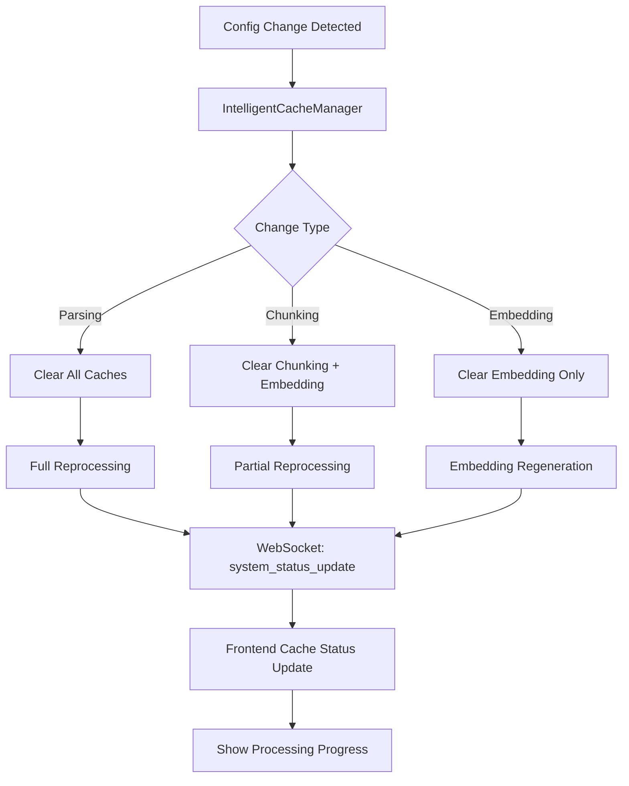

# PDF KB MCP Server Web Interface - Technical Architecture Specification

## Executive Summary

This document specifies the comprehensive web server architecture for the PDF KB MCP server web interface. The design integrates a FastAPI-based async web server directly into the existing [`PDFKnowledgebaseServer`](../src/pdfkb/main.py:31) class, providing a modern web interface alongside the existing MCP functionality while leveraging all existing components and services.

## Table of Contents

1. [Web Server Architecture](#1-web-server-architecture)
2. [API Endpoints Specification](#2-api-endpoints-specification)
3. [WebSocket Architecture](#3-websocket-architecture)
4. [Data Models](#4-data-models)
5. [Configuration Integration](#5-configuration-integration)
6. [Frontend Architecture](#6-frontend-architecture)
7. [Data Flow Diagrams](#7-data-flow-diagrams)
8. [Security Considerations](#8-security-considerations)
9. [Error Handling](#9-error-handling)
10. [Implementation Plan](#10-implementation-plan)

## 1. Web Server Architecture

### 1.1 High-Level Architecture

The web server integrates directly into the existing [`PDFKnowledgebaseServer`](../src/pdfkb/main.py:31) using a dual-interface approach:

```
┌─────────────────────────────────────────────────────────────────┐
│                   PDFKnowledgebaseServer                        │
├─────────────────────────────────────────────────────────────────┤
│  ┌─────────────────┐           ┌───────────────────────────────┐ │
│  │   MCP Interface │           │      FastAPI Web Interface   │ │
│  │   (FastMCP)     │           │      (port 8080)             │ │
│  │                 │           │                               │ │
│  │ • Tools         │           │ • REST API Endpoints         │ │
│  │ • Resources     │           │ • WebSocket Endpoints        │ │
│  │ • stdio         │           │ • Static File Serving        │ │
│  └─────────────────┘           └───────────────────────────────┘ │
├─────────────────────────────────────────────────────────────────┤
│                      Shared Core Services                      │
│  ┌──────────────┐ ┌─────────────┐ ┌─────────────┐ ┌───────────┐ │
│  │PDFProcessor  │ │VectorStore  │ │EmbeddingService│ │FileMonitor│ │
│  └──────────────┘ └─────────────┘ └─────────────┘ └───────────┘ │
├─────────────────────────────────────────────────────────────────┤
│                   Configuration & Cache                        │
│  ┌──────────────┐ ┌─────────────────────────────────────────────┐ │
│  │ServerConfig  │ │     IntelligentCacheManager                 │ │
│  └──────────────┘ └─────────────────────────────────────────────┘ │
└─────────────────────────────────────────────────────────────────┘
```

### 1.2 Core Integration Points

#### 1.2.1 Extended PDFKnowledgebaseServer Class

```python
class PDFKnowledgebaseServer:
    """Enhanced server with both MCP and Web interfaces."""

    def __init__(self, config: Optional[ServerConfig] = None):
        # Existing MCP initialization
        self.config = config or ServerConfig.from_env()
        self.app = FastMCP("PDF Knowledgebase")

        # New web server components
        self.web_app: Optional[FastAPI] = None
        self.web_server: Optional[uvicorn.Server] = None
        self.websocket_manager: Optional[WebSocketManager] = None

        # Shared services (existing)
        self.pdf_processor: Optional[PDFProcessor] = None
        self.vector_store: Optional[VectorStore] = None
        # ... other existing services

    async def initialize(self) -> None:
        # Existing initialization
        # + Web server initialization if enabled

    async def start_web_server(self) -> None:
        # Start FastAPI web server on configured port

    async def run(self) -> None:
        # Run both MCP and Web servers concurrently
```

### 1.3 Service Layer Architecture

The web interface leverages existing services through a new service layer:

```
┌─────────────────────────────────────────────────────────────────┐
│                    Web Service Layer                           │
├─────────────────────────────────────────────────────────────────┤
│ ┌─────────────────┐ ┌─────────────────┐ ┌─────────────────────┐ │
│ │WebDocumentService│ │WebSearchService │ │  WebStatusService   │ │
│ │                 │ │                 │ │                     │ │
│ │• upload_file()  │ │• search_docs()  │ │• get_status()       │ │
│ │• get_documents()│ │• advanced_search│ │• get_statistics()   │ │
│ │• remove_doc()   │ │  _with_filters()│ │• get_system_info()  │ │
│ │• get_preview()  │ └─────────────────┘ └─────────────────────┘ │
│ └─────────────────┘                                             │
├─────────────────────────────────────────────────────────────────┤
│                   WebSocket Event Manager                      │
│ ┌─────────────────────────────────────────────────────────────┐ │
│ │              WebSocketManager                               │ │
│ │                                                             │ │
│ │• Connection Management                                      │ │
│ │• Real-time Progress Updates                                 │ │
│ │• Document Processing Status                                 │ │
│ │• Error Notifications                                        │ │
│ └─────────────────────────────────────────────────────────────┘ │
└─────────────────────────────────────────────────────────────────┘
                                    │
                                    ▼
┌─────────────────────────────────────────────────────────────────┐
│                 Existing Core Services                         │
│ PDFProcessor │ VectorStore │ EmbeddingService │ FileMonitor    │
└─────────────────────────────────────────────────────────────────┘
```

### 1.4 Async Concurrency Pattern

```python
async def run_combined_server(self) -> None:
    """Run both MCP and Web servers concurrently."""
    tasks = []

    # Always run MCP server
    tasks.append(asyncio.create_task(self.app.run_async()))

    # Conditionally run web server
    if self.config.web_server_enabled:
        tasks.append(asyncio.create_task(self._run_web_server()))

    # Wait for any task to complete (shouldn't happen in normal operation)
    done, pending = await asyncio.wait(tasks, return_when=asyncio.FIRST_COMPLETED)

    # Cancel remaining tasks
    for task in pending:
        task.cancel()
```

## 2. API Endpoints Specification

### 2.1 Document Management Endpoints

#### 2.1.1 Upload Document
```http
POST /api/v1/documents/upload
Content-Type: multipart/form-data
```

**Request Body:**
- `file: File` - PDF file to upload
- `metadata: JSON` (optional) - Additional metadata

**Response:**
```json
{
  "success": true,
  "document": {
    "id": "doc_a1b2c3d4e5f6g7h8",
    "title": "Research Paper Title",
    "filename": "research_paper.pdf",
    "path": "/path/to/research_paper.pdf",
    "file_size": 2048576,
    "page_count": 42,
    "chunk_count": 67,
    "added_at": "2024-01-15T10:30:00Z",
    "processing_time": 15.2,
    "has_embeddings": true
  },
  "processing_stats": {
    "chunks_created": 67,
    "embeddings_generated": 67
  }
}
```

#### 2.1.2 Add Document by Path
```http
POST /api/v1/documents/add-path
Content-Type: application/json
```

**Request Body:**
```json
{
  "path": "/absolute/path/to/document.pdf",
  "metadata": {
    "category": "research",
    "tags": ["ml", "nlp"]
  }
}
```

**Response:** Same as upload endpoint

#### 2.1.3 List Documents
```http
GET /api/v1/documents
GET /api/v1/documents?limit=20&offset=0&filter=category:research
```

**Query Parameters:**
- `limit: int = 20` - Maximum number of documents
- `offset: int = 0` - Pagination offset
- `filter: string` - Metadata filter (e.g., "category:research,status:active")
- `sort: string = "added_at"` - Sort field
- `order: string = "desc"` - Sort order (asc/desc)

**Response:**
```json
{
  "success": true,
  "documents": [
    {
      "id": "doc_a1b2c3d4e5f6g7h8",
      "title": "Document Title",
      "filename": "document.pdf",
      "path": "/path/to/document.pdf",
      "file_size": 2048576,
      "page_count": 42,
      "chunk_count": 67,
      "added_at": "2024-01-15T10:30:00Z",
      "has_embeddings": true,
      "metadata": {
        "category": "research"
      }
    }
  ],
  "pagination": {
    "total": 150,
    "limit": 20,
    "offset": 0,
    "has_next": true,
    "has_prev": false
  },
  "statistics": {
    "total_documents": 150,
    "total_chunks": 3456,
    "total_size_bytes": 52428800
  }
}
```

#### 2.1.4 Get Document Details
```http
GET /api/v1/documents/{document_id}
GET /api/v1/documents/{document_id}?include_chunks=true
```

**Query Parameters:**
- `include_chunks: bool = false` - Include full chunk content
- `include_preview: bool = true` - Include document preview

**Response:**
```json
{
  "success": true,
  "document": {
    "id": "doc_a1b2c3d4e5f6g7h8",
    "title": "Document Title",
    "filename": "document.pdf",
    "path": "/path/to/document.pdf",
    "file_size": 2048576,
    "page_count": 42,
    "chunk_count": 67,
    "added_at": "2024-01-15T10:30:00Z",
    "updated_at": "2024-01-15T10:30:00Z",
    "checksum": "sha256:abc123...",
    "has_embeddings": true,
    "metadata": {
      "category": "research",
      "processing_time": 15.2
    },
    "preview": {
      "first_page_text": "Document content preview...",
      "summary_chunks": [
        {
          "chunk_index": 0,
          "text": "First chunk content...",
          "page_number": 1
        }
      ]
    },
    "chunks": [
      {
        "id": "chunk_x1y2z3a4b5c6d7e8",
        "text": "Full chunk content...",
        "page_number": 1,
        "chunk_index": 0,
        "has_embedding": true,
        "metadata": {}
      }
    ]
  }
}
```

#### 2.1.5 Remove Document
```http
DELETE /api/v1/documents/{document_id}
```

**Response:**
```json
{
  "success": true,
  "message": "Document removed successfully",
  "document_id": "doc_a1b2c3d4e5f6g7h8",
  "removed_chunks": 67,
  "removal_time": 0.5
}
```

#### 2.1.6 Document Preview
```http
GET /api/v1/documents/{document_id}/preview
```

**Query Parameters:**
- `page: int` - Specific page number
- `chunk_limit: int = 5` - Number of preview chunks

**Response:**
```json
{
  "success": true,
  "document_id": "doc_a1b2c3d4e5f6g7h8",
  "preview": {
    "title": "Document Title",
    "first_page_content": "Page 1 content...",
    "sample_chunks": [
      {
        "chunk_index": 0,
        "text": "Sample chunk content...",
        "page_number": 1
      }
    ],
    "statistics": {
      "page_count": 42,
      "chunk_count": 67,
      "estimated_read_time": "25 minutes"
    }
  }
}
```

### 2.2 Search Endpoints

#### 2.2.1 Basic Search
```http
GET /api/v1/search?q=machine+learning&limit=10
POST /api/v1/search
Content-Type: application/json
```

**Request Body (POST):**
```json
{
  "query": "machine learning algorithms",
  "limit": 10,
  "min_score": 0.7,
  "metadata_filter": {
    "category": "research",
    "tags": ["ml"]
  }
}
```

**Response:**
```json
{
  "success": true,
  "query": "machine learning algorithms",
  "results": [
    {
      "document_id": "doc_a1b2c3d4e5f6g7h8",
      "document_title": "ML Research Paper",
      "document_path": "/path/to/document.pdf",
      "chunk_id": "chunk_x1y2z3a4b5c6d7e8",
      "chunk_text": "Machine learning algorithms are computational methods...",
      "page_number": 5,
      "chunk_index": 12,
      "score": 0.95,
      "highlights": [
        {
          "field": "text",
          "fragments": ["<mark>machine learning algorithms</mark> are computational"]
        }
      ],
      "metadata": {
        "category": "research"
      }
    }
  ],
  "search_metadata": {
    "total_results": 1,
    "search_time": 0.15,
    "max_score": 0.95,
    "query_embedding_time": 0.05
  }
}
```

#### 2.2.2 Advanced Search
```http
POST /api/v1/search/advanced
Content-Type: application/json
```

**Request Body:**
```json
{
  "query": "neural networks deep learning",
  "filters": {
    "documents": ["doc_id1", "doc_id2"],
    "date_range": {
      "start": "2024-01-01T00:00:00Z",
      "end": "2024-12-31T23:59:59Z"
    },
    "metadata": {
      "category": ["research", "tutorial"],
      "tags": ["ml", "ai"]
    },
    "content": {
      "min_chunk_length": 100,
      "max_chunk_length": 2000,
      "pages": [1, 2, 3, 4, 5]
    }
  },
  "options": {
    "limit": 20,
    "min_score": 0.6,
    "include_highlights": true,
    "highlight_fragment_size": 150,
    "group_by_document": false,
    "rerank": true
  }
}
```

#### 2.2.3 Similar Documents
```http
GET /api/v1/documents/{document_id}/similar?limit=5
```

**Response:**
```json
{
  "success": true,
  "reference_document": {
    "id": "doc_a1b2c3d4e5f6g7h8",
    "title": "Reference Document"
  },
  "similar_documents": [
    {
      "document_id": "doc_b2c3d4e5f6g7h8i9",
      "document_title": "Similar Document",
      "similarity_score": 0.87,
      "matching_chunks": 12,
      "common_topics": ["machine learning", "neural networks"]
    }
  ]
}
```

### 2.3 Status and Configuration Endpoints

#### 2.3.1 System Status
```http
GET /api/v1/status
```

**Response:**
```json
{
  "success": true,
  "status": "healthy",
  "uptime": 86400,
  "services": {
    "mcp_server": {
      "status": "running",
      "uptime": 86400
    },
    "web_server": {
      "status": "running",
      "uptime": 86400,
      "port": 8080
    },
    "vector_store": {
      "status": "healthy",
      "collection_name": "pdf_knowledgebase",
      "total_documents": 150,
      "total_chunks": 3456
    },
    "embedding_service": {
      "status": "healthy",
      "model": "text-embedding-3-large",
      "last_request": "2024-01-15T10:29:45Z"
    },
    "file_monitor": {
      "status": "running",
      "watched_directory": "/path/to/pdfs",
      "files_tracked": 150
    }
  },
  "configuration": {
    "pdf_parser": "pymupdf4llm",
    "pdf_chunker": "langchain",
    "embedding_model": "text-embedding-3-large",
    "chunk_size": 1000,
    "chunk_overlap": 200
  },
  "cache_status": {
    "intelligent_cache_enabled": true,
    "cache_hit_rate": 0.75,
    "total_cache_size": "2.5 GB"
  }
}
```

#### 2.3.2 Processing Statistics
```http
GET /api/v1/statistics
GET /api/v1/statistics?period=24h&granularity=hour
```

**Response:**
```json
{
  "success": true,
  "time_range": {
    "start": "2024-01-14T10:30:00Z",
    "end": "2024-01-15T10:30:00Z"
  },
  "document_stats": {
    "total_documents": 150,
    "documents_added": 5,
    "documents_processed": 5,
    "documents_failed": 0,
    "processing_time_avg": 12.5,
    "processing_time_total": 62.5
  },
  "search_stats": {
    "total_searches": 234,
    "search_time_avg": 0.15,
    "popular_queries": [
      {"query": "machine learning", "count": 45},
      {"query": "neural networks", "count": 32}
    ]
  },
  "file_monitor_stats": {
    "files_tracked": 150,
    "files_processed": 5,
    "files_failed": 0,
    "queue_size": 0
  },
  "cache_stats": {
    "parsing_cache_hits": 12,
    "chunking_cache_hits": 8,
    "embedding_cache_hits": 5,
    "cache_size": "2.5 GB"
  }
}
```

#### 2.3.3 Configuration Info
```http
GET /api/v1/config
```

**Response:**
```json
{
  "success": true,
  "configuration": {
    "server": {
      "web_server_enabled": true,
      "web_server_port": 8080,
      "log_level": "INFO"
    },
    "processing": {
      "pdf_parser": "pymupdf4llm",
      "pdf_chunker": "langchain",
      "chunk_size": 1000,
      "chunk_overlap": 200
    },
    "embedding": {
      "embedding_model": "text-embedding-3-large",
      "embedding_batch_size": 100
    },
    "storage": {
      "knowledgebase_path": "/path/to/pdfs",
      "cache_dir": "/path/to/.cache",
      "vector_search_k": 5
    },
    "monitoring": {
      "file_scan_interval": 60,
      "supported_extensions": [".pdf"]
    }
  },
  "capabilities": {
    "available_parsers": ["pymupdf4llm", "marker", "docling", "unstructured"],
    "available_chunkers": ["langchain", "unstructured"],
    "available_embedding_models": [
      "text-embedding-3-small",
      "text-embedding-3-large",
      "text-embedding-ada-002"
    ]
  }
}
```

## 3. WebSocket Architecture

### 3.1 WebSocket Connection Management

```python
class WebSocketManager:
    """Manages WebSocket connections and real-time updates."""

    def __init__(self):
        self.connections: Dict[str, WebSocket] = {}
        self.subscriptions: Dict[str, Set[str]] = {}

    async def connect(self, websocket: WebSocket, client_id: str):
        await websocket.accept()
        self.connections[client_id] = websocket

    async def disconnect(self, client_id: str):
        if client_id in self.connections:
            del self.connections[client_id]

    async def subscribe(self, client_id: str, event_type: str):
        if event_type not in self.subscriptions:
            self.subscriptions[event_type] = set()
        self.subscriptions[event_type].add(client_id)

    async def broadcast_event(self, event_type: str, data: Dict):
        if event_type in self.subscriptions:
            for client_id in self.subscriptions[event_type]:
                if client_id in self.connections:
                    await self._send_to_client(client_id, {
                        "type": event_type,
                        "data": data,
                        "timestamp": datetime.now(timezone.utc).isoformat()
                    })
```

### 3.2 WebSocket Endpoints

#### 3.2.1 Main WebSocket Connection
```
WS /ws/{client_id}
```

**Connection Protocol:**
1. Client connects with unique client_id
2. Server accepts connection and sends welcome message
3. Client can subscribe to specific event types
4. Server sends real-time updates for subscribed events

#### 3.2.2 Event Types

**Document Processing Events:**
```json
{
  "type": "document_processing_started",
  "data": {
    "document_id": "doc_a1b2c3d4e5f6g7h8",
    "filename": "document.pdf",
    "file_size": 2048576,
    "started_at": "2024-01-15T10:30:00Z"
  }
}
```

```json
{
  "type": "document_processing_progress",
  "data": {
    "document_id": "doc_a1b2c3d4e5f6g7h8",
    "stage": "parsing",
    "progress": 0.45,
    "estimated_remaining": 8.5,
    "status": "Extracting text from pages 12/27"
  }
}
```

```json
{
  "type": "document_processing_completed",
  "data": {
    "document_id": "doc_a1b2c3d4e5f6g7h8",
    "success": true,
    "processing_time": 15.2,
    "chunks_created": 67,
    "embeddings_generated": 67,
    "completed_at": "2024-01-15T10:30:15Z"
  }
}
```

**File Monitor Events:**
```json
{
  "type": "file_added",
  "data": {
    "file_path": "/path/to/new_document.pdf",
    "file_size": 1024000,
    "detected_at": "2024-01-15T10:30:00Z"
  }
}
```

**System Events:**
```json
{
  "type": "system_status_update",
  "data": {
    "status": "healthy",
    "total_documents": 151,
    "total_chunks": 3523,
    "queue_size": 2
  }
}
```

**Error Events:**
```json
{
  "type": "error",
  "data": {
    "error_type": "processing_error",
    "document_id": "doc_a1b2c3d4e5f6g7h8",
    "message": "Failed to extract text from PDF",
    "details": "Corrupted PDF file or unsupported format",
    "occurred_at": "2024-01-15T10:30:00Z"
  }
}
```

### 3.3 WebSocket Integration with Core Services

The WebSocket manager integrates with existing services to provide real-time updates:

```python
# In PDFProcessor
async def process_pdf(self, file_path: Path) -> ProcessingResult:
    # Notify processing started
    await self.websocket_manager.broadcast_event("document_processing_started", {
        "filename": file_path.name,
        "file_size": file_path.stat().st_size
    })

    # ... existing processing logic with progress updates

    # Notify completion
    await self.websocket_manager.broadcast_event("document_processing_completed", {
        "success": result.success,
        "processing_time": result.processing_time
    })
```

## 4. Data Models

### 4.1 Web-Specific Request Models

Located in [`src/pdfkb/web/models/requests.py`](../src/pdfkb/web/models/requests.py):

```python
from pydantic import BaseModel, Field, validator
from typing import Dict, List, Optional, Any
from datetime import datetime

class DocumentUploadRequest(BaseModel):
    """Request model for document upload."""
    metadata: Optional[Dict[str, Any]] = Field(default_factory=dict)

    @validator('metadata')
    def validate_metadata(cls, v):
        # Validate metadata structure
        if v and not isinstance(v, dict):
            raise ValueError('Metadata must be a dictionary')
        return v

class AddDocumentByPathRequest(BaseModel):
    """Request model for adding document by file path."""
    path: str = Field(..., min_length=1, description="Absolute path to PDF file")
    metadata: Optional[Dict[str, Any]] = Field(default_factory=dict)

    @validator('path')
    def validate_path(cls, v):
        if not v.strip():
            raise ValueError('Path cannot be empty')
        return v.strip()

class SearchRequest(BaseModel):
    """Basic search request model."""
    query: str = Field(..., min_length=1, max_length=500)
    limit: int = Field(default=5, ge=1, le=100)
    min_score: float = Field(default=0.0, ge=0.0, le=1.0)
    metadata_filter: Optional[Dict[str, Any]] = None

class AdvancedSearchRequest(BaseModel):
    """Advanced search request with comprehensive filtering."""
    query: str = Field(..., min_length=1, max_length=500)

    class FilterConfig(BaseModel):
        documents: Optional[List[str]] = None
        date_range: Optional[Dict[str, datetime]] = None
        metadata: Optional[Dict[str, Any]] = None
        content: Optional[Dict[str, Any]] = None

    class SearchOptions(BaseModel):
        limit: int = Field(default=20, ge=1, le=100)
        min_score: float = Field(default=0.6, ge=0.0, le=1.0)
        include_highlights: bool = True
        highlight_fragment_size: int = Field(default=150, ge=50, le=500)
        group_by_document: bool = False
        rerank: bool = True

    filters: FilterConfig = Field(default_factory=FilterConfig)
    options: SearchOptions = Field(default_factory=SearchOptions)

class WebSocketSubscribeRequest(BaseModel):
    """WebSocket subscription request."""
    event_types: List[str] = Field(..., min_items=1)

    @validator('event_types')
    def validate_event_types(cls, v):
        valid_types = {
            'document_processing_started',
            'document_processing_progress',
            'document_processing_completed',
            'file_added',
            'file_removed',
            'system_status_update',
            'error'
        }

        for event_type in v:
            if event_type not in valid_types:
                raise ValueError(f'Invalid event type: {event_type}')
        return v
```

### 4.2 Web-Specific Response Models

Located in [`src/pdfkb/web/models/responses.py`](../src/pdfkb/web/models/responses.py):

```python
from pydantic import BaseModel, Field
from typing import Dict, List, Optional, Any, Union
from datetime import datetime
from ..models import Document, SearchResult

class BaseResponse(BaseModel):
    """Base response model with success indicator."""
    success: bool
    message: Optional[str] = None
    timestamp: datetime = Field(default_factory=datetime.utcnow)

class ErrorResponse(BaseResponse):
    """Error response model."""
    success: bool = False
    error_code: Optional[str] = None
    error_details: Optional[Dict[str, Any]] = None

class DocumentResponse(BaseResponse):
    """Single document response."""
    document: Optional[Dict[str, Any]] = None
    processing_stats: Optional[Dict[str, Any]] = None

class DocumentListResponse(BaseResponse):
    """Document list response with pagination."""
    documents: List[Dict[str, Any]] = Field(default_factory=list)

    class PaginationInfo(BaseModel):
        total: int
        limit: int
        offset: int
        has_next: bool
        has_prev: bool

    class DocumentStatistics(BaseModel):
        total_documents: int
        total_chunks: int
        total_size_bytes: int
        avg_chunks_per_doc: float

    pagination: PaginationInfo
    statistics: DocumentStatistics

class SearchResponse(BaseResponse):
    """Search results response."""
    query: str
    results: List[Dict[str, Any]] = Field(default_factory=list)

    class SearchMetadata(BaseModel):
        total_results: int
        search_time: float
        max_score: float
        query_embedding_time: float
        reranking_time: Optional[float] = None

    search_metadata: SearchMetadata

class StatusResponse(BaseResponse):
    """System status response."""
    status: str = "healthy"
    uptime: int
    services: Dict[str, Dict[str, Any]]
    configuration: Dict[str, Any]
    cache_status: Dict[str, Any]

class StatisticsResponse(BaseResponse):
    """Processing statistics response."""
    time_range: Dict[str, datetime]
    document_stats: Dict[str, Any]
    search_stats: Dict[str, Any]
    file_monitor_stats: Dict[str, Any]
    cache_stats: Dict[str, Any]

class ConfigurationResponse(BaseResponse):
    """Configuration information response."""
    configuration: Dict[str, Any]
    capabilities: Dict[str, List[str]]

class WebSocketEventResponse(BaseModel):
    """WebSocket event message."""
    type: str
    data: Dict[str, Any]
    timestamp: datetime = Field(default_factory=datetime.utcnow)

class FileUploadProgress(BaseModel):
    """File upload progress model."""
    upload_id: str
    filename: str
    total_size: int
    uploaded_size: int
    progress: float
    stage: str  # "uploading", "processing", "completed", "error"
    estimated_remaining: Optional[float] = None
    error_message: Optional[str] = None
```

### 4.3 Enhanced Core Models

Extend existing models in [`src/pdfkb/models.py`](../src/pdfkb/models.py) with web-specific methods:

```python
# Add these methods to existing Document class
class Document:
    # ... existing implementation

    def to_web_dict(self, include_preview: bool = True, include_chunks: bool = False) -> Dict[str, Any]:
        """Convert to web-optimized dictionary format."""
        result = self.to_dict(include_chunks=include_chunks)

        if include_preview and not include_chunks:
            # Add preview information
            result["preview"] = {
                "first_page_text": self._get_first_page_preview(),
                "summary_chunks": self._get_summary_chunks(limit=3),
                "estimated_read_time": self._estimate_read_time()
            }

        return result

    def _get_first_page_preview(self, max_length: int = 500) -> str:
        """Get first page text preview."""
        if not self.chunks:
            return ""

        first_page_chunks = [c for c in self.chunks if c.page_number == 1]
        if not first_page_chunks:
            first_page_chunks = self.chunks[:3]  # Fallback to first 3 chunks

        preview_text = " ".join(chunk.text for chunk in first_page_chunks)
        return preview_text[:max_length] + "..." if len(preview_text) > max_length else preview_text

    def _get_summary_chunks(self, limit: int = 3) -> List[Dict[str, Any]]:
        """Get representative chunks for summary."""
        if not self.chunks:
            return []

        # Select chunks from beginning, middle, and end
        chunk_count = len(self.chunks)
        selected_indices = [0]

        if chunk_count > 1:
            selected_indices.append(chunk_count // 2)
        if chunk_count > 2:
            selected_indices.append(chunk_count - 1)

        selected_indices = selected_indices[:limit]

        return [
            {
                "chunk_index": i,
                "text": self.chunks[i].text[:200] + "...",
                "page_number": self.chunks[i].page_number
            }
            for i in selected_indices
        ]

    def _estimate_read_time(self) -> str:
        """Estimate reading time based on content."""
        if not self.chunks:
            return "0 minutes"

        total_words = sum(len(chunk.text.split()) for chunk in self.chunks)
        # Average reading speed: 200-250 words per minute
        minutes = max(1, total_words // 225)

        if minutes < 60:
            return f"{minutes} minutes"
        else:
            hours = minutes // 60
            remaining_minutes = minutes % 60
            if remaining_minutes > 0:
                return f"{hours}h {remaining_minutes}m"
            else:
                return f"{hours}h"

# Add these methods to existing SearchResult class
class SearchResult:
    # ... existing implementation

    def to_web_dict(self, include_highlights: bool = True) -> Dict[str, Any]:
        """Convert to web-optimized dictionary format with highlights."""
        result = self.to_dict()

        if include_highlights:
            result["highlights"] = self._generate_highlights()

        return result

    def _generate_highlights(self, fragment_size: int = 150) -> List[Dict[str, Any]]:
        """Generate highlighted fragments for search results."""
        # Simple highlighting implementation
        # In production, use proper text highlighting library
        chunk_text = self.chunk.text.lower()

        # This is a simplified implementation
        # Real implementation would use proper tokenization and highlighting
        fragments = []
        if len(chunk_text) > fragment_size:
            start_pos = max(0, len(chunk_text) // 2 - fragment_size // 2)
            fragment = self.chunk.text[start_pos:start_pos + fragment_size]
            if start_pos > 0:
                fragment = "..." + fragment
            if start_pos + fragment_size < len(self.chunk.text):
                fragment = fragment + "..."
        else:
            fragment = self.chunk.text

        return [{
            "field": "text",
            "fragments": [fragment]
        }]
```

## 5. Configuration Integration

### 5.1 Extended ServerConfig

Enhance [`src/pdfkb/config.py`](../src/pdfkb/config.py) with web server settings:

```python
@dataclass
class ServerConfig:
    # ... existing fields

    # Web server configuration
    web_server_enabled: bool = False
    web_server_port: int = 8080
    web_server_host: str = "0.0.0.0"
    web_cors_origins: List[str] = field(default_factory=lambda: ["*"])
    web_max_upload_size: int = 100 * 1024 * 1024  # 100MB
    web_upload_timeout: int = 300  # 5 minutes
    web_rate_limit_requests: int = 100
    web_rate_limit_window: int = 3600  # 1 hour
    web_static_files_enabled: bool = True
    web_static_files_path: str = "static"

    # WebSocket configuration
    websocket_enabled: bool = True
    websocket_max_connections: int = 100
    websocket_ping_interval: int = 20
    websocket_ping_timeout: int = 10

    @classmethod
    def from_env(cls) -> "ServerConfig":
        """Enhanced environment loading with web server settings."""
        # ... existing environment loading

        # Web server settings
        if web_enabled := os.getenv("WEB_SERVER_ENABLED"):
            config_kwargs["web_server_enabled"] = web_enabled.lower() in ["true", "1", "yes"]

        if web_port := os.getenv("WEB_SERVER_PORT"):
            try:
                config_kwargs["web_server_port"] = int(web_port)
            except ValueError:
                raise ConfigurationError(f"Invalid WEB_SERVER_PORT: {web_port}")

        if web_host := os.getenv("WEB_SERVER_HOST"):
            config_kwargs["web_server_host"] = web_host

        if cors_origins := os.getenv("WEB_CORS_ORIGINS"):
            config_kwargs["web_cors_origins"] = [origin.strip() for origin in cors_origins.split(",")]

        if upload_size := os.getenv("WEB_MAX_UPLOAD_SIZE"):
            try:
                config_kwargs["web_max_upload_size"] = int(upload_size)
            except ValueError:
                raise ConfigurationError(f"Invalid WEB_MAX_UPLOAD_SIZE: {upload_size}")

        # ... additional web settings

        return cls(**config_kwargs)
```

### 5.2 Environment Variables

New environment variables for web server configuration:

```bash
# Web Server Configuration
WEB_SERVER_ENABLED=true
WEB_SERVER_PORT=8080
WEB_SERVER_HOST=0.0.0.0
WEB_CORS_ORIGINS=*
WEB_MAX_UPLOAD_SIZE=104857600  # 100MB in bytes
WEB_UPLOAD_TIMEOUT=300
WEB_RATE_LIMIT_REQUESTS=100
WEB_RATE_LIMIT_WINDOW=3600

# WebSocket Configuration
WEBSOCKET_ENABLED=true
WEBSOCKET_MAX_CONNECTIONS=100
WEBSOCKET_PING_INTERVAL=20
WEBSOCKET_PING_TIMEOUT=10

# Static Files
WEB_STATIC_FILES_ENABLED=true
WEB_STATIC_FILES_PATH=static
```

## 6. Frontend Architecture

### 6.1 Technology Stack

**Recommended Stack:**
- **Framework**: Vue 3 with Composition API or React 18
- **Build Tool**: Vite for fast development and optimized builds
- **CSS Framework**: Tailwind CSS for utility-first styling
- **HTTP Client**: Axios for API requests
- **WebSocket**: Native WebSocket API with reconnection logic
- **File Upload**: Custom upload component with progress tracking
- **State Management**: Pinia (Vue) or Zustand (React) for local state

### 6.2 Component Architecture

```
src/frontend/
├── components/
│   ├── layout/
│   │   ├── AppHeader.vue          # Navigation and branding
│   │   ├── AppSidebar.vue         # Navigation sidebar
│   │   └── AppLayout.vue          # Main layout wrapper
│   ├── documents/
│   │   ├── DocumentList.vue       # Document list with pagination
│   │   ├── DocumentCard.vue       # Document preview card
│   │   ├── DocumentDetails.vue    # Document details modal/page
│   │   ├── DocumentPreview.vue    # Document content preview
│   │   ├── DocumentUpload.vue     # File upload component
│   │   └── AddByPathModal.vue     # Add by path modal
│   ├── search/
│   │   ├── SearchBar.vue          # Basic search input
│   │   ├── AdvancedSearch.vue     # Advanced search form
│   │   ├── SearchResults.vue      # Search results list
│   │   ├── SearchFilters.vue      # Search filter sidebar
│   │   └── ResultHighlight.vue    # Highlighted search result
│   ├── system/
│   │   ├── StatusDashboard.vue    # System status overview
│   │   ├── ProcessingQueue.vue    # Real-time processing status
│   │   ├── SystemStats.vue       # Statistics charts
│   │   └── ConfigurationView.vue  # Configuration display
│   ├── common/
│   │   ├── LoadingSpinner.vue     # Loading indicator
│   │   ├── ErrorAlert.vue        # Error display component
│   │   ├── ProgressBar.vue       # Progress indicator
│   │   ├── PaginationNav.vue     # Pagination controls
│   │   └── ConfirmModal.vue      # Confirmation dialog
│   └── websocket/
│       ├── WebSocketClient.vue    # WebSocket connection manager
│       ├── NotificationCenter.vue # Real-time notifications
│       └── ProcessingStatus.vue   # Live processing updates
├── views/
│   ├── DocumentsView.vue          # Main documents page
│   ├── SearchView.vue             # Search interface
│   ├── DocumentDetailView.vue     # Individual document page
│   ├── StatusView.vue             # System status page
│   └── SettingsView.vue           # Settings and configuration
├── composables/
│   ├── useAPI.js                  # API interaction composable
│   ├── useWebSocket.js            # WebSocket management
│   ├── useDocuments.js            # Document operations
│   ├── useSearch.js               # Search functionality
│   └── useNotifications.js        # Notification management
├── services/
│   ├── api.js                     # API service layer
│   ├── websocket.js               # WebSocket service
│   ├── upload.js                  # File upload service
│   └── notifications.js          # Notification service
├── stores/
│   ├── documents.js               # Document state management
│   ├── search.js                  # Search state management
│   ├── system.js                  # System status state
│   └── ui.js                      # UI state management
└── utils/
    ├── formatters.js              # Data formatting utilities
    ├── validators.js              # Input validation
    ├── constants.js               # Application constants
    └── helpers.js                 # General helper functions
```

### 6.3 Key UI Components

#### 6.3.1 Document List Component

```vue
<template>
  <div class="document-list">
    <!-- Header with controls -->
    <div class="flex justify-between items-center mb-6">
      <h2 class="text-2xl font-bold">Documents ({{ totalDocuments }})</h2>
      <div class="flex gap-4">
        <button @click="showUpload = true" class="btn-primary">
          <UploadIcon class="w-5 h-5 mr-2" />
          Upload Document
        </button>
        <button @click="showAddByPath = true" class="btn-secondary">
          <FolderIcon class="w-5 h-5 mr-2" />
          Add by Path
        </button>
      </div>
    </div>

    <!-- Document grid/list -->
    <div class="grid grid-cols-1 md:grid-cols-2 lg:grid-cols-3 gap-6">
      <DocumentCard
        v-for="document in documents"
        :key="document.id"
        :document="document"
        @view="viewDocument"
        @remove="removeDocument"
      />
    </div>

    <!-- Pagination -->
    <PaginationNav
      :current-page="currentPage"
      :total-pages="totalPages"
      @page-change="loadPage"
    />

    <!-- Modals -->
    <DocumentUpload v-if="showUpload" @close="showUpload = false" />
    <AddByPathModal v-if="showAddByPath" @close="showAddByPath = false" />
  </div>
</template>

<script setup>
import { ref, onMounted, computed } from 'vue'
import { useDocuments } from '@/composables/useDocuments'
import DocumentCard from './DocumentCard.vue'
// ... other imports

const {
  documents,
  totalDocuments,
  currentPage,
  totalPages,
  loadDocuments,
  removeDocument: removeDoc
} = useDocuments()

const showUpload = ref(false)
const showAddByPath = ref(false)

const removeDocument = async (documentId) => {
  if (confirm('Are you sure you want to remove this document?')) {
    await removeDoc(documentId)
  }
}

onMounted(() => {
  loadDocuments()
})
</script>
```

#### 6.3.2 Real-time Processing Status Component

```vue
<template>
  <div class="processing-status">
    <div v-if="processingDocuments.length > 0" class="mb-4">
      <h3 class="text-lg font-semibold mb-2">Processing Queue</h3>
      <div class="space-y-2">
        <div
          v-for="doc in processingDocuments"
          :key="doc.id"
          class="bg-blue-50 border border-blue-200 rounded-lg p-3"
        >
          <div class="flex justify-between items-center">
            <span class="font-medium">{{ doc.filename }}</span>
            <span class="text-sm text-gray-600">{{ doc.stage }}</span>
          </div>
          <ProgressBar :progress="doc.progress" class="mt-2" />
          <div class="flex justify-between text-xs text-gray-500 mt-1">
            <span>{{ Math.round(doc.progress * 100) }}% complete</span>
            <span v-if="doc.estimatedRemaining">
              ~{{ Math.round(doc.estimatedRemaining) }}s remaining
            </span>
          </div>
        </div>
      </div>
    </div>

    <!-- Recent completions -->
    <div v-if="recentCompletions.length > 0">
      <h3 class="text-lg font-semibold mb-2">Recently Completed</h3>
      <div class="space-y-1">
        <div
          v-for="completion in recentCompletions"
          :key="completion.id"
          class="flex justify-between items-center py-2 px-3 bg-green-50 border border-green-200 rounded"
        >
          <span class="text-sm">{{ completion.filename }}</span>
          <div class="text-xs text-green-600">
            ✓ {{ completion.processingTime }}s
          </div>
        </div>
      </div>
    </div>
  </div>
</template>

<script setup>
import { ref, onMounted, onUnmounted } from 'vue'
import { useWebSocket } from '@/composables/useWebSocket'
import ProgressBar from '@/components/common/ProgressBar.vue'

const processingDocuments = ref([])
const recentCompletions = ref([])

const { connect, disconnect, subscribe } = useWebSocket()

onMounted(async () => {
  await connect()

  // Subscribe to processing events
  subscribe('document_processing_started', (data) => {
    processingDocuments.value.push({
      id: data.document_id,
      filename: data.filename,
      stage: 'Starting...',
      progress: 0,
      estimatedRemaining: null
    })
  })

  subscribe('document_processing_progress', (data) => {
    const doc = processingDocuments.value.find(d => d.id === data.document_id)
    if (doc) {
      doc.stage = data.status
      doc.progress = data.progress
      doc.estimatedRemaining = data.estimated_remaining
    }
  })

  subscribe('document_processing_completed', (data) => {
    // Remove from processing list
    processingDocuments.value = processingDocuments.value.filter(
      d => d.id !== data.document_id
    )

    // Add to recent completions
    if (data.success) {
      recentCompletions.value.unshift({
        id: data.document_id,
        filename: data.filename || 'Unknown',
        processingTime: data.processing_time
      })

      // Keep only last 5 completions
      recentCompletions.value = recentCompletions.value.slice(0, 5)
    }
  })
})

onUnmounted(() => {
  disconnect()
})
</script>
```

### 6.4 Responsive Design Considerations

**Mobile-First Approach:**
- Responsive grid layouts that adapt from 1 column (mobile) to 3+ columns (desktop)
- Touch-friendly interface elements with appropriate sizing
- Collapsible navigation sidebar for mobile devices
- Swipe gestures for document cards and search results

**Progressive Enhancement:**
- Core functionality works without JavaScript (where possible)
- Enhanced features like real-time updates require WebSocket support
- Graceful degradation for older browsers

**Accessibility:**
- WCAG 2.1 AA compliance
- Proper ARIA labels and roles
- Keyboard navigation support
- Screen reader optimization
- High contrast mode support

## 7. Data Flow Diagrams

### 7.1 Document Upload Flow

```mermaid
graph TB
    A[User Selects File] --> B[Frontend Validation]
    B --> C{Valid File?}
    C -->|No| D[Show Error Message]
    C -->|Yes| E[Create Upload Progress UI]
    E --> F[POST /api/v1/documents/upload]
    F --> G[Web Service Layer]
    G --> H[PDFProcessor.process_pdf()]
    H --> I[Parse PDF]
    I --> J[Generate Chunks]
    J --> K[Generate Embeddings]
    K --> L[Store in VectorStore]
    L --> M[Update Document Cache]
    M --> N[Broadcast WebSocket Events]
    N --> O[Update Frontend UI]

    H --> P{Processing Events}
    P --> Q[WS: processing_started]
    P --> R[WS: processing_progress]
    P --> S[WS: processing_completed]

    Q --> T[Frontend Progress Update]
    R --> T
    S --> U[Final Success/Error Display]
```

### 7.2 Search Flow

```mermaid
graph TB
    A[User Enters Query] --> B[Frontend Query Validation]
    B --> C[POST /api/v1/search]
    C --> D[WebSearchService.search()]
    D --> E[Generate Query Embedding]
    E --> F[VectorStore.search()]
    F --> G[Retrieve Similar Chunks]
    G --> H[Score and Rank Results]
    H --> I[Generate Highlights]
    I --> J[Format Web Response]
    J --> K[Return to Frontend]
    K --> L[Display Search Results]

    D --> M[Cache Query Results]
    L --> N[User Clicks Result]
    N --> O[Navigate to Document]
```

### 7.3 Real-time Update Flow

```mermaid
graph TB
    A[File System Event] --> B[FileMonitor]
    B --> C{Event Type}
    C -->|New File| D[Process New File]
    C -->|Modified| E[Reprocess File]
    C -->|Deleted| F[Remove from Store]

    D --> G[PDFProcessor]
    E --> G
    F --> H[VectorStore.remove()]

    G --> I[Processing Steps]
    I --> J[WebSocket Manager]
    H --> J

    J --> K[Broadcast Event]
    K --> L[Connected Clients]
    L --> M[Update UI Components]

    subgraph "WebSocket Events"
        N[document_processing_started]
        O[document_processing_progress]
        P[document_processing_completed]
        Q[file_added]
        R[file_removed]
        S[system_status_update]
    end
```

### 7.4 Configuration Change Flow



## 8. Security Considerations

### 8.1 Authentication and Authorization

**Current Implementation:**
- **No Authentication Required** (as specified in requirements)
- Suitable for internal networks or development environments
- Web server should bind to localhost or internal network interfaces only

**Future Authentication Options:**
```python
# Optional authentication middleware for production deployment
class OptionalAuthMiddleware:
    async def __call__(self, request: Request, call_next):
        if self.config.auth_enabled:
            # Implement JWT, API key, or basic auth
            pass
        return await call_next(request)
```

### 8.2 Input Validation and Sanitization

**File Upload Security:**
```python
async def validate_upload_file(file: UploadFile) -> None:
    """Comprehensive file validation."""

    # File size limits
    if file.size > MAX_FILE_SIZE:
        raise ValueError(f"File too large: {file.size} bytes")

    # File type validation
    if not file.filename.lower().endswith('.pdf'):
        raise ValueError("Only PDF files are allowed")

    # Content type validation
    if file.content_type not in ['application/pdf', 'application/octet-stream']:
        raise ValueError("Invalid content type")

    # Magic number validation
    header = await file.read(8)
    await file.seek(0)  # Reset file pointer

    if not header.startswith(b'%PDF-'):
        raise ValueError("File does not appear to be a valid PDF")

    # Virus scanning (if available)
    if virus_scanner_available:
        scan_result = await scan_file(file)
        if not scan_result.clean:
            raise ValueError("File failed security scan")
```

**Path Traversal Prevention:**
```python
def validate_file_path(path: str) -> Path:
    """Prevent path traversal attacks."""

    # Resolve to absolute path
    resolved_path = Path(path).resolve()

    # Ensure path is within allowed directories
    allowed_dirs = [
        Path(config.knowledgebase_path).resolve(),
        Path(config.cache_dir).resolve()
    ]

    for allowed_dir in allowed_dirs:
        try:
            resolved_path.relative_to(allowed_dir)
            return resolved_path
        except ValueError:
            continue

    raise ValueError("Path not in allowed directory")
```

### 8.3 Rate Limiting and CORS

**Rate Limiting Implementation:**
```python
from slowapi import Limiter, _rate_limit_exceeded_handler
from slowapi.util import get_remote_address

limiter = Limiter(key_func=get_remote_address)

@app.post("/api/v1/documents/upload")
@limiter.limit("10/minute")  # 10 uploads per minute per IP
async def upload_document(request: Request, file: UploadFile):
    # Upload logic
    pass

@app.get("/api/v1/search")
@limiter.limit("100/hour")   # 100 searches per hour per IP
async def search_documents(request: Request, q: str):
    # Search logic
    pass
```

**CORS Configuration:**
```python
from fastapi.middleware.cors import CORSMiddleware

app.add_middleware(
    CORSMiddleware,
    allow_origins=config.web_cors_origins,  # ["*"] or specific domains
    allow_credentials=True,
    allow_methods=["GET", "POST", "DELETE"],
    allow_headers=["*"],
    expose_headers=["X-Process-Time", "X-Request-ID"]
)
```

### 8.4 WebSocket Security

```python
class SecureWebSocketManager:
    async def connect(self, websocket: WebSocket, client_id: str):
        # Connection rate limiting
        if self._connection_attempts.get(client_ip, 0) > MAX_CONNECTIONS_PER_IP:
            await websocket.close(code=1008, reason="Too many connections")
            return

        # Validate client_id format
        if not self._is_valid_client_id(client_id):
            await websocket.close(code=1003, reason="Invalid client ID")
            return

        await websocket.accept()
        self.connections[client_id] = websocket

    async def broadcast_event(self, event_type: str, data: Dict):
        # Sanitize data before broadcasting
        sanitized_data = self._sanitize_event_data(data)

        # Rate limit broadcasts
        if self._should_rate_limit_broadcast(event_type):
            return

        # Send to subscribed clients only
        await self._send_to_subscribers(event_type, sanitized_data)
```

### 8.5 Error Information Disclosure

```python
class SafeErrorHandler:
    def format_error_response(self, error: Exception, debug: bool = False) -> ErrorResponse:
        """Format error response with appropriate detail level."""

        if debug:
            # Full error details in development
            return ErrorResponse(
                success=False,
                message=str(error),
                error_code=error.__class__.__name__,
                error_details={
                    "traceback": traceback.format_exc(),
                    "error_type": type(error).__name__
                }
            )
        else:
            # Limited error details in production
            safe_message = self._get_safe_error_message(error)
            return ErrorResponse(
                success=False,
                message=safe_message,
                error_code=self._get_error_code(error)
            )

    def _get_safe_error_message(self, error: Exception) -> str:
        """Get user-safe error message."""
        safe_messages = {
            ValidationError: "Invalid input provided",
            PDFProcessingError: "Unable to process PDF file",
            VectorStoreError: "Search service temporarily unavailable",
            FileNotFoundError: "Document not found"
        }

        return safe_messages.get(type(error), "An internal error occurred")
```

## 9. Error Handling

### 9.1 Global Error Handler

```python
from fastapi import HTTPException
from fastapi.responses import JSONResponse

@app.exception_handler(Exception)
async def global_exception_handler(request: Request, exc: Exception):
    """Global exception handler for consistent error responses."""

    logger.error(f"Unhandled exception: {exc}", exc_info=True)

    # Map internal exceptions to HTTP status codes
    status_code_map = {
        ValidationError: 400,
        DocumentNotFoundError: 404,
        PDFProcessingError: 422,
        VectorStoreError: 503,
        EmbeddingError: 503,
        FileSystemError: 500
    }

    status_code =
